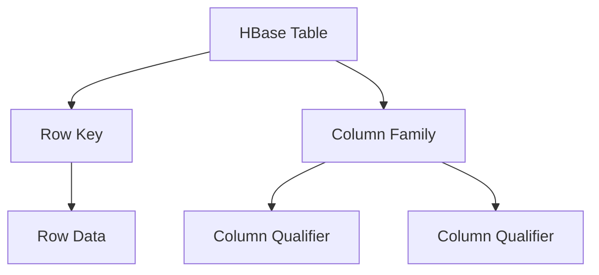
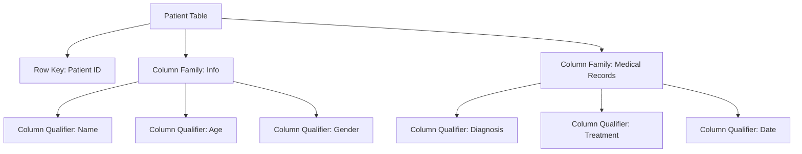

# HBase 医疗数据平台

## 介绍

在现代医疗系统中，数据量呈指数级增长。从患者记录到医疗影像，再到实时监测数据，医疗数据的规模和复杂性都在不断增加。为了有效地存储、管理和分析这些数据，我们需要一个强大的分布式数据库系统。HBase，作为Hadoop生态系统的一部分，正是为此而设计的。

HBase是一个分布式的、面向列的数据库，特别适合处理大规模数据集。它的高吞吐量和低延迟特性使其成为医疗数据平台的理想选择。本文将逐步介绍如何使用HBase构建一个医疗数据平台，并通过实际案例展示其应用。

## HBase 基础

在深入探讨医疗数据平台之前，让我们先了解一些HBase的基础知识。

### HBase 表结构

HBase中的数据存储在表中，表由行和列组成。每一行都有一个唯一的行键（Row Key），列则被分组为列族（Column Family）。每个列族可以包含多个列限定符（Column Qualifier），用于进一步细分数据。



### HBase 数据模型

HBase的数据模型是面向列的，这意味着数据是按列存储的，而不是按行。这种存储方式特别适合处理稀疏数据，因为只有实际存在的数据才会占用存储空间。

## 构建医疗数据平台

### 1. 设计表结构

在医疗数据平台中，我们需要存储患者的基本信息、医疗记录、实验室结果等。我们可以设计一个HBase表来存储这些数据。



### 2. 创建HBase表

使用HBase Shell或Java API创建表。以下是一个使用HBase Shell创建表的示例：

```bash
create 'patient', 'info', 'medical_records'
```

### 3. 插入数据

接下来，我们可以向表中插入数据。以下是一个插入患者信息的示例：

```bash
put 'patient', 'patient001', 'info:name', 'John Doe'
put 'patient', 'patient001', 'info:age', '30'
put 'patient', 'patient001', 'info:gender', 'Male'
put 'patient', 'patient001', 'medical_records:diagnosis', 'Hypertension'
put 'patient', 'patient001', 'medical_records:treatment', 'Medication'
put 'patient', 'patient001', 'medical_records:date', '2023-10-01'
```

### 4. 查询数据

我们可以通过行键查询特定患者的数据：

```bash
get 'patient', 'patient001'
```

输出结果将显示患者的所有信息：

```
COLUMN                     CELL
 info:age                  timestamp=1698765432100, value=30
 info:gender               timestamp=1698765432100, value=Male
 info:name                 timestamp=1698765432100, value=John Doe
 medical_records:date      timestamp=1698765432100, value=2023-10-01
 medical_records:diagnosis timestamp=1698765432100, value=Hypertension
 medical_records:treatment timestamp=1698765432100, value=Medication
```

## 实际案例：医疗数据分析

假设我们需要分析某医院的高血压患者数量。我们可以使用HBase的扫描功能来查询所有诊断为高血压的患者。

```bash
scan 'patient', {FILTER => "SingleColumnValueFilter('medical_records', 'diagnosis', =, 'binary:Hypertension')"}
```

输出结果将显示所有高血压患者的行键和相关信息。

## 总结

通过本文，我们了解了如何使用HBase构建一个医疗数据平台。我们从设计表结构开始，逐步介绍了如何创建表、插入数据、查询数据，并通过实际案例展示了HBase在医疗数据分析中的应用。

HBase的高吞吐量和低延迟特性使其成为处理大规模医疗数据的理想选择。通过合理设计表结构和利用HBase的强大功能，我们可以构建一个高效、可靠的医疗数据平台。

## 附加资源

- [HBase官方文档](https://hbase.apache.org/)
- [HBase实战指南](https://www.oreilly.com/library/view/hbase-in-action/9781935182957/)
- [HBase与医疗数据管理](https://www.ncbi.nlm.nih.gov/pmc/articles/PMC4170902/)

## 练习

1. 设计一个HBase表来存储医院的药品库存信息。
2. 使用HBase Shell插入一些药品数据，并查询特定药品的库存数量。
3. 尝试使用HBase的过滤器功能查询所有库存低于某个阈值的药品。

通过完成这些练习，您将更深入地理解HBase在医疗数据管理中的应用。