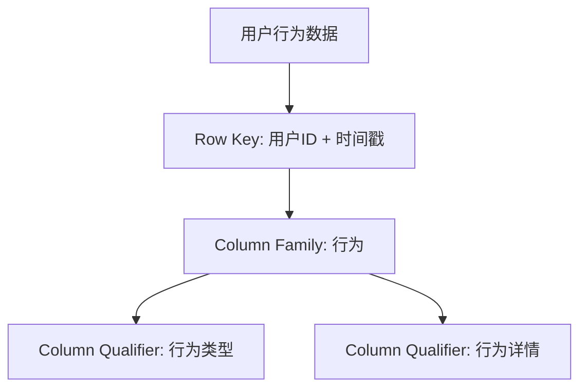

# HBase 风控系统

在现代金融和电商领域，风控系统（Risk Control System）是确保业务安全的重要工具。它通过实时监控和分析用户行为，识别潜在的风险行为，如欺诈、异常交易等。HBase作为一个分布式、可扩展的NoSQL数据库，非常适合用于构建高效的风控系统。

## 什么是HBase风控系统？

HBase风控系统是基于HBase数据库构建的一个实时风险监控和分析系统。它通过存储和处理大量的用户行为数据，结合规则引擎和机器学习模型，快速识别和响应潜在的风险行为。

### 为什么选择HBase？

- **高吞吐量**：HBase能够处理大量的读写请求，适合实时风控场景。
- **可扩展性**：HBase可以轻松扩展以应对数据量的增长。
- **强一致性**：HBase提供强一致性的数据存储，确保数据的准确性。

## 构建HBase风控系统的步骤

### 1. 数据模型设计

在HBase中，数据以表的形式存储，表由行键（Row Key）、列族（Column Family）和列限定符（Column Qualifier）组成。设计一个高效的数据模型是构建风控系统的第一步。



### 2. 数据写入

用户行为数据需要实时写入HBase。以下是一个简单的Java代码示例，展示如何将数据写入HBase。

```java
import org.apache.hadoop.hbase.TableName;
import org.apache.hadoop.hbase.client.Connection;
import org.apache.hadoop.hbase.client.ConnectionFactory;
import org.apache.hadoop.hbase.client.Put;
import org.apache.hadoop.hbase.client.Table;
import org.apache.hadoop.hbase.util.Bytes;

public class HBaseWriter {
    public static void main(String[] args) throws Exception {
        Connection connection = ConnectionFactory.createConnection();
        Table table = connection.getTable(TableName.valueOf("user_behavior"));

        String rowKey = "user123_20231010120000";
        Put put = new Put(Bytes.toBytes(rowKey));
        put.addColumn(Bytes.toBytes("behavior"), Bytes.toBytes("type"), Bytes.toBytes("login"));
        put.addColumn(Bytes.toBytes("behavior"), Bytes.toBytes("detail"), Bytes.toBytes("login from IP 192.168.1.1"));

        table.put(put);
        table.close();
        connection.close();
    }
}
```

### 3. 数据查询与分析

风控系统需要实时查询用户行为数据，并根据预定义的规则或机器学习模型进行分析。以下是一个查询示例：

```java
import org.apache.hadoop.hbase.TableName;
import org.apache.hadoop.hbase.client.Connection;
import org.apache.hadoop.hbase.client.ConnectionFactory;
import org.apache.hadoop.hbase.client.Get;
import org.apache.hadoop.hbase.client.Result;
import org.apache.hadoop.hbase.client.Table;
import org.apache.hadoop.hbase.util.Bytes;

public class HBaseReader {
    public static void main(String[] args) throws Exception {
        Connection connection = ConnectionFactory.createConnection();
        Table table = connection.getTable(TableName.valueOf("user_behavior"));

        String rowKey = "user123_20231010120000";
        Get get = new Get(Bytes.toBytes(rowKey));
        Result result = table.get(get);

        byte[] type = result.getValue(Bytes.toBytes("behavior"), Bytes.toBytes("type"));
        byte[] detail = result.getValue(Bytes.toBytes("behavior"), Bytes.toBytes("detail"));

        System.out.println("Behavior Type: " + Bytes.toString(type));
        System.out.println("Behavior Detail: " + Bytes.toString(detail));

        table.close();
        connection.close();
    }
}
```

### 4. 规则引擎与风险识别

风控系统通常结合规则引擎来识别风险行为。例如，如果一个用户在短时间内多次登录失败，系统可以标记该用户为潜在风险。

```java
if (loginAttempts > 5) {
    System.out.println("Potential risk detected: Multiple failed login attempts.");
}
```

### 5. 机器学习模型集成

除了规则引擎，风控系统还可以集成机器学习模型来识别更复杂的风险行为。例如，使用异常检测算法来识别异常交易。

```python
from sklearn.ensemble import IsolationForest

# 假设我们有一些用户行为数据
X = [[0.1], [0.2], [0.3], [10.0], [0.4], [0.5]]

# 训练异常检测模型
clf = IsolationForest(contamination=0.1)
clf.fit(X)

# 预测异常行为
print(clf.predict([[10.0]]))  # 输出: -1 表示异常
```

## 实际案例：电商风控系统

假设我们正在为一个电商平台构建风控系统。该系统需要实时监控用户的登录、交易等行为，识别潜在的欺诈行为。

### 场景描述

- **用户登录**：监控用户登录行为，识别异常登录（如短时间内多次失败登录）。
- **交易监控**：监控用户的交易行为，识别异常交易（如大额交易、高频交易）。

### 实现步骤

1. **数据收集**：收集用户的登录和交易数据，并实时写入HBase。
2. **规则引擎**：定义规则，如“如果用户在5分钟内登录失败超过3次，则标记为风险”。
3. **机器学习模型**：训练异常检测模型，识别异常交易。
4. **风险响应**：当检测到风险行为时，触发相应的响应措施，如发送警报、冻结账户等。

## 总结

HBase风控系统是一个强大的工具，能够帮助企业和平台实时监控和识别潜在的风险行为。通过合理的数据模型设计、高效的读写操作、规则引擎和机器学习模型的结合，可以构建一个高效、可扩展的风控系统。

## 附加资源与练习

- **练习1**：尝试设计一个HBase表，用于存储用户的交易数据，并编写代码将数据写入HBase。
- **练习2**：实现一个简单的规则引擎，监控用户的登录行为，并在检测到异常时输出警告。
- **附加资源**：
  - [HBase官方文档](https://hbase.apache.org/)
  - [HBase实战指南](https://www.oreilly.com/library/view/hbase-in-action/9781935182957/)

:::tip
在构建风控系统时，务必考虑系统的实时性和可扩展性。HBase的高吞吐量和强一致性特性使其成为理想的选择。
:::