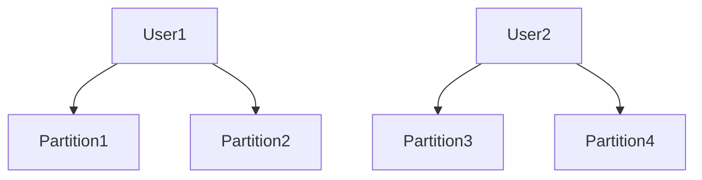

## 介绍

HBase是一个分布式的、面向列的数据库，基于Hadoop和HDFS构建。它非常适合存储大规模数据，并提供高吞吐量和低延迟的访问。在本教程中，我们将探讨如何使用HBase构建一个消息存储系统，用于存储和检索大量的消息数据。

### 为什么选择HBase？

- **高吞吐量**：HBase能够处理大量的读写请求，适合消息系统的高并发场景。
- **低延迟**：HBase提供了快速的随机读写能力，适合实时消息存储。
- **可扩展性**：HBase可以轻松扩展到数百台服务器，支持PB级数据存储。

## HBase 消息存储系统的设计

在设计消息存储系统时，我们需要考虑以下几个关键点：

1. **表结构设计**：如何设计HBase表来存储消息数据。
2. **数据写入**：如何高效地将消息写入HBase。
3. **数据读取**：如何快速地从HBase中检索消息。
4. **数据分区**：如何对数据进行分区以提高查询性能。

### 表结构设计

在HBase中，表是由行键（Row Key）、列族（Column Family）和列限定符（Column Qualifier）组成的。对于消息存储系统，我们可以设计如下表结构：

- **Row Key**：消息的唯一标识符，通常由时间戳和用户ID组合而成。
- **Column Family**：`msg`，用于存储消息内容。
- **Column Qualifier**：`content`，用于存储消息的具体内容。

```java
// 创建HBase表
create 'messages', 'msg'
```

### 数据写入

消息的写入可以通过HBase的Put操作来实现。以下是一个简单的Java示例，展示了如何将消息写入HBase：

```java
import org.apache.hadoop.hbase.client.Connection;
import org.apache.hadoop.hbase.client.ConnectionFactory;
import org.apache.hadoop.hbase.client.Put;
import org.apache.hadoop.hbase.client.Table;
import org.apache.hadoop.hbase.util.Bytes;

public class MessageStorage {
    public static void main(String[] args) throws Exception {
        Connection connection = ConnectionFactory.createConnection();
        Table table = connection.getTable(TableName.valueOf("messages"));

        // 创建Put对象，指定Row Key
        Put put = new Put(Bytes.toBytes("user1_1234567890"));

        // 添加消息内容
        put.addColumn(Bytes.toBytes("msg"), Bytes.toBytes("content"), Bytes.toBytes("Hello, HBase!"));

        // 写入数据
        table.put(put);

        table.close();
        connection.close();
    }
}
```

### 数据读取

消息的读取可以通过HBase的Get操作来实现。以下是一个简单的Java示例，展示了如何从HBase中读取消息：

```java
import org.apache.hadoop.hbase.client.Connection;
import org.apache.hadoop.hbase.client.ConnectionFactory;
import org.apache.hadoop.hbase.client.Get;
import org.apache.hadoop.hbase.client.Result;
import org.apache.hadoop.hbase.client.Table;
import org.apache.hadoop.hbase.util.Bytes;

public class MessageRetrieval {
    public static void main(String[] args) throws Exception {
        Connection connection = ConnectionFactory.createConnection();
        Table table = connection.getTable(TableName.valueOf("messages"));

        // 创建Get对象，指定Row Key
        Get get = new Get(Bytes.toBytes("user1_1234567890"));

        // 读取数据
        Result result = table.get(get);

        // 解析结果
        byte[] content = result.getValue(Bytes.toBytes("msg"), Bytes.toBytes("content"));
        System.out.println("Message: " + Bytes.toString(content));

        table.close();
        connection.close();
    }
}
```

### 数据分区

为了提高查询性能，我们可以对数据进行分区。HBase支持基于Row Key的分区策略。例如，我们可以根据用户ID对消息进行分区：



## 实际案例：即时通讯系统

假设我们正在构建一个即时通讯系统，用户可以在系统中发送和接收消息。我们可以使用HBase作为消息存储系统，存储所有用户的消息记录。

### 场景描述

- **用户A**向**用户B**发送一条消息。
- 消息被存储在HBase中，Row Key为`userA_userB_timestamp`。
- **用户B**登录系统后，从HBase中检索所有发送给他的消息。

### 实现步骤

1. **消息发送**：用户A发送消息时，将消息写入HBase。
2. **消息接收**：用户B登录后，从HBase中检索所有以`userB_`开头的Row Key的消息。

```java
// 消息发送
Put put = new Put(Bytes.toBytes("userA_userB_1234567890"));
put.addColumn(Bytes.toBytes("msg"), Bytes.toBytes("content"), Bytes.toBytes("Hi, userB!"));
table.put(put);

// 消息接收
Scan scan = new Scan();
scan.setRowPrefixFilter(Bytes.toBytes("userB_"));
ResultScanner scanner = table.getScanner(scan);
for (Result result : scanner) {
    byte[] content = result.getValue(Bytes.toBytes("msg"), Bytes.toBytes("content"));
    System.out.println("Message: " + Bytes.toString(content));
}
```

## 总结

在本教程中，我们学习了如何使用HBase构建一个高效的消息存储系统。我们探讨了表结构设计、数据写入、数据读取和数据分区等关键概念，并通过一个即时通讯系统的实际案例展示了HBase在消息存储中的应用。

:::tip
**提示**：在实际应用中，您可能需要考虑更多的优化策略，如数据压缩、缓存和负载均衡等。
:::

## 附加资源

- [HBase官方文档](https://hbase.apache.org/book.html)
- [HBase实战指南](https://www.oreilly.com/library/view/hbase-in-action/9781935182187/)

## 练习

1. 尝试修改表结构，增加更多的列族和列限定符，例如存储消息的发送者和接收者。
2. 实现一个简单的消息检索功能，允许用户根据时间范围检索消息。
3. 探索HBase的分区策略，尝试对数据进行更细粒度的分区。

通过以上练习，您将更深入地理解HBase在消息存储系统中的应用。