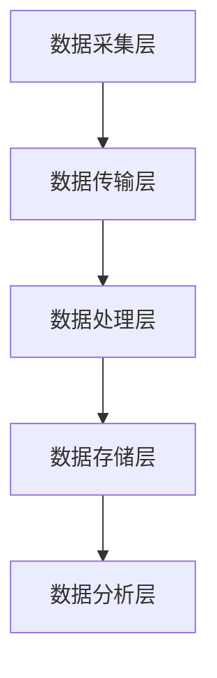

## 介绍

物联网（IoT）正在迅速改变我们的世界，数以亿计的设备每天都在生成海量数据。为了高效地存储、管理和分析这些数据，我们需要一个强大的分布式数据库系统。HBase，作为Hadoop生态系统的一部分，是一个分布式的、面向列的数据库，特别适合处理大规模数据集。本文将带你了解如何使用HBase构建一个物联网数据平台，并通过实际案例展示其应用。

## HBase 与物联网数据平台

### 为什么选择HBase？

HBase具有以下特点，使其成为物联网数据平台的理想选择：

1. **高扩展性**：HBase可以轻松扩展到数百甚至数千台服务器，处理PB级的数据。
2. **高吞吐量**：HBase支持高并发的读写操作，适合实时数据处理。
3. **强一致性**：HBase提供强一致性的数据访问，确保数据的准确性。
4. **灵活的数据模型**：HBase的列族设计允许灵活的数据存储，适合多样化的物联网数据。

### 物联网数据平台架构

一个典型的物联网数据平台通常包括以下几个组件：

1. **数据采集层**：负责从各种物联网设备中收集数据。
2. **数据传输层**：将采集到的数据传输到数据处理层。
3. **数据处理层**：对数据进行清洗、转换和存储。
4. **数据存储层**：使用HBase存储处理后的数据。
5. **数据分析层**：对存储的数据进行分析和可视化。



## HBase 在物联网数据平台中的应用

### 数据模型设计

在物联网场景中，设备数据通常以时间序列的形式存储。我们可以为每个设备创建一个HBase表，其中行键（Row Key）由设备ID和时间戳组成，列族（Column Family）存储设备的不同属性。

例如，假设我们有一个温度传感器设备，其数据模型可以设计如下：

- **表名**：`sensor_data`
- **行键**：`device_id:timestamp`
- **列族**：`cf`
  - **列**：`temperature`, `humidity`, `status`

### 数据插入示例

以下是一个使用Java API向HBase插入数据的示例：

```java
import org.apache.hadoop.hbase.TableName;
import org.apache.hadoop.hbase.client.Connection;
import org.apache.hadoop.hbase.client.ConnectionFactory;
import org.apache.hadoop.hbase.client.Put;
import org.apache.hadoop.hbase.client.Table;
import org.apache.hadoop.hbase.util.Bytes;

public class HBaseIoTExample {
    public static void main(String[] args) throws Exception {
        Connection connection = ConnectionFactory.createConnection();
        Table table = connection.getTable(TableName.valueOf("sensor_data"));

        String deviceId = "sensor_001";
        long timestamp = System.currentTimeMillis();
        String rowKey = deviceId + ":" + timestamp;

        Put put = new Put(Bytes.toBytes(rowKey));
        put.addColumn(Bytes.toBytes("cf"), Bytes.toBytes("temperature"), Bytes.toBytes("25.3"));
        put.addColumn(Bytes.toBytes("cf"), Bytes.toBytes("humidity"), Bytes.toBytes("60.5"));
        put.addColumn(Bytes.toBytes("cf"), Bytes.toBytes("status"), Bytes.toBytes("normal"));

        table.put(put);
        table.close();
        connection.close();
    }
}
```

### 数据查询示例

以下是一个使用Java API从HBase查询数据的示例：

```java
import org.apache.hadoop.hbase.TableName;
import org.apache.hadoop.hbase.client.Connection;
import org.apache.hadoop.hbase.client.ConnectionFactory;
import org.apache.hadoop.hbase.client.Get;
import org.apache.hadoop.hbase.client.Result;
import org.apache.hadoop.hbase.client.Table;
import org.apache.hadoop.hbase.util.Bytes;

public class HBaseIoTQueryExample {
    public static void main(String[] args) throws Exception {
        Connection connection = ConnectionFactory.createConnection();
        Table table = connection.getTable(TableName.valueOf("sensor_data"));

        String deviceId = "sensor_001";
        long timestamp = System.currentTimeMillis();
        String rowKey = deviceId + ":" + timestamp;

        Get get = new Get(Bytes.toBytes(rowKey));
        Result result = table.get(get);

        byte[] temperature = result.getValue(Bytes.toBytes("cf"), Bytes.toBytes("temperature"));
        byte[] humidity = result.getValue(Bytes.toBytes("cf"), Bytes.toBytes("humidity"));
        byte[] status = result.getValue(Bytes.toBytes("cf"), Bytes.toBytes("status"));

        System.out.println("Temperature: " + Bytes.toString(temperature));
        System.out.println("Humidity: " + Bytes.toString(humidity));
        System.out.println("Status: " + Bytes.toString(status));

        table.close();
        connection.close();
    }
}
```

## 实际案例：智能家居数据平台

假设我们正在构建一个智能家居数据平台，该平台需要处理来自各种传感器（如温度传感器、湿度传感器、运动传感器等）的数据。我们可以使用HBase来存储这些数据，并通过HBase的高效查询能力实现实时监控和分析。

### 数据存储

每个传感器的数据将存储在HBase中，行键由传感器ID和时间戳组成，列族存储传感器的各种读数。

### 数据分析

通过HBase的Scan操作，我们可以轻松地查询某个时间段内某个传感器的所有数据，或者查询某个时间点所有传感器的状态。

## 总结

HBase是一个强大的分布式数据库，特别适合处理物联网场景中的海量数据。通过合理的数据模型设计和高效的查询操作，我们可以构建一个高性能的物联网数据平台。希望本文能帮助你理解HBase在物联网中的应用，并为你的项目提供参考。

## 附加资源

- [HBase官方文档](https://hbase.apache.org/)
- [HBase与Hadoop集成指南](https://hadoop.apache.org/docs/current/hadoop-project-dist/hadoop-hbase/HBaseUserGuide.html)
- [物联网数据平台设计模式](https://www.oreilly.com/library/view/designing-the-internet/9781492055318/)

## 练习

1. 尝试在本地HBase环境中创建一个物联网数据表，并插入一些模拟数据。
2. 编写一个查询程序，从HBase中查询某个时间段内某个传感器的所有数据。
3. 探索如何使用HBase的过滤器（Filter）来优化查询性能。

:::tip
在开发过程中，建议使用HBase的Shell工具进行快速测试和调试。
:::