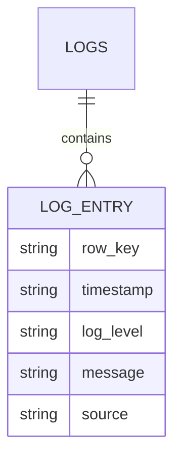

# HBase 日志分析系统

在现代大数据应用中，日志分析是一个非常重要的任务。日志数据通常以高频率生成，并且需要高效地存储和查询。HBase，作为一个分布式的、面向列的数据库，非常适合处理这种大规模的数据存储和实时查询需求。本文将带你逐步了解如何使用HBase构建一个日志分析系统。

## 什么是HBase？

HBase是一个开源的、分布式的、面向列的数据库，它构建在Hadoop文件系统（HDFS）之上。HBase设计用于处理大规模数据集，并提供实时读写访问。它的数据模型类似于Google的Bigtable，支持随机、实时的读/写访问。

## 为什么选择HBase进行日志分析？

日志数据通常具有以下特点：

- **高写入频率**：日志数据通常以高频率生成，需要高效的写入能力。
- **大规模存储**：日志数据量通常非常大，需要能够扩展到PB级别的存储。
- **实时查询**：在某些场景下，需要实时查询日志数据以进行监控或故障排查。

HBase的分布式架构和高效的写入能力使其成为处理日志数据的理想选择。

## 构建HBase日志分析系统的步骤

### 1. 设计表结构

在HBase中，数据存储在表中，表由行和列组成。为了存储日志数据，我们需要设计一个合适的表结构。

假设我们的日志数据包含以下字段：

- `timestamp`：日志生成的时间戳
- `log_level`：日志级别（如INFO, ERROR, WARN等）
- `message`：日志消息
- `source`：日志来源（如服务器名称）

我们可以设计一个表结构如下：



在HBase中，`row_key`是行的唯一标识符。我们可以将`timestamp`和`source`组合作为`row_key`，以确保唯一性。

### 2. 创建HBase表

使用HBase Shell或HBase API创建表。以下是一个使用HBase Shell创建表的示例：

```bash
create 'logs', 'cf'
```

这里，`logs`是表名，`cf`是列族名。

### 3. 插入日志数据

接下来，我们需要将日志数据插入到HBase表中。以下是一个使用Java API插入数据的示例：

```java
import org.apache.hadoop.hbase.TableName;
import org.apache.hadoop.hbase.client.Connection;
import org.apache.hadoop.hbase.client.ConnectionFactory;
import org.apache.hadoop.hbase.client.Put;
import org.apache.hadoop.hbase.client.Table;
import org.apache.hadoop.hbase.util.Bytes;

public class LogIngestor {
    public static void main(String[] args) throws IOException {
        Connection connection = ConnectionFactory.createConnection();
        Table table = connection.getTable(TableName.valueOf("logs"));

        String rowKey = "20231010120000_server1";
        Put put = new Put(Bytes.toBytes(rowKey));
        put.addColumn(Bytes.toBytes("cf"), Bytes.toBytes("timestamp"), Bytes.toBytes("2023-10-10 12:00:00"));
        put.addColumn(Bytes.toBytes("cf"), Bytes.toBytes("log_level"), Bytes.toBytes("INFO"));
        put.addColumn(Bytes.toBytes("cf"), Bytes.toBytes("message"), Bytes.toBytes("System started"));
        put.addColumn(Bytes.toBytes("cf"), Bytes.toBytes("source"), Bytes.toBytes("server1"));

        table.put(put);
        table.close();
        connection.close();
    }
}
```

### 4. 查询日志数据

HBase支持多种查询方式，包括按行键查询、扫描表等。以下是一个使用Java API查询日志数据的示例：

```java
import org.apache.hadoop.hbase.TableName;
import org.apache.hadoop.hbase.client.Connection;
import org.apache.hadoop.hbase.client.ConnectionFactory;
import org.apache.hadoop.hbase.client.Get;
import org.apache.hadoop.hbase.client.Result;
import org.apache.hadoop.hbase.client.Table;
import org.apache.hadoop.hbase.util.Bytes;

public class LogQuery {
    public static void main(String[] args) throws IOException {
        Connection connection = ConnectionFactory.createConnection();
        Table table = connection.getTable(TableName.valueOf("logs"));

        String rowKey = "20231010120000_server1";
        Get get = new Get(Bytes.toBytes(rowKey));
        Result result = table.get(get);

        byte[] timestamp = result.getValue(Bytes.toBytes("cf"), Bytes.toBytes("timestamp"));
        byte[] logLevel = result.getValue(Bytes.toBytes("cf"), Bytes.toBytes("log_level"));
        byte[] message = result.getValue(Bytes.toBytes("cf"), Bytes.toBytes("message"));
        byte[] source = result.getValue(Bytes.toBytes("cf"), Bytes.toBytes("source"));

        System.out.println("Timestamp: " + Bytes.toString(timestamp));
        System.out.println("Log Level: " + Bytes.toString(logLevel));
        System.out.println("Message: " + Bytes.toString(message));
        System.out.println("Source: " + Bytes.toString(source));

        table.close();
        connection.close();
    }
}
```

### 5. 实际应用场景

假设我们有一个分布式系统，每天生成数百万条日志。我们需要实时监控系统状态，并在出现错误时快速定位问题。使用HBase存储日志数据，我们可以：

- **实时写入**：将日志数据实时写入HBase，确保数据不丢失。
- **快速查询**：通过`row_key`快速查询特定时间段的日志，或按日志级别过滤日志。
- **扩展性**：随着日志量的增加，可以通过增加HBase集群节点来扩展存储和查询能力。

## 总结

通过本文，我们了解了如何使用HBase构建一个高效的日志分析系统。我们从设计表结构、创建表、插入数据到查询数据，逐步讲解了HBase在日志分析中的应用。HBase的分布式架构和高效的写入能力使其成为处理大规模日志数据的理想选择。

## 附加资源与练习

- **练习1**：尝试在HBase中创建一个包含更多字段的日志表，并插入一些示例数据。
- **练习2**：编写一个程序，按日志级别（如ERROR）查询HBase中的日志数据。
- **附加资源**：
  - [HBase官方文档](https://hbase.apache.org/book.html)
  - [HBase Java API文档](https://hbase.apache.org/apidocs/org/apache/hadoop/hbase/client/package-summary.html)

:::tip
如果你在练习中遇到问题，可以参考HBase官方文档或社区论坛，获取更多帮助。
:::