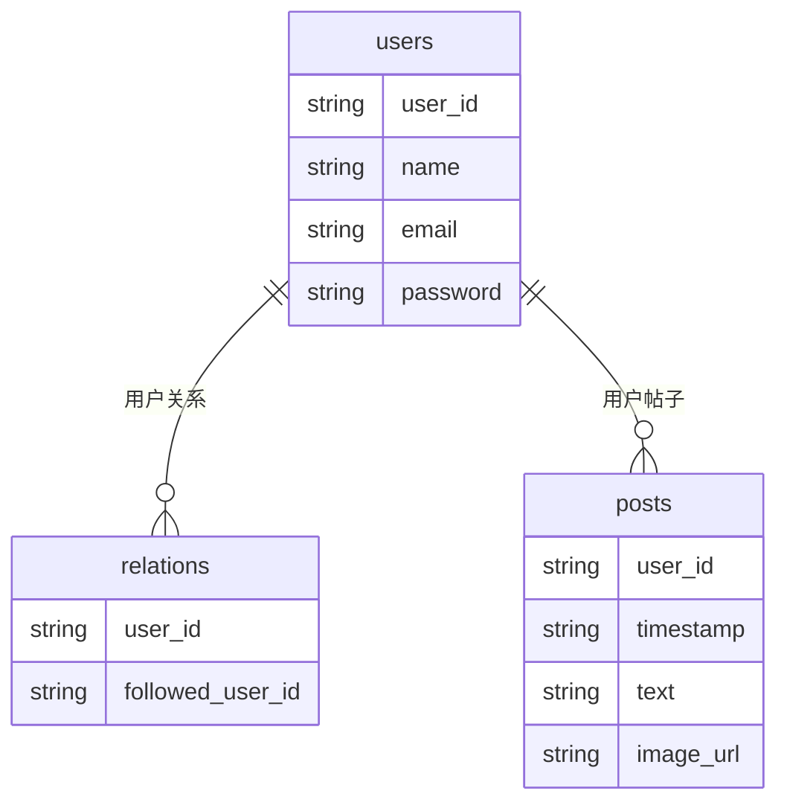

# HBase 社交网络应用

在现代社交网络中，数据量庞大且需要高效存储和查询。HBase作为一个分布式、面向列的数据库，非常适合处理这种场景。本文将逐步介绍如何使用HBase构建一个简单的社交网络应用，涵盖用户关系、帖子存储和实时数据查询。

## 介绍

HBase是一个基于Hadoop的分布式数据库，专为处理大规模数据集而设计。它的列式存储模型和分布式架构使其非常适合存储和查询社交网络中的用户数据、帖子内容和关系网络。

在本教程中，我们将构建一个简单的社交网络应用，包括以下功能：
- 用户注册和登录
- 用户关系（关注/被关注）
- 帖子发布和存储
- 实时数据查询（如查看某用户的帖子）

## 数据模型设计

在HBase中，数据以表的形式存储，表由行和列族组成。我们将设计以下表结构：

1. **用户表（users）**：
   - 行键：用户ID
   - 列族：info（存储用户基本信息）
     - 列：name, email, password

2. **关系表（relations）**：
   - 行键：用户ID
   - 列族：follows（存储用户关注的其他用户）
     - 列：followed_user_id（列名为被关注用户的ID，值为空）

3. **帖子表（posts）**：
   - 行键：用户ID + 时间戳
   - 列族：content（存储帖子内容）
     - 列：text, image_url



## 实现步骤

### 1. 创建HBase表

首先，我们需要在HBase中创建上述表。可以使用HBase Shell或Java API来创建表。

```bash
# 创建用户表
create 'users', 'info'

# 创建关系表
create 'relations', 'follows'

# 创建帖子表
create 'posts', 'content'
```

### 2. 用户注册

用户注册时，我们将用户信息存储在`users`表中。

```java
// Java示例代码
Put put = new Put(Bytes.toBytes("user1"));
put.addColumn(Bytes.toBytes("info"), Bytes.toBytes("name"), Bytes.toBytes("Alice"));
put.addColumn(Bytes.toBytes("info"), Bytes.toBytes("email"), Bytes.toBytes("alice@example.com"));
put.addColumn(Bytes.toBytes("info"), Bytes.toBytes("password"), Bytes.toBytes("password123"));
usersTable.put(put);
```

### 3. 用户关系管理

当用户A关注用户B时，我们在`relations`表中添加一条记录。

```java
Put put = new Put(Bytes.toBytes("userA"));
put.addColumn(Bytes.toBytes("follows"), Bytes.toBytes("userB"), Bytes.toBytes(""));
relationsTable.put(put);
```

### 4. 发布帖子

用户发布帖子时，我们将帖子内容存储在`posts`表中。

```java
long timestamp = System.currentTimeMillis();
Put put = new Put(Bytes.toBytes("user1" + timestamp));
put.addColumn(Bytes.toBytes("content"), Bytes.toBytes("text"), Bytes.toBytes("Hello, HBase!"));
put.addColumn(Bytes.toBytes("content"), Bytes.toBytes("image_url"), Bytes.toBytes("http://example.com/image.jpg"));
postsTable.put(put);
```

### 5. 查询用户帖子

要查询某个用户的所有帖子，我们可以使用`Scan`操作。

```java
Scan scan = new Scan();
scan.setStartRow(Bytes.toBytes("user1"));
scan.setStopRow(Bytes.toBytes("user1" + Long.MAX_VALUE));
ResultScanner scanner = postsTable.getScanner(scan);
for (Result result : scanner) {
    System.out.println(Bytes.toString(result.getValue(Bytes.toBytes("content"), Bytes.toBytes("text"))));
}
```

## 实际应用场景

假设我们正在构建一个类似Twitter的社交网络应用。用户可以在平台上发布短消息（帖子），并关注其他用户。使用HBase，我们可以高效地存储和查询这些数据。

例如，当用户A发布一条帖子时，该帖子会被存储在`posts`表中。当用户B查看用户A的帖子时，我们可以通过`Scan`操作快速检索出用户A的所有帖子。

## 总结

通过本教程，我们学习了如何使用HBase构建一个简单的社交网络应用。我们设计了数据模型，实现了用户注册、关系管理和帖子发布功能，并展示了如何查询用户帖子。

HBase的分布式架构和列式存储模型使其非常适合处理大规模社交网络数据。通过合理设计表结构和行键，我们可以实现高效的数据存储和查询。

## 附加资源

- [HBase官方文档](https://hbase.apache.org/)
- [HBase Java API文档](https://hbase.apache.org/apidocs/index.html)
- [HBase实战案例](https://example.com/hbase-cases)

## 练习

1. 扩展用户表，添加更多用户信息（如年龄、性别等）。
2. 实现用户取消关注功能。
3. 优化帖子查询，按时间倒序排列。

:::tip
在实际应用中，HBase的性能调优和表设计非常重要。建议深入学习HBase的架构和最佳实践。
:::