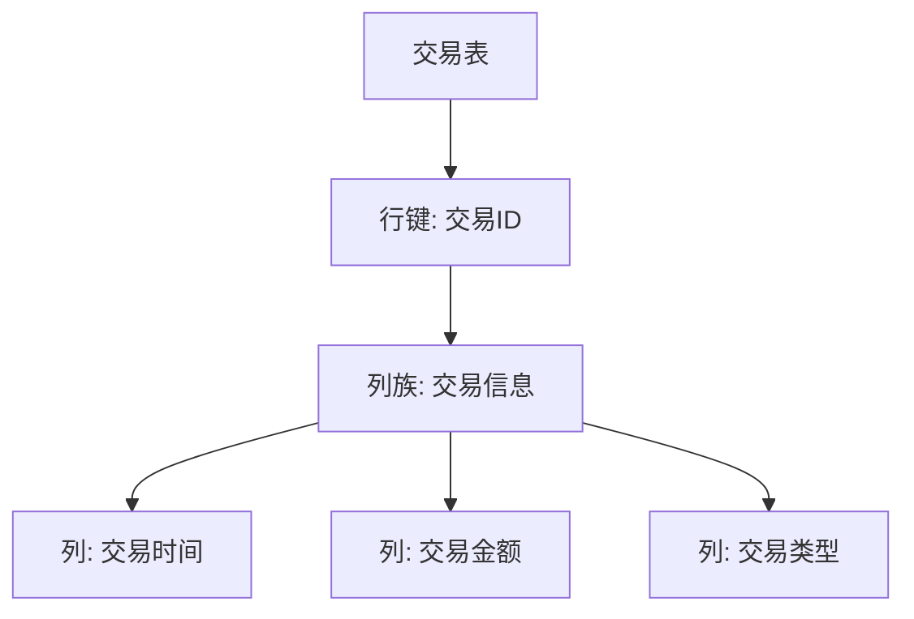

# HBase 金融交易系统

在现代金融系统中，高效的数据存储和查询是至关重要的。HBase作为一个分布式、面向列的数据库，非常适合处理金融交易系统中的大量数据。本文将逐步介绍如何使用HBase构建一个金融交易系统，并通过实际案例展示其应用。

## 1. 什么是HBase？

HBase是一个开源的、分布式的、面向列的数据库，基于Google的Bigtable设计。它运行在Hadoop分布式文件系统（HDFS）之上，能够处理海量数据，并提供高吞吐量和低延迟的读写操作。

## 2. 为什么选择HBase？

金融交易系统通常需要处理大量的实时交易数据，并且要求高可用性和低延迟。HBase的分布式架构和列存储特性使其成为处理这类数据的理想选择。

## 3. HBase在金融交易系统中的应用

### 3.1 数据模型设计

在金融交易系统中，数据通常以交易记录的形式存储。我们可以将交易记录存储在HBase的表中，每一行代表一个交易，列族（Column Family）可以包含交易的不同属性，如交易时间、交易金额、交易类型等。



### 3.2 创建HBase表

首先，我们需要在HBase中创建一个表来存储交易数据。以下是一个创建表的示例代码：

```java
import org.apache.hadoop.hbase.HBaseConfiguration;
import org.apache.hadoop.hbase.TableName;
import org.apache.hadoop.hbase.client.Admin;
import org.apache.hadoop.hbase.client.Connection;
import org.apache.hadoop.hbase.client.ConnectionFactory;
import org.apache.hadoop.hbase.client.TableDescriptor;
import org.apache.hadoop.hbase.client.TableDescriptorBuilder;
import org.apache.hadoop.hbase.client.ColumnFamilyDescriptor;
import org.apache.hadoop.hbase.client.ColumnFamilyDescriptorBuilder;

public class CreateTable {
    public static void main(String[] args) throws Exception {
        org.apache.hadoop.conf.Configuration config = HBaseConfiguration.create();
        try (Connection connection = ConnectionFactory.createConnection(config);
             Admin admin = connection.getAdmin()) {
            TableName tableName = TableName.valueOf("transactions");
            TableDescriptor tableDescriptor = TableDescriptorBuilder.newBuilder(tableName)
                    .setColumnFamily(ColumnFamilyDescriptorBuilder.newBuilder("cf".getBytes()).build())
                    .build();
            admin.createTable(tableDescriptor);
            System.out.println("Table created successfully.");
        }
    }
}
```

### 3.3 插入交易数据

接下来，我们可以向表中插入交易数据。以下是一个插入数据的示例代码：

```java
import org.apache.hadoop.hbase.HBaseConfiguration;
import org.apache.hadoop.hbase.TableName;
import org.apache.hadoop.hbase.client.Connection;
import org.apache.hadoop.hbase.client.ConnectionFactory;
import org.apache.hadoop.hbase.client.Put;
import org.apache.hadoop.hbase.client.Table;
import org.apache.hadoop.hbase.util.Bytes;

public class InsertData {
    public static void main(String[] args) throws Exception {
        org.apache.hadoop.conf.Configuration config = HBaseConfiguration.create();
        try (Connection connection = ConnectionFactory.createConnection(config);
             Table table = connection.getTable(TableName.valueOf("transactions"))) {
            Put put = new Put(Bytes.toBytes("transaction1"));
            put.addColumn(Bytes.toBytes("cf"), Bytes.toBytes("time"), Bytes.toBytes("2023-10-01 12:00:00"));
            put.addColumn(Bytes.toBytes("cf"), Bytes.toBytes("amount"), Bytes.toBytes("100.00"));
            put.addColumn(Bytes.toBytes("cf"), Bytes.toBytes("type"), Bytes.toBytes("buy"));
            table.put(put);
            System.out.println("Data inserted successfully.");
        }
    }
}
```

### 3.4 查询交易数据

我们可以通过行键查询特定的交易数据。以下是一个查询数据的示例代码：

```java
import org.apache.hadoop.hbase.HBaseConfiguration;
import org.apache.hadoop.hbase.TableName;
import org.apache.hadoop.hbase.client.Connection;
import org.apache.hadoop.hbase.client.ConnectionFactory;
import org.apache.hadoop.hbase.client.Get;
import org.apache.hadoop.hbase.client.Result;
import org.apache.hadoop.hbase.client.Table;
import org.apache.hadoop.hbase.util.Bytes;

public class GetData {
    public static void main(String[] args) throws Exception {
        org.apache.hadoop.conf.Configuration config = HBaseConfiguration.create();
        try (Connection connection = ConnectionFactory.createConnection(config);
             Table table = connection.getTable(TableName.valueOf("transactions"))) {
            Get get = new Get(Bytes.toBytes("transaction1"));
            Result result = table.get(get);
            byte[] time = result.getValue(Bytes.toBytes("cf"), Bytes.toBytes("time"));
            byte[] amount = result.getValue(Bytes.toBytes("cf"), Bytes.toBytes("amount"));
            byte[] type = result.getValue(Bytes.toBytes("cf"), Bytes.toBytes("type"));
            System.out.println("Time: " + Bytes.toString(time));
            System.out.println("Amount: " + Bytes.toString(amount));
            System.out.println("Type: " + Bytes.toString(type));
        }
    }
}
```

## 4. 实际案例

假设我们有一个金融交易系统，每天处理数百万笔交易。使用HBase，我们可以轻松地存储和查询这些交易数据。例如，我们可以通过交易ID快速查找某笔交易的详细信息，或者通过时间范围查询某段时间内的所有交易。

:::tip
在实际应用中，为了提高查询效率，我们可以使用HBase的二级索引或协处理器来优化查询性能。
:::

## 5. 总结

HBase是一个强大的分布式数据库，非常适合处理金融交易系统中的大量数据。通过合理的数据模型设计和优化，我们可以构建一个高效、可靠的金融交易系统。

## 6. 附加资源

- [HBase官方文档](https://hbase.apache.org/)
- [HBase实战指南](https://www.oreilly.com/library/view/hbase-the-definitive/9781449314682/)
- [HBase性能优化](https://hbase.apache.org/book.html#performance)

## 7. 练习

1. 尝试在HBase中创建一个新的表，并插入一些交易数据。
2. 编写一个查询程序，通过交易ID查询交易数据。
3. 研究HBase的二级索引，并尝试在交易表中实现一个二级索引。

通过以上步骤，你将能够掌握如何使用HBase构建一个高效的金融交易系统。祝你学习愉快！