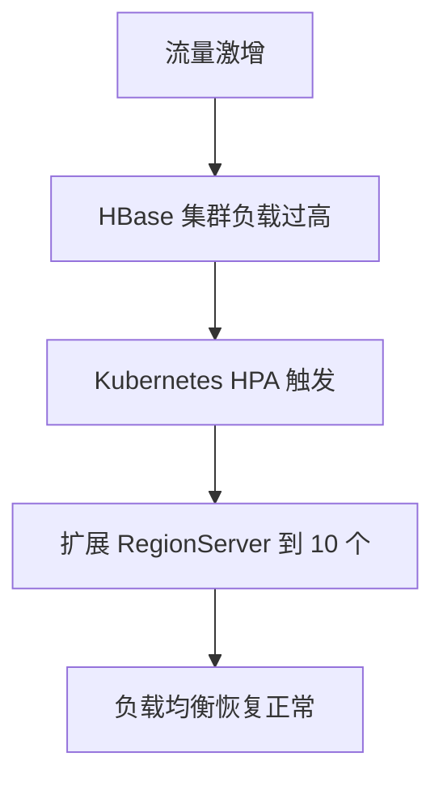

## 介绍

HBase 是一个分布式的、面向列的数据库，基于 Hadoop 和 HDFS 构建，适用于海量数据的存储和实时访问。随着云原生技术的兴起，HBase 也逐渐与云原生生态融合，利用容器化、微服务、Kubernetes 等技术，进一步提升其弹性、可扩展性和管理效率。

云原生技术旨在通过容器化、动态编排、微服务架构和 DevOps 实践，帮助应用程序更好地运行在云环境中。HBase 与云原生技术的结合，不仅能够简化部署和管理，还能更好地应对现代数据密集型应用的需求。

---

## HBase 与云原生技术的结合

### 1. 容器化 HBase

容器化是云原生的核心之一。通过将 HBase 打包到容器中，可以简化部署流程，并确保环境一致性。Docker 是常用的容器化工具，以下是一个简单的 Dockerfile 示例，用于构建 HBase 镜像：

```dockerfile
FROM openjdk:8-jdk
ENV HBASE_VERSION 2.4.9
RUN wget https://downloads.apache.org/hbase/$HBASE_VERSION/hbase-$HBASE_VERSION-bin.tar.gz && \
    tar -xzf hbase-$HBASE_VERSION-bin.tar.gz && \
    mv hbase-$HBASE_VERSION /hbase
WORKDIR /hbase
CMD ["./bin/start-hbase.sh"]
```

:::tip
容器化后，HBase 可以更容易地在不同的云环境中部署，例如 AWS、GCP 或 Azure。
:::

### 2. 使用 Kubernetes 管理 HBase

Kubernetes 是云原生生态中的核心编排工具。通过 Kubernetes，可以轻松管理 HBase 集群的扩展、故障恢复和资源调度。以下是一个简单的 Kubernetes Deployment 示例，用于部署 HBase Master 节点：

```yaml
apiVersion: apps/v1
kind: Deployment
metadata:
  name: hbase-master
spec:
  replicas: 1
  selector:
    matchLabels:
      app: hbase-master
  template:
    metadata:
      labels:
        app: hbase-master
    spec:
      containers:
      - name: hbase-master
        image: my-hbase-image:latest
        ports:
        - containerPort: 16000
```

:::note
Kubernetes 的 StatefulSet 更适合管理 HBase RegionServer，因为它可以确保 Pod 的持久化存储和稳定的网络标识。
:::

### 3. 动态扩展与弹性

云原生技术的一个关键优势是动态扩展能力。HBase 可以通过 Kubernetes 的 Horizontal Pod Autoscaler (HPA) 实现自动扩展。以下是一个 HPA 配置示例：

```yaml
apiVersion: autoscaling/v2beta2
kind: HorizontalPodAutoscaler
metadata:
  name: hbase-regionserver
spec:
  scaleTargetRef:
    apiVersion: apps/v1
    kind: Deployment
    name: hbase-regionserver
  minReplicas: 3
  maxReplicas: 10
  metrics:
  - type: Resource
    resource:
      name: cpu
      target:
        type: Utilization
        averageUtilization: 80
```

:::caution
在配置 HPA 时，需要确保 HBase 集群的 RegionServer 能够快速启动并加入集群，以避免数据访问中断。
:::

---

## 实际案例

### 案例：HBase 在 Kubernetes 上的弹性扩展

某电商平台使用 HBase 存储用户行为数据。在促销活动期间，流量激增，导致 HBase 集群负载过高。通过 Kubernetes 的 HPA 功能，平台自动扩展了 HBase RegionServer 的数量，从 3 个扩展到 10 个，成功应对了流量高峰。



---

## 总结

HBase 与云原生技术的结合，为分布式数据库的管理和扩展提供了新的可能性。通过容器化、Kubernetes 编排和动态扩展，HBase 能够更好地适应现代云环境的需求，提升系统的弹性和可靠性。

---

## 附加资源与练习

### 资源
- [HBase 官方文档](https://hbase.apache.org/)
- [Kubernetes 官方文档](https://kubernetes.io/docs/home/)
- [Docker 官方文档](https://docs.docker.com/)

### 练习
1. 使用 Docker 构建一个 HBase 镜像，并在本地运行。
2. 在 Kubernetes 上部署一个简单的 HBase 集群，包含 Master 和 RegionServer。
3. 配置 Kubernetes HPA，模拟流量激增场景，观察 HBase 集群的扩展行为。