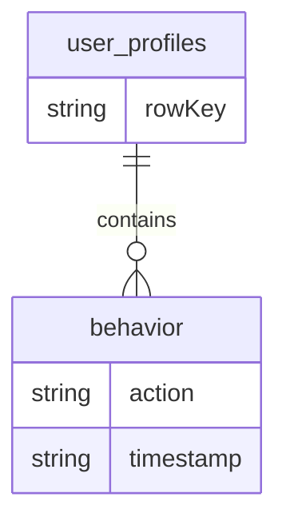

## 介绍

在现代分布式系统中，微服务架构已经成为一种流行的设计模式。它将应用程序拆分为多个小型、独立的服务，每个服务负责特定的功能。这种架构模式带来了许多优势，例如更好的可扩展性、灵活性和容错性。然而，微服务架构也带来了数据管理的挑战，尤其是在需要处理大量数据时。

HBase 是一个分布式的、面向列的数据库，基于 Google 的 Bigtable 设计，专为处理大规模数据集而设计。它非常适合与微服务架构结合使用，尤其是在需要高吞吐量和低延迟的场景中。本文将探讨 HBase 如何与微服务架构结合，并提供实际应用案例和代码示例。

## HBase 与微服务架构的结合

### 1. 微服务架构中的数据管理挑战

在微服务架构中，每个服务通常都有自己的数据库，这有助于实现服务的独立性。然而，当多个服务需要访问相同的数据时，数据一致性和性能问题可能会变得复杂。HBase 作为一个分布式数据库，可以帮助解决这些问题。

### 2. HBase 的优势

- **高吞吐量**：HBase 能够处理大量的读写请求，适合高并发的微服务场景。
- **低延迟**：HBase 的设计使其能够在毫秒级别响应查询请求。
- **可扩展性**：HBase 可以轻松扩展到数百甚至数千台服务器，适合大规模分布式系统。
- **强一致性**：HBase 提供了强一致性的数据模型，确保数据的一致性和可靠性。

### 3. HBase 在微服务架构中的应用场景

HBase 可以用于以下微服务场景：

- **用户画像系统**：存储和分析用户行为数据，支持个性化推荐。
- **日志存储与分析**：集中存储微服务产生的日志数据，便于后续分析。
- **实时数据处理**：作为实时数据流的存储后端，支持实时分析和查询。

## 代码示例：HBase 与微服务的集成

以下是一个简单的示例，展示如何在微服务中使用 HBase 存储和查询数据。

### 1. 安装 HBase 客户端库

首先，确保你的微服务项目中包含了 HBase 的 Java 客户端库。你可以通过 Maven 添加依赖：

```xml
<dependency>
    <groupId>org.apache.hbase</groupId>
    <artifactId>hbase-client</artifactId>
    <version>2.4.9</version>
</dependency>
```

### 2. 连接到 HBase

在微服务中，首先需要建立与 HBase 的连接：

```java
import org.apache.hadoop.conf.Configuration;
import org.apache.hadoop.hbase.HBaseConfiguration;
import org.apache.hadoop.hbase.client.Connection;
import org.apache.hadoop.hbase.client.ConnectionFactory;

public class HBaseClient {
    private static Connection connection;

    public static Connection getConnection() throws IOException {
        if (connection == null) {
            Configuration config = HBaseConfiguration.create();
            config.set("hbase.zookeeper.quorum", "localhost");
            config.set("hbase.zookeeper.property.clientPort", "2181");
            connection = ConnectionFactory.createConnection(config);
        }
        return connection;
    }
}
```

### 3. 插入数据

接下来，我们可以编写一个方法，将数据插入到 HBase 表中：

```java
import org.apache.hadoop.hbase.TableName;
import org.apache.hadoop.hbase.client.Put;
import org.apache.hadoop.hbase.client.Table;
import org.apache.hadoop.hbase.util.Bytes;

public class HBaseService {
    public void insertData(String tableName, String rowKey, String columnFamily, String column, String value) throws IOException {
        Table table = HBaseClient.getConnection().getTable(TableName.valueOf(tableName));
        Put put = new Put(Bytes.toBytes(rowKey));
        put.addColumn(Bytes.toBytes(columnFamily), Bytes.toBytes(column), Bytes.toBytes(value));
        table.put(put);
        table.close();
    }
}
```

### 4. 查询数据

最后，我们可以编写一个方法，从 HBase 表中查询数据：

```java
import org.apache.hadoop.hbase.client.Get;
import org.apache.hadoop.hbase.client.Result;
import org.apache.hadoop.hbase.client.Table;

public class HBaseService {
    public String getData(String tableName, String rowKey, String columnFamily, String column) throws IOException {
        Table table = HBaseClient.getConnection().getTable(TableName.valueOf(tableName));
        Get get = new Get(Bytes.toBytes(rowKey));
        Result result = table.get(get);
        byte[] value = result.getValue(Bytes.toBytes(columnFamily), Bytes.toBytes(column));
        table.close();
        return Bytes.toString(value);
    }
}
```

## 实际案例：用户画像系统

假设我们正在构建一个用户画像系统，该系统需要存储和分析用户的行为数据。我们可以使用 HBase 作为数据存储后端，每个微服务负责处理不同的用户行为数据。

### 1. 数据模型设计

我们可以在 HBase 中设计一个表 `user_profiles`，其中每一行代表一个用户，列族 `behavior` 存储用户的行为数据。



### 2. 数据插入与查询

当用户执行某个行为时，微服务会将行为数据插入到 HBase 中：

```java
HBaseService service = new HBaseService();
service.insertData("user_profiles", "user123", "behavior", "action", "click");
service.insertData("user_profiles", "user123", "behavior", "timestamp", "2023-10-01T12:00:00Z");
```

当需要查询用户的行为数据时，微服务可以从 HBase 中获取数据：

```java
String action = service.getData("user_profiles", "user123", "behavior", "action");
System.out.println("User action: " + action);
```

## 总结

HBase 是一个强大的分布式数据库，非常适合与微服务架构结合使用。它能够处理大规模数据集，并提供高吞吐量和低延迟的访问。通过将 HBase 集成到微服务中，可以有效地解决数据管理和性能问题。

## 附加资源与练习

- **练习**：尝试在你的微服务项目中集成 HBase，并实现一个简单的数据存储和查询功能。
- **资源**：
  - [HBase 官方文档](https://hbase.apache.org/)
  - [微服务架构设计模式](https://microservices.io/)

:::tip
如果你在集成过程中遇到问题，可以参考 HBase 的官方文档或社区论坛，获取更多帮助。
:::