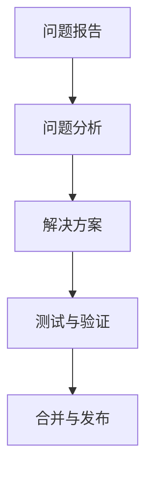

## 介绍

HBase是一个分布式的、面向列的数据库，它是基于Google的Bigtable论文设计的，并且是Apache Hadoop生态系统的一部分。HBase社区由全球的开发者和用户组成，他们共同推动HBase的发展，确保其能够满足现代大数据应用的需求。

## HBase 社区的主要活动

HBase社区的活动主要集中在以下几个方面：

1. **版本发布**：社区定期发布新版本，每个版本都包含新特性、性能改进和bug修复。
2. **贡献者活动**：社区成员通过提交代码、参与讨论和审查代码来贡献自己的力量。
3. **社区驱动的项目**：社区成员可以发起和参与各种项目，这些项目旨在扩展HBase的功能或改进其性能。

## 版本更新

HBase的版本更新通常包括以下几个步骤：

1. **需求收集**：社区成员提出新特性或改进的需求。
2. **设计与实现**：开发者根据需求设计并实现新特性。
3. **测试与审查**：新特性经过严格的测试和代码审查，确保其稳定性和性能。
4. **发布**：新版本发布后，社区成员可以下载并使用。

:::note
HBase的版本号遵循语义化版本控制（Semantic Versioning），即主版本号.次版本号.修订号。例如，`2.4.0`表示主版本号为2，次版本号为4，修订号为0。
:::

## 贡献者活动

HBase社区鼓励所有成员积极参与贡献。贡献的方式包括：

- **提交代码**：通过GitHub提交Pull Request。
- **参与讨论**：在邮件列表或论坛中讨论问题和解决方案。
- **审查代码**：帮助审查其他贡献者的代码。

:::tip
如果你是HBase的新手，可以从解决简单的bug或文档改进开始贡献。
:::

## 社区驱动的项目

HBase社区驱动的项目通常由社区成员发起，旨在解决特定的问题或扩展HBase的功能。这些项目可能包括：

- **性能优化**：通过改进算法或数据结构来提高HBase的性能。
- **新特性开发**：添加新的功能，如新的API或存储格式。
- **工具开发**：开发辅助工具，如监控工具或迁移工具。

## 实际案例

以下是一个实际案例，展示了HBase社区如何通过协作解决一个性能问题：

1. **问题报告**：用户报告在特定场景下HBase的性能下降。
2. **问题分析**：社区成员分析问题，发现是由于某个算法的时间复杂度较高。
3. **解决方案**：开发者提出并实现了一个新的算法，显著降低了时间复杂度。
4. **测试与验证**：新算法经过测试，验证了其有效性。
5. **合并与发布**：新算法被合并到主分支，并在下一个版本中发布。

## 总结

HBase社区是一个活跃的、开放的社区，它通过版本更新、贡献者活动和社区驱动的项目不断推动HBase的发展。无论你是开发者还是用户，都可以通过参与社区活动来贡献自己的力量，并从中受益。

## 附加资源

- [HBase官方文档](https://hbase.apache.org/)
- [HBase GitHub仓库](https://github.com/apache/hbase)
- [HBase邮件列表](https://hbase.apache.org/mail-lists.html)

## 练习

1. 访问HBase的GitHub仓库，尝试解决一个简单的bug。
2. 加入HBase的邮件列表，参与一次讨论。
3. 阅读HBase的官方文档，了解其最新版本的新特性。
