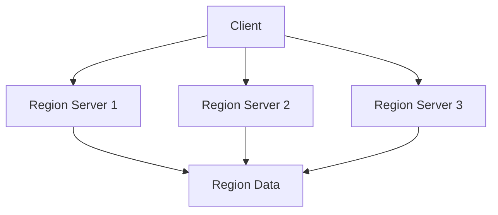

# HBase 新特性预览

HBase是一个分布式的、面向列的数据库，基于Google的Bigtable设计。它被广泛应用于大数据存储和实时查询场景。随着技术的不断发展，HBase也在不断演进，引入了许多新特性以提升性能、扩展性和易用性。本文将带你预览HBase的最新特性，并探讨它们在实际应用中的价值。

## 1. 介绍

HBase的最新版本引入了一些令人兴奋的新特性，这些特性不仅提升了数据库的性能，还简化了开发者的工作流程。无论你是HBase的新手还是经验丰富的开发者，了解这些新特性都将帮助你更好地利用HBase的强大功能。

## 2. 新特性概览

### 2.1 异步客户端

HBase 2.0引入了异步客户端API，允许开发者以非阻塞的方式与HBase进行交互。这对于需要高并发、低延迟的应用场景非常有用。

```java
// 示例：使用异步客户端查询数据
AsyncConnection connection = ConnectionFactory.createAsyncConnection(conf).get();
AsyncTable<AdvancedScanResultConsumer> table = connection.getTable(TableName.valueOf("my_table"));
Get get = new Get(Bytes.toBytes("row1"));
table.get(get).thenAccept(result -> {
    System.out.println("Result: " + result);
});
```

### 2.2 区域复制

区域复制（Region Replication）是HBase 2.0引入的一项重要特性，它允许在多个区域服务器上复制同一区域的数据。这提高了数据的可用性和读取性能。



### 2.3 时间序列数据支持

HBase 2.0增强了对时间序列数据的支持，通过引入新的压缩算法和存储格式，显著提升了时间序列数据的存储和查询效率。

```java
// 示例：存储时间序列数据
Put put = new Put(Bytes.toBytes("row1"));
put.addColumn(Bytes.toBytes("cf"), Bytes.toBytes("timestamp"), Bytes.toBytes(System.currentTimeMillis()));
table.put(put);
```

## 3. 实际应用案例

### 3.1 实时日志分析

在一个实时日志分析系统中，HBase的异步客户端和区域复制特性可以显著提升系统的吞吐量和响应速度。通过异步客户端，系统可以同时处理多个查询请求，而区域复制则确保了数据的高可用性。

### 3.2 物联网数据存储

在物联网应用中，大量的时间序列数据需要被高效地存储和查询。HBase的时间序列数据支持特性使得它成为存储传感器数据的理想选择。

## 4. 总结

HBase的最新特性为开发者提供了更多的工具和选项，以应对日益复杂的数据存储和查询需求。无论是异步客户端、区域复制还是时间序列数据支持，这些新特性都极大地提升了HBase的性能和可用性。

## 5. 附加资源与练习

- **官方文档**: 阅读HBase的[官方文档](https://hbase.apache.org/)以获取更多详细信息。
- **练习**: 尝试在你的本地环境中配置HBase，并使用异步客户端API进行数据查询。

:::tip
提示：在实际项目中应用这些新特性时，务必进行充分的测试，以确保系统的稳定性和性能。
:::

:::caution
注意：虽然新特性带来了许多优势，但在升级到最新版本时，请确保你的应用程序与新版HBase兼容。
:::