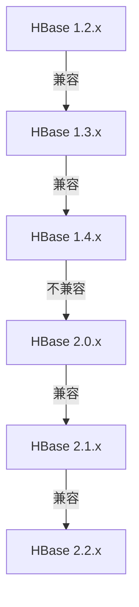

## 介绍

HBase 是一个分布式的、面向列的数据库，广泛应用于大数据领域。随着 HBase 的不断发展，其版本也在不断更新。为了确保系统的稳定性和兼容性，了解 HBase 的版本兼容性矩阵至关重要。本文将详细介绍 HBase 的兼容性矩阵，帮助初学者理解如何在不同版本之间进行迁移和升级。

## 什么是 HBase 兼容性矩阵？

HBase 兼容性矩阵是一个表格，展示了不同 HBase 版本之间的兼容性。它帮助用户了解哪些版本可以无缝升级，哪些版本需要进行特定的迁移步骤。兼容性矩阵通常包括以下几个方面：

- **客户端与服务器兼容性**：客户端库与 HBase 服务器之间的兼容性。
- **HDFS 兼容性**：HBase 与底层 HDFS 存储系统的兼容性。
- **ZooKeeper 兼容性**：HBase 与 ZooKeeper 协调服务之间的兼容性。

## HBase 兼容性矩阵示例

以下是一个简化的 HBase 兼容性矩阵示例：

:::note
注意：实际兼容性矩阵可能更为复杂，具体取决于 HBase 的版本和配置。
:::

## 实际案例

### 案例 1：从 HBase 1.4.x 升级到 HBase 2.0.x

假设你当前使用的是 HBase 1.4.x，并且计划升级到 HBase 2.0.x。根据兼容性矩阵，这两个版本之间不兼容，因此需要进行以下步骤：

1. **备份数据**：在进行任何升级之前，务必备份所有数据。
2. **停止 HBase 服务**：确保所有 HBase 服务已停止。
3. **升级 HBase**：下载并安装 HBase 2.0.x。
4. **迁移数据**：使用 HBase 提供的迁移工具将数据从 1.4.x 迁移到 2.0.x。
5. **启动 HBase 服务**：启动新的 HBase 服务并验证数据完整性。

### 案例 2：从 HBase 2.1.x 升级到 HBase 2.2.x

如果你当前使用的是 HBase 2.1.x，并且计划升级到 HBase 2.2.x，根据兼容性矩阵，这两个版本是兼容的。因此，你可以直接进行以下步骤：

1. **备份数据**：尽管版本兼容，但备份数据仍然是一个好习惯。
2. **停止 HBase 服务**：确保所有 HBase 服务已停止。
3. **升级 HBase**：下载并安装 HBase 2.2.x。
4. **启动 HBase 服务**：启动新的 HBase 服务并验证数据完整性。

## 总结

了解 HBase 的兼容性矩阵对于系统的稳定性和数据的安全性至关重要。通过本文的介绍，你应该已经掌握了如何在不同 HBase 版本之间进行迁移和升级的基本知识。在实际操作中，务必参考官方文档和兼容性矩阵，以确保升级过程的顺利进行。

## 附加资源

- [HBase 官方文档](https://hbase.apache.org/book.html)
- [HBase 版本发布说明](https://hbase.apache.org/releases.html)
- [HBase 迁移指南](https://hbase.apache.org/book.html#upgrading)

## 练习

1. 查阅 HBase 官方文档，找到最新的兼容性矩阵，并尝试理解其内容。
2. 假设你当前使用的是 HBase 1.3.x，计划升级到 HBase 2.2.x，请列出升级步骤。
3. 在本地环境中模拟一次 HBase 版本升级，记录遇到的问题和解决方案。
