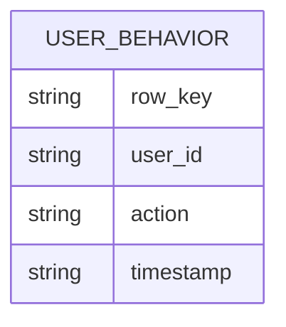
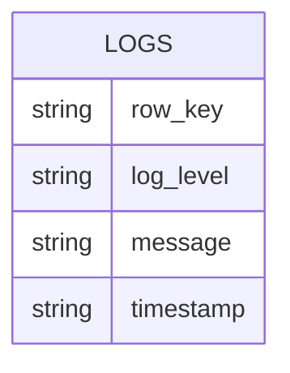

# HBase 数据查询

HBase是一个分布式的、面向列的数据库，广泛应用于大数据存储和处理。在HBase中，数据查询是最常见的操作之一。本文将详细介绍如何在HBase中进行数据查询，包括基本的查询操作和实际应用场景。

## 介绍

HBase的数据查询主要通过`Get`和`Scan`操作来实现。`Get`操作用于获取单行数据，而`Scan`操作用于扫描多行数据。这两种操作都是基于行键（Row Key）进行的，行键是HBase中唯一标识一行数据的键。

## 基本查询操作

### 使用`Get`操作查询单行数据

`Get`操作用于获取指定行键的数据。以下是一个简单的示例：

```java
import org.apache.hadoop.hbase.client.*;
import org.apache.hadoop.hbase.util.Bytes;

Connection connection = ConnectionFactory.createConnection(conf);
Table table = connection.getTable(TableName.valueOf("my_table"));

Get get = new Get(Bytes.toBytes("row1"));
Result result = table.get(get);

for (Cell cell : result.rawCells()) {
    System.out.println("Row Key: " + Bytes.toString(CellUtil.cloneRow(cell)));
    System.out.println("Column Family: " + Bytes.toString(CellUtil.cloneFamily(cell)));
    System.out.println("Column Qualifier: " + Bytes.toString(CellUtil.cloneQualifier(cell)));
    System.out.println("Value: " + Bytes.toString(CellUtil.cloneValue(cell)));
}
```

**输入：**
- 表名：`my_table`
- 行键：`row1`

**输出：**
- 行键、列族、列限定符和对应的值。

### 使用`Scan`操作查询多行数据

`Scan`操作用于扫描多行数据。以下是一个简单的示例：

```java
Scan scan = new Scan();
scan.setStartRow(Bytes.toBytes("row1"));
scan.setStopRow(Bytes.toBytes("row5"));

ResultScanner scanner = table.getScanner(scan);
for (Result result : scanner) {
    for (Cell cell : result.rawCells()) {
        System.out.println("Row Key: " + Bytes.toString(CellUtil.cloneRow(cell)));
        System.out.println("Column Family: " + Bytes.toString(CellUtil.cloneFamily(cell)));
        System.out.println("Column Qualifier: " + Bytes.toString(CellUtil.cloneQualifier(cell)));
        System.out.println("Value: " + Bytes.toString(CellUtil.cloneValue(cell)));
    }
}
```

**输入：**
- 表名：`my_table`
- 起始行键：`row1`
- 结束行键：`row5`

**输出：**
- 行键、列族、列限定符和对应的值。

## 实际应用场景

### 场景1：用户行为分析

假设我们有一个存储用户行为数据的HBase表，表结构如下：



我们可以使用`Scan`操作来查询某个用户在特定时间段内的行为数据：

```java
Scan scan = new Scan();
scan.setStartRow(Bytes.toBytes("user1_20230101"));
scan.setStopRow(Bytes.toBytes("user1_20230131"));

ResultScanner scanner = table.getScanner(scan);
for (Result result : scanner) {
    for (Cell cell : result.rawCells()) {
        System.out.println("User ID: " + Bytes.toString(CellUtil.cloneRow(cell)));
        System.out.println("Action: " + Bytes.toString(CellUtil.cloneQualifier(cell)));
        System.out.println("Timestamp: " + Bytes.toString(CellUtil.cloneValue(cell)));
    }
}
```

**输入：**
- 表名：`user_behavior`
- 起始行键：`user1_20230101`
- 结束行键：`user1_20230131`

**输出：**
- 用户ID、行为和对应的时间戳。

### 场景2：实时日志查询

假设我们有一个存储实时日志的HBase表，表结构如下：



我们可以使用`Get`操作来查询某条日志的详细信息：

```java
Get get = new Get(Bytes.toBytes("log12345"));
Result result = table.get(get);

for (Cell cell : result.rawCells()) {
    System.out.println("Log Level: " + Bytes.toString(CellUtil.cloneQualifier(cell)));
    System.out.println("Message: " + Bytes.toString(CellUtil.cloneValue(cell)));
    System.out.println("Timestamp: " + Bytes.toString(CellUtil.cloneRow(cell)));
}
```

**输入：**
- 表名：`logs`
- 行键：`log12345`

**输出：**
- 日志级别、消息内容和时间戳。

## 总结

在本文中，我们介绍了HBase中的数据查询操作，包括`Get`和`Scan`操作的基本用法，并通过实际应用场景展示了这些操作的实际应用。掌握这些基本操作是使用HBase进行数据存储和查询的关键。

## 附加资源

- [HBase官方文档](https://hbase.apache.org/book.html)
- [HBase Java API文档](https://hbase.apache.org/apidocs/org/apache/hadoop/hbase/client/package-summary.html)

## 练习

1. 创建一个HBase表，并插入一些数据。使用`Get`操作查询单行数据。
2. 使用`Scan`操作查询某个范围内的多行数据，并输出结果。
3. 设计一个实际应用场景，使用HBase进行数据查询，并编写相应的代码实现。

:::tip
在编写HBase查询代码时，务必注意行键的设计，合理的行键设计可以显著提高查询效率。
:::