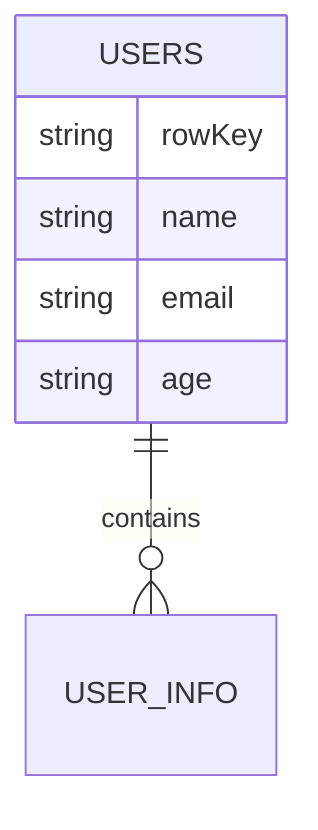

# HBase 过滤器API

HBase是一个分布式的、面向列的数据库，广泛用于处理大规模数据集。在实际应用中，我们经常需要从海量数据中提取特定的记录。HBase过滤器API提供了一种灵活的方式来过滤和查询数据，从而减少不必要的数据传输和处理。

## 什么是HBase过滤器API？

HBase过滤器API允许用户在查询数据时应用各种过滤条件，从而只返回符合条件的数据。通过使用过滤器，可以显著减少从HBase表中读取的数据量，提高查询效率。

过滤器可以应用于行键、列族、列限定符以及单元格值等。HBase提供了多种内置过滤器，如`RowFilter`、`PrefixFilter`、`ValueFilter`等，同时也支持自定义过滤器。

## 常用过滤器类型

### 1. RowFilter
`RowFilter`用于根据行键过滤数据。它支持比较操作符（如`EQUAL`、`LESS`、`GREATER`等）来匹配行键。

```java
Filter rowFilter = new RowFilter(CompareOperator.EQUAL, new BinaryComparator(Bytes.toBytes("rowKey1")));
Scan scan = new Scan();
scan.setFilter(rowFilter);
ResultScanner scanner = table.getScanner(scan);
for (Result result : scanner) {
    System.out.println(result);
}
```

### 2. PrefixFilter
`PrefixFilter`用于根据行键的前缀过滤数据。它只返回行键以指定前缀开头的记录。

```java
Filter prefixFilter = new PrefixFilter(Bytes.toBytes("prefix"));
Scan scan = new Scan();
scan.setFilter(prefixFilter);
ResultScanner scanner = table.getScanner(scan);
for (Result result : scanner) {
    System.out.println(result);
}
```

### 3. ValueFilter
`ValueFilter`用于根据单元格的值过滤数据。它支持比较操作符来匹配单元格的值。

```java
Filter valueFilter = new ValueFilter(CompareOperator.EQUAL, new BinaryComparator(Bytes.toBytes("value1")));
Scan scan = new Scan();
scan.setFilter(valueFilter);
ResultScanner scanner = table.getScanner(scan);
for (Result result : scanner) {
    System.out.println(result);
}
```

### 4. ColumnPrefixFilter
`ColumnPrefixFilter`用于根据列限定符的前缀过滤数据。它只返回列限定符以指定前缀开头的记录。

```java
Filter columnPrefixFilter = new ColumnPrefixFilter(Bytes.toBytes("colPrefix"));
Scan scan = new Scan();
scan.setFilter(columnPrefixFilter);
ResultScanner scanner = table.getScanner(scan);
for (Result result : scanner) {
    System.out.println(result);
}
```

## 实际案例

假设我们有一个存储用户信息的HBase表，表结构如下：



我们需要查询所有年龄大于30岁的用户。可以使用`SingleColumnValueFilter`来实现：

```java
Filter ageFilter = new SingleColumnValueFilter(
    Bytes.toBytes("info"),
    Bytes.toBytes("age"),
    CompareOperator.GREATER,
    new BinaryComparator(Bytes.toBytes("30"))
);
Scan scan = new Scan();
scan.setFilter(ageFilter);
ResultScanner scanner = table.getScanner(scan);
for (Result result : scanner) {
    System.out.println(result);
}
```

## 总结

HBase过滤器API提供了一种强大的方式来过滤和查询HBase表中的数据。通过合理使用过滤器，可以显著提高查询效率，减少不必要的数据传输。本文介绍了常用的过滤器类型，并通过实际案例展示了如何应用这些过滤器。

## 附加资源

- [HBase官方文档](https://hbase.apache.org/book.html)
- [HBase过滤器API参考](https://hbase.apache.org/apidocs/org/apache/hadoop/hbase/filter/package-summary.html)

## 练习

1. 使用`RowFilter`查询行键以"user_"开头的所有记录。
2. 使用`ValueFilter`查询所有包含特定值的单元格。
3. 结合多个过滤器，查询年龄大于30岁且邮箱以"example.com"结尾的用户。

通过完成这些练习，你将更深入地理解HBase过滤器API的使用方法。