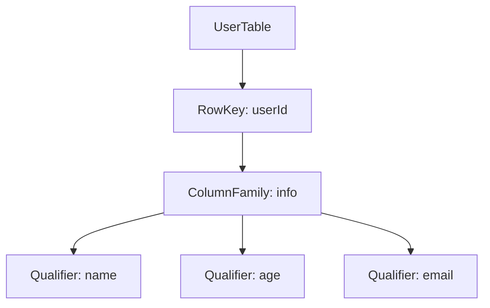

# HBase 过滤器详解

HBase是一个分布式的、面向列的数据库，广泛用于处理大规模数据。在实际应用中，我们经常需要从海量数据中筛选出符合特定条件的记录。HBase过滤器（Filter）正是为此而设计的工具，它允许我们在查询时对数据进行过滤，从而减少不必要的数据传输和处理。

本文将详细介绍HBase过滤器的基本概念、常见类型及其在实际场景中的应用。

## 什么是HBase过滤器？

HBase过滤器是一种在服务器端对数据进行筛选的机制。它可以在数据返回给客户端之前，过滤掉不符合条件的行或列，从而减少网络传输和客户端处理的开销。过滤器可以应用于行键、列族、列限定符以及单元格值等多个维度。

## 常见的HBase过滤器类型

HBase提供了多种内置过滤器，以下是几种常见的过滤器类型：

### 1. 行键过滤器（RowFilter）

行键过滤器用于根据行键的值进行过滤。常见的比较操作符包括 `EQUAL`、`GREATER`、`LESS` 等。

```java
Filter rowFilter = new RowFilter(CompareOperator.EQUAL, new BinaryComparator(Bytes.toBytes("rowKey1")));
```

### 2. 列族过滤器（FamilyFilter）

列族过滤器用于根据列族名称进行过滤。

```java
Filter familyFilter = new FamilyFilter(CompareOperator.EQUAL, new BinaryComparator(Bytes.toBytes("cf1")));
```

### 3. 列限定符过滤器（QualifierFilter）

列限定符过滤器用于根据列限定符（列名）进行过滤。

```java
Filter qualifierFilter = new QualifierFilter(CompareOperator.EQUAL, new BinaryComparator(Bytes.toBytes("col1")));
```

### 4. 值过滤器（ValueFilter）

值过滤器用于根据单元格的值进行过滤。

```java
Filter valueFilter = new ValueFilter(CompareOperator.EQUAL, new BinaryComparator(Bytes.toBytes("value1")));
```

### 5. 单列值过滤器（SingleColumnValueFilter）

单列值过滤器用于根据指定列的值进行过滤。如果指定的列不存在，可以选择是否包含该行。

```java
SingleColumnValueFilter singleColumnValueFilter = new SingleColumnValueFilter(
    Bytes.toBytes("cf1"),
    Bytes.toBytes("col1"),
    CompareOperator.EQUAL,
    Bytes.toBytes("value1")
);
singleColumnValueFilter.setFilterIfMissing(true); // 如果列不存在，是否过滤掉该行
```

## 过滤器的组合使用

HBase允许将多个过滤器组合使用，以实现更复杂的查询条件。常见的组合方式包括 `FilterList`，它支持 `MUST_PASS_ALL`（所有条件都必须满足）和 `MUST_PASS_ONE`（至少满足一个条件）两种模式。

```java
FilterList filterList = new FilterList(FilterList.Operator.MUST_PASS_ALL);
filterList.addFilter(rowFilter);
filterList.addFilter(valueFilter);
```

## 实际应用案例

假设我们有一个存储用户信息的HBase表，表结构如下：



我们需要查询所有年龄大于30岁的用户，可以使用以下过滤器：

```java
SingleColumnValueFilter ageFilter = new SingleColumnValueFilter(
    Bytes.toBytes("info"),
    Bytes.toBytes("age"),
    CompareOperator.GREATER,
    Bytes.toBytes("30")
);
ageFilter.setFilterIfMissing(true);

Scan scan = new Scan();
scan.setFilter(ageFilter);

ResultScanner scanner = table.getScanner(scan);
for (Result result : scanner) {
    // 处理查询结果
}
```

## 总结

HBase过滤器是进行高效数据查询的重要工具。通过合理使用各种过滤器，我们可以在服务器端对数据进行筛选，从而减少不必要的数据传输和处理。本文介绍了常见的过滤器类型及其组合使用方式，并通过实际案例展示了如何应用这些过滤器。

## 附加资源与练习

- **练习1**：尝试使用 `RowFilter` 和 `ValueFilter` 组合查询特定行键和值的记录。
- **练习2**：使用 `FilterList` 实现一个复杂的查询条件，例如查询年龄大于30岁且邮箱包含特定域名的用户。

通过不断练习，你将能够熟练掌握HBase过滤器的使用，并在实际项目中灵活应用。