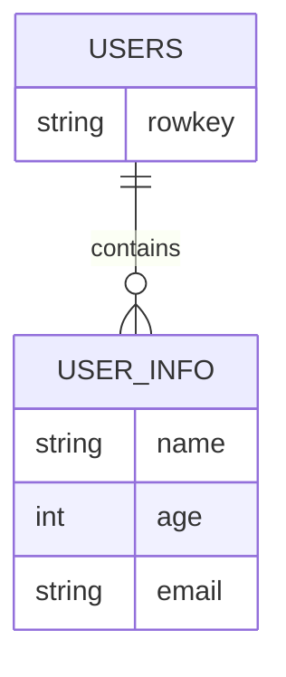

# HBase 比较器

在HBase中，比较器（Comparator）是用于在扫描（Scan）或过滤（Filter）操作中比较行键、列族、列限定符或值的工具。它们允许你定义自定义的匹配规则，从而更灵活地查询数据。本文将详细介绍HBase中的比较器，并通过示例展示其使用方法。

## 什么是HBase比较器？

HBase比较器是用于比较两个值的工具，通常用于过滤数据。它们可以用于行键、列族、列限定符或值的比较。HBase提供了多种内置的比较器，同时也支持自定义比较器。

### 内置比较器

HBase提供了以下几种内置比较器：

1. **BinaryComparator**：按字节顺序比较两个值。
2. **BinaryPrefixComparator**：比较两个值的前缀是否相同。
3. **RegexStringComparator**：使用正则表达式匹配字符串。
4. **SubstringComparator**：检查一个字符串是否包含另一个字符串。
5. **LongComparator**：比较两个长整型值。

## 使用比较器进行过滤

在HBase中，比较器通常与过滤器（Filter）一起使用，以过滤出符合条件的数据。以下是一个使用`BinaryComparator`的示例：

```java
import org.apache.hadoop.hbase.client.Scan;
import org.apache.hadoop.hbase.filter.CompareFilter;
import org.apache.hadoop.hbase.filter.SingleColumnValueFilter;
import org.apache.hadoop.hbase.filter.BinaryComparator;
import org.apache.hadoop.hbase.util.Bytes;

Scan scan = new Scan();
SingleColumnValueFilter filter = new SingleColumnValueFilter(
    Bytes.toBytes("cf"), // 列族
    Bytes.toBytes("qualifier"), // 列限定符
    CompareFilter.CompareOp.EQUAL, // 比较操作符
    new BinaryComparator(Bytes.toBytes("value")) // 比较器
);
scan.setFilter(filter);
```

在这个示例中，我们创建了一个`SingleColumnValueFilter`，它使用`BinaryComparator`来比较列`cf:qualifier`的值是否等于`"value"`。

## 实际案例

假设我们有一个存储用户信息的HBase表，表结构如下：



我们希望查询所有年龄大于30岁的用户。可以使用`LongComparator`来实现：

```java
import org.apache.hadoop.hbase.client.Scan;
import org.apache.hadoop.hbase.filter.CompareFilter;
import org.apache.hadoop.hbase.filter.SingleColumnValueFilter;
import org.apache.hadoop.hbase.filter.LongComparator;
import org.apache.hadoop.hbase.util.Bytes;

Scan scan = new Scan();
SingleColumnValueFilter filter = new SingleColumnValueFilter(
    Bytes.toBytes("USER_INFO"), // 列族
    Bytes.toBytes("age"), // 列限定符
    CompareFilter.CompareOp.GREATER, // 比较操作符
    new LongComparator(30) // 比较器
);
scan.setFilter(filter);
```

在这个例子中，我们使用`LongComparator`来比较`age`列的值是否大于30。

## 总结

HBase比较器是进行高级查询和过滤的强大工具。通过使用内置的比较器，你可以轻松地实现复杂的查询逻辑。本文介绍了HBase中的几种常见比较器，并通过实际案例展示了如何使用它们。

### 附加资源

- [HBase官方文档](https://hbase.apache.org/)
- [HBase过滤器指南](https://hbase.apache.org/book.html#filters)

### 练习

1. 尝试使用`RegexStringComparator`来查询所有电子邮件地址以`.com`结尾的用户。
2. 使用`SubstringComparator`来查询所有名字中包含`"John"`的用户。

通过练习，你将更深入地理解HBase比较器的使用场景和技巧。