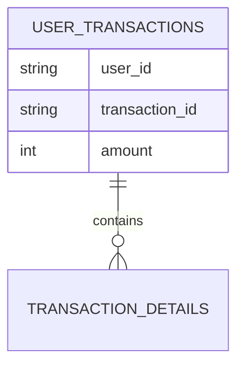

## 介绍

在HBase中，过滤器（Filter）是一种强大的工具，用于在查询时对数据进行筛选。HBase提供了多种内置过滤器，例如行键过滤器、列族过滤器等。然而，在某些复杂的场景中，内置过滤器可能无法满足需求。这时，我们可以通过自定义过滤器来实现更灵活的数据筛选。

自定义过滤器允许开发者根据特定的业务逻辑编写过滤规则，从而在查询时只返回符合条件的数据。本文将详细介绍如何创建和使用HBase自定义过滤器，并通过实际案例展示其应用场景。

## 自定义过滤器的工作原理

HBase的自定义过滤器是通过实现 `org.apache.hadoop.hbase.filter.Filter` 接口来创建的。该接口定义了过滤器的主要方法，包括：

- `filterRowKey(byte[] buffer, int offset, int length)`：用于过滤行键。
- `filterKeyValue(Cell v)`：用于过滤列键值对。
- `filterRow()`：用于过滤整行数据。
- `filterAllRemaining()`：用于提前终止扫描。

通过实现这些方法，开发者可以根据需要自定义过滤逻辑。

## 创建自定义过滤器

下面是一个简单的自定义过滤器示例，该过滤器用于筛选出列值大于指定阈值的行。

```java
import org.apache.hadoop.hbase.Cell;
import org.apache.hadoop.hbase.filter.FilterBase;
import org.apache.hadoop.hbase.util.Bytes;

public class ValueGreaterThanFilter extends FilterBase {
    private byte[] value;
    private boolean filterRow = false;

    public ValueGreaterThanFilter(byte[] value) {
        this.value = value;
    }

    @Override
    public ReturnCode filterKeyValue(Cell cell) {
        byte[] cellValue = cell.getValueArray();
        if (Bytes.compareTo(cellValue, value) > 0) {
            return ReturnCode.INCLUDE;
        } else {
            filterRow = true;
            return ReturnCode.SKIP;
        }
    }

    @Override
    public boolean filterRow() {
        return filterRow;
    }

    @Override
    public void reset() {
        filterRow = false;
    }
}
```

### 代码解释

1. **ValueGreaterThanFilter** 类继承自 `FilterBase`，这是HBase提供的一个基础过滤器类，简化了过滤器的实现。
2. **filterKeyValue** 方法用于比较列值与指定阈值。如果列值大于阈值，则返回 `ReturnCode.INCLUDE`，表示包含该列；否则返回 `ReturnCode.SKIP`，表示跳过该列。
3. **filterRow** 方法用于决定是否过滤整行数据。如果任何列值小于等于阈值，则过滤该行。
4. **reset** 方法用于重置过滤器的状态，以便在扫描下一行时使用。

## 使用自定义过滤器

创建自定义过滤器后，可以通过以下方式在HBase查询中使用它：

```java
import org.apache.hadoop.hbase.client.Scan;
import org.apache.hadoop.hbase.client.ResultScanner;
import org.apache.hadoop.hbase.client.Table;
import org.apache.hadoop.hbase.client.Connection;
import org.apache.hadoop.hbase.client.ConnectionFactory;
import org.apache.hadoop.hbase.util.Bytes;

public class HBaseCustomFilterExample {
    public static void main(String[] args) throws Exception {
        Connection connection = ConnectionFactory.createConnection();
        Table table = connection.getTable(TableName.valueOf("my_table"));

        Scan scan = new Scan();
        scan.setFilter(new ValueGreaterThanFilter(Bytes.toBytes(100)));

        ResultScanner scanner = table.getScanner(scan);
        scanner.forEach(result -> {
            System.out.println(Bytes.toString(result.getRow()));
        });

        scanner.close();
        table.close();
        connection.close();
    }
}
```

### 代码解释

1. **Scan** 对象用于定义扫描操作。
2. **setFilter** 方法用于设置自定义过滤器。
3. **ResultScanner** 用于获取扫描结果，并遍历输出符合条件的行键。

## 实际应用场景

假设我们有一个存储用户交易数据的HBase表，表结构如下：



我们希望查询出所有交易金额大于1000的用户交易记录。这时，可以使用自定义过滤器来实现：

```java
Scan scan = new Scan();
scan.setFilter(new ValueGreaterThanFilter(Bytes.toBytes(1000)));

ResultScanner scanner = table.getScanner(scan);
scanner.forEach(result -> {
    System.out.println("User ID: " + Bytes.toString(result.getValue(Bytes.toBytes("cf"), Bytes.toBytes("user_id"))));
    System.out.println("Transaction ID: " + Bytes.toString(result.getValue(Bytes.toBytes("cf"), Bytes.toBytes("transaction_id"))));
    System.out.println("Amount: " + Bytes.toInt(result.getValue(Bytes.toBytes("cf"), Bytes.toBytes("amount"))));
});
```

## 总结

HBase自定义过滤器为开发者提供了强大的数据筛选能力，能够满足复杂的查询需求。通过实现 `Filter` 接口，开发者可以根据业务逻辑自定义过滤规则，从而在查询时只返回符合条件的数据。

在实际应用中，自定义过滤器可以用于各种场景，例如筛选特定范围的数据、过滤无效记录等。掌握自定义过滤器的使用方法，将有助于提升HBase查询的灵活性和效率。

## 附加资源与练习

- **练习**：尝试创建一个自定义过滤器，用于筛选出列值在指定范围内的行。
- **资源**：阅读HBase官方文档中关于过滤器的部分，了解更多内置过滤器的使用方法。

:::tip
在实际开发中，建议先使用HBase提供的内置过滤器，如果内置过滤器无法满足需求，再考虑使用自定义过滤器。
:::