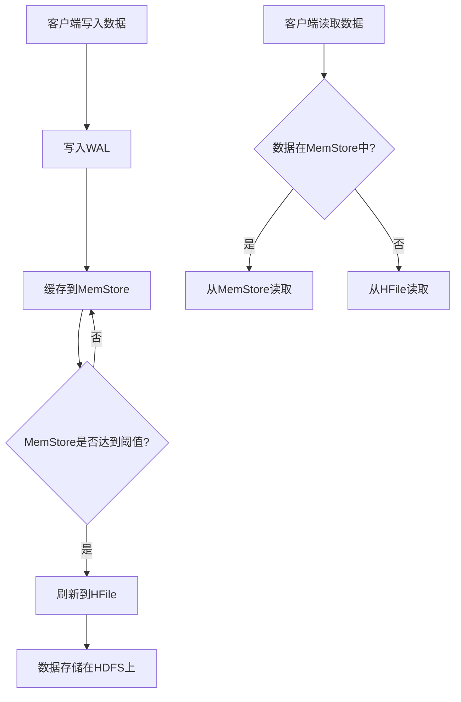

# HBase 文件系统

HBase是一个分布式的、面向列的数据库，构建在Hadoop文件系统（HDFS）之上。HBase文件系统是HBase存储架构的核心部分，负责管理数据的存储和访问。本文将详细介绍HBase文件系统的概念、架构及其在实际应用中的表现。

## 什么是HBase文件系统？

HBase文件系统是HBase存储数据的底层机制，它依赖于HDFS来存储和管理数据。HBase文件系统的主要任务是确保数据的高可用性、一致性和可扩展性。HBase通过将数据分割成多个区域（Regions）并在集群中分布这些区域来实现这些目标。

## HBase 文件系统的核心组件

### 1. HDFS（Hadoop分布式文件系统）

HDFS是HBase文件系统的基础，它提供了高吞吐量的数据访问和容错能力。HDFS将大文件分割成多个块（Blocks），并将这些块分布在集群中的多个节点上。

### 2. HFile

HFile是HBase中存储数据的文件格式。它是一个有序的、不可变的键值存储文件，通常存储在HDFS上。HFile的设计使得HBase能够高效地进行数据读取和写入。

### 3. WAL（Write-Ahead Log）

WAL是HBase用于确保数据持久性和一致性的机制。在数据写入HFile之前，HBase会先将数据写入WAL。这样即使在系统崩溃的情况下，HBase也可以通过WAL恢复未写入HFile的数据。

### 4. MemStore

MemStore是HBase内存中的一个数据结构，用于缓存写入的数据。当MemStore达到一定大小时，HBase会将其内容刷新到HFile中。

## HBase 文件系统的工作流程

1. **数据写入**：当客户端向HBase写入数据时，数据首先被写入WAL，然后被缓存到MemStore中。
2. **数据刷新**：当MemStore达到一定大小时，HBase会将其内容刷新到HDFS上的HFile中。
3. **数据读取**：当客户端读取数据时，HBase会首先检查MemStore，如果数据不在MemStore中，则会从HFile中读取数据。

## 实际应用场景

### 案例：日志存储与分析

假设我们有一个需要存储和分析大量日志数据的系统。使用HBase文件系统，我们可以将日志数据高效地存储在HDFS上，并通过HBase进行快速查询和分析。由于HBase的高可用性和可扩展性，我们可以轻松地处理PB级别的日志数据。

## 总结

HBase文件系统是HBase存储架构的核心部分，它依赖于HDFS来存储和管理数据。通过理解HBase文件系统的核心组件和工作流程，我们可以更好地利用HBase进行大规模数据存储和处理。

## 附加资源与练习

- **练习**：尝试在本地Hadoop集群上配置HBase，并编写一个简单的Java程序来读写HBase数据。
- **资源**：阅读HBase官方文档，了解更多关于HBase文件系统的详细信息。

:::tip
提示：在实际应用中，合理配置HBase的MemStore大小和WAL策略可以显著提高系统的性能和可靠性。
:::