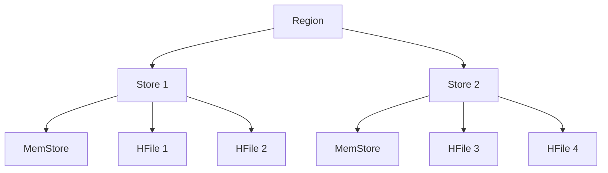

# HBase Region组成

HBase是一个分布式的、面向列的数据库，它基于Google的Bigtable设计。在HBase中，数据被分割成多个Region，每个Region负责存储一部分数据。理解Region的组成对于掌握HBase的存储架构至关重要。

## 什么是Region？

Region是HBase中数据存储的基本单元。每个Region包含一定范围的行键（Row Key），并且这些行键是连续的。Region的大小可以通过配置进行调整，通常默认大小为1GB。当Region的大小超过这个阈值时，HBase会自动将其拆分成两个新的Region。

## Region的组成

一个Region主要由以下几个部分组成：

1. **Store**：每个Region包含多个Store，每个Store对应一个列族（Column Family）。Store是实际存储数据的地方，它包含一个MemStore和多个HFile。

2. **MemStore**：MemStore是一个内存中的数据结构，用于缓存写入的数据。当MemStore的大小达到一定阈值时，数据会被刷新到磁盘上的HFile中。

3. **HFile**：HFile是HBase中实际存储数据的文件格式，它基于Hadoop的HDFS。HFile是一个有序的、不可变的文件，存储了键值对数据。

4. **WAL（Write-Ahead Log）**：WAL用于记录所有的写操作，以确保数据的持久性。在数据写入MemStore之前，首先会写入WAL。这样即使在系统崩溃的情况下，数据也可以从WAL中恢复。

## Region的工作原理

当一个客户端向HBase写入数据时，数据首先会被写入WAL，然后写入MemStore。当MemStore的大小达到一定阈值时，数据会被刷新到HFile中。读取数据时，HBase会首先检查MemStore，如果数据不在MemStore中，则会从HFile中读取。

## 实际应用场景

假设我们有一个电商网站，需要存储用户的订单信息。我们可以将订单信息存储在HBase中，并使用用户ID作为行键。随着订单数量的增加，HBase会自动将数据分割成多个Region，每个Region负责存储一部分用户ID的订单信息。

## 总结

Region是HBase中数据存储的基本单元，它由多个Store组成，每个Store对应一个列族。Region通过MemStore和HFile来存储数据，并通过WAL来确保数据的持久性。理解Region的组成和工作原理对于掌握HBase的存储架构至关重要。

## 附加资源

- [HBase官方文档](https://hbase.apache.org/book.html)
- [HBase Region拆分与合并](https://hbase.apache.org/book.html#region.splitting)
- [HBase存储架构详解](https://hbase.apache.org/book.html#architecture)

## 练习

1. 尝试在HBase中创建一个表，并观察Region的自动拆分过程。
2. 修改HBase的配置，调整Region的大小阈值，观察其对性能的影响。
3. 研究HBase的WAL机制，并尝试模拟系统崩溃后的数据恢复过程。
