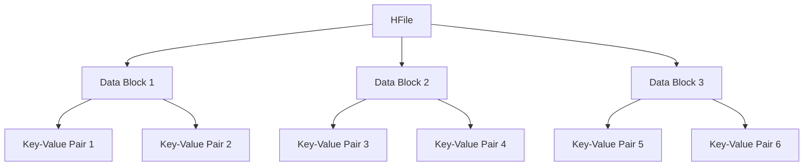
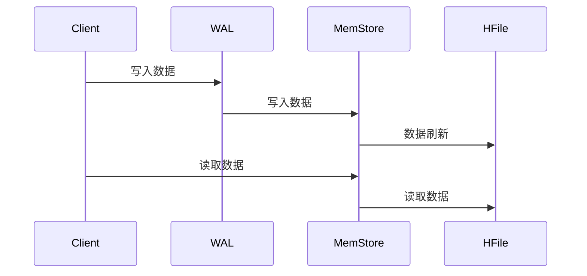

# HBase 存储引擎

HBase是一个分布式的、面向列的数据库，基于Google的Bigtable设计。它是Hadoop生态系统的一部分，专为处理大规模数据集而设计。HBase的存储引擎是其核心组件之一，负责数据的存储、检索和管理。本文将详细介绍HBase存储引擎的工作原理、关键组件及其在实际应用中的使用场景。

## 1. HBase存储引擎概述

HBase存储引擎的核心目标是高效地存储和检索大规模数据。它采用了一种分布式的、分层的存储架构，能够处理海量数据并提供低延迟的访问。HBase存储引擎的主要特点包括：

- **分布式存储**：数据分布在多个节点上，支持水平扩展。
- **列式存储**：数据按列存储，适合处理稀疏数据。
- **强一致性**：支持强一致性模型，确保数据的一致性。
- **自动分区**：数据自动分区并分布在多个RegionServer上。

## 2. HBase存储引擎的关键组件

HBase存储引擎由以下几个关键组件组成：

### 2.1 HFile

HFile是HBase的底层存储文件格式，用于存储实际的数据。每个HFile包含多个数据块，每个数据块包含多个键值对。HFile的设计目标是高效地存储和检索数据。

### 2.2 MemStore

MemStore是HBase的内存存储组件，用于缓存写入的数据。当数据写入HBase时，首先会被写入MemStore。当MemStore达到一定大小时，数据会被刷新到HFile中。

### 2.3 WAL (Write-Ahead Log)

WAL是HBase的预写日志，用于确保数据的持久性。在数据写入MemStore之前，会先写入WAL。这样即使在系统崩溃的情况下，数据也不会丢失。

### 2.4 RegionServer

RegionServer是HBase的存储节点，负责管理多个Region。每个Region包含一定范围的行键，RegionServer负责处理这些Region的读写请求。

## 3. HBase存储引擎的工作原理

HBase存储引擎的工作流程可以分为以下几个步骤：

1. **数据写入**：当客户端写入数据时，数据首先被写入WAL，然后写入MemStore。
2. **数据刷新**：当MemStore达到一定大小时，数据会被刷新到HFile中。
3. **数据读取**：当客户端读取数据时，HBase会首先检查MemStore，如果数据不在MemStore中，则会从HFile中读取。
4. **数据压缩**：为了优化存储和查询性能，HBase会定期对HFile进行压缩。

## 4. 实际应用场景

HBase存储引擎在许多实际应用场景中得到了广泛应用，以下是一些典型的应用场景：

### 4.1 实时数据分析

HBase的高吞吐量和低延迟特性使其非常适合用于实时数据分析。例如，在电商平台中，可以使用HBase存储用户行为数据，并实时分析用户偏好。

### 4.2 日志存储

HBase的分布式存储和自动分区特性使其非常适合用于日志存储。例如，在大型互联网公司中，可以使用HBase存储服务器日志，并快速检索和分析日志数据。

### 4.3 推荐系统

HBase的列式存储和高效查询特性使其非常适合用于推荐系统。例如，在视频网站中，可以使用HBase存储用户观看历史，并基于此生成个性化推荐。

## 5. 总结

HBase存储引擎是HBase的核心组件之一，负责数据的存储、检索和管理。它采用了一种分布式的、分层的存储架构，能够高效地处理大规模数据。通过理解HBase存储引擎的关键组件和工作原理，您可以更好地利用HBase构建高性能、可扩展的应用程序。

## 6. 附加资源与练习

- **附加资源**：
  - [HBase官方文档](https://hbase.apache.org/)
  - 《HBase权威指南》书籍
  - HBase社区论坛和博客

- **练习**：
  1. 尝试在本地搭建一个HBase集群，并练习数据的写入和读取操作。
  2. 使用HBase存储日志数据，并尝试进行实时分析。
  3. 探索HBase的压缩和分区策略，并尝试优化存储性能。

:::tip
在学习HBase存储引擎时，建议结合实际的代码示例和实验环境进行练习，以加深理解。
:::