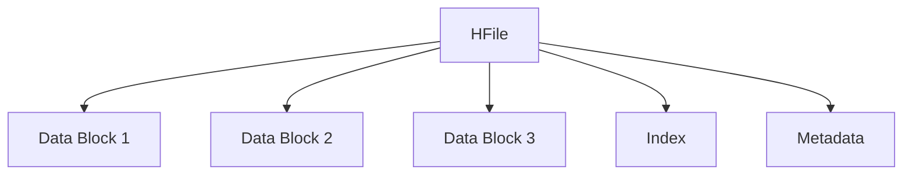

## 介绍

HBase是一个分布式的、面向列的数据库，基于Google的Bigtable设计。它被设计用来处理海量数据，并提供高吞吐量和低延迟的读写操作。HBase的持久化机制是其核心功能之一，确保数据在写入后能够持久保存，并在需要时快速恢复。

持久化机制是指将数据从内存中写入到磁盘或其他持久存储介质的过程。在HBase中，持久化机制主要通过以下两个组件实现：

1. **MemStore**：内存中的写缓存，用于临时存储写入的数据。
2. **HFile**：磁盘上的文件，用于持久化存储数据。

接下来，我们将逐步讲解HBase的持久化机制，并通过实际案例展示其应用场景。

## MemStore：内存中的写缓存

当数据写入HBase时，首先会被写入到MemStore中。MemStore是一个内存中的数据结构，用于临时存储写入的数据。每个列族（Column Family）都有一个对应的MemStore。

:::note
MemStore的设计目的是为了提高写入性能，因为内存的读写速度远快于磁盘。
:::

### MemStore的刷新机制

当MemStore中的数据达到一定大小时，HBase会将其刷新（Flush）到磁盘，生成一个HFile。这个过程称为**MemStore Flush**。刷新的大小由配置参数`hbase.hregion.memstore.flush.size`控制，默认值为128MB。

```java
// 示例：配置MemStore刷新大小
Configuration config = HBaseConfiguration.create();
config.set("hbase.hregion.memstore.flush.size", "134217728"); // 128MB
```

:::caution
如果MemStore中的数据量过大，可能会导致内存不足，进而影响系统性能。因此，合理配置MemStore的大小非常重要。
:::

## HFile：磁盘上的持久化存储

HFile是HBase中用于持久化存储数据的文件格式。它是一个有序的、不可变的文件，存储了键值对（Key-Value）数据。HFile的设计目标是高效地支持随机读取和顺序扫描。

### HFile的结构

HFile由多个数据块（Data Block）组成，每个数据块包含多个键值对。HFile还包含索引（Index）和元数据（Metadata），用于快速定位数据。



:::tip
HFile的索引结构使得HBase能够快速定位到所需的数据块，从而提高读取性能。
:::

### HFile的合并（Compaction）

随着数据的不断写入，HBase会生成多个HFile。为了优化读取性能，HBase会定期执行合并操作（Compaction），将多个小的HFile合并成一个大的HFile。合并操作分为两种：

1. **Minor Compaction**：合并小的HFile，减少文件数量。
2. **Major Compaction**：合并所有的HFile，删除过期或标记为删除的数据。

```java
// 示例：手动触发Major Compaction
HBaseAdmin admin = new HBaseAdmin(config);
admin.majorCompact("my_table");
```

:::warning
Major Compaction会消耗大量的I/O和CPU资源，因此建议在系统负载较低时执行。
:::

## 实际案例：HBase持久化机制的应用

假设我们有一个电商网站，需要存储用户的购物车数据。购物车数据需要频繁更新，并且需要保证数据的持久性。我们可以使用HBase来存储这些数据，并利用其持久化机制确保数据的安全。

### 数据写入流程

1. 用户将商品添加到购物车，数据首先写入MemStore。
2. 当MemStore达到128MB时，数据被刷新到HFile。
3. 定期执行Compaction操作，合并HFile，优化读取性能。

### 数据恢复流程

如果系统发生故障，HBase可以通过HFile恢复数据。由于HFile是持久化存储的，即使内存中的数据丢失，磁盘上的数据仍然可以恢复。

## 总结

HBase的持久化机制通过MemStore和HFile的结合，确保了数据的高效写入和持久存储。MemStore作为内存中的写缓存，提高了写入性能；而HFile作为磁盘上的持久化存储，确保了数据的安全性和可恢复性。通过合理的配置和优化，HBase能够处理海量数据，并提供高吞吐量和低延迟的读写操作。

## 附加资源与练习

- **练习1**：尝试配置HBase的MemStore刷新大小，并观察其对写入性能的影响。
- **练习2**：手动触发Major Compaction，并记录其对系统资源的影响。
- **资源**：阅读HBase官方文档，了解更多关于持久化机制的细节。

通过以上内容，你应该对HBase的持久化机制有了初步的了解。继续深入学习，你将能够更好地掌握HBase的核心原理，并在实际项目中应用这些知识。