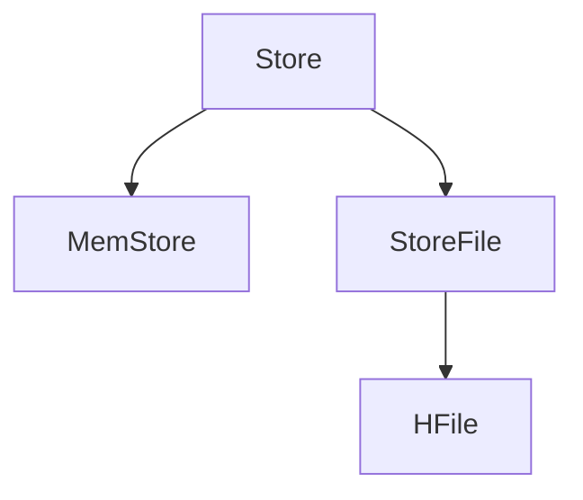
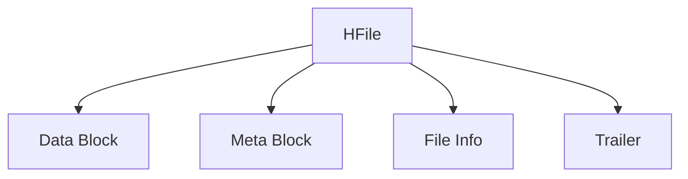

# HBase Store结构

HBase是一个分布式的、面向列的数据库，基于Google的Bigtable设计。在HBase中，数据存储的基本单元是Store。理解Store的结构对于掌握HBase的存储机制至关重要。本文将详细介绍HBase Store的组成部分及其工作原理。

## 什么是HBase Store？

在HBase中，每个表被划分为多个区域（Region），每个区域又包含多个Store。每个Store对应表中的一个列族（Column Family）。Store是HBase中数据存储的核心单元，负责管理内存和磁盘上的数据。

## Store的组成部分

一个Store主要由以下几个部分组成：

1. **MemStore**：内存中的数据结构，用于存储最近写入的数据。当MemStore达到一定大小时，数据会被刷新（Flush）到磁盘上的StoreFile中。
2. **StoreFile**：磁盘上的文件，存储已经刷新到磁盘的数据。StoreFile是HFile格式的文件，HFile是HBase的底层存储格式。
3. **HFile**：HBase的底层存储文件格式，基于Hadoop的SequenceFile实现，支持高效的随机读写操作。



## MemStore的工作原理

MemStore是一个内存中的数据结构，用于缓存最近写入的数据。当数据写入HBase时，首先会被写入MemStore。MemStore中的数据是按行键（Row Key）排序的，这样可以提高查询效率。

当MemStore的大小达到配置的阈值时，HBase会触发Flush操作，将MemStore中的数据写入磁盘，生成一个新的StoreFile。

```java
// 示例：写入数据到HBase
Put put = new Put(Bytes.toBytes("row1"));
put.addColumn(Bytes.toBytes("cf"), Bytes.toBytes("col1"), Bytes.toBytes("value1"));
table.put(put);
```

:::note
MemStore的大小可以通过配置参数 `hbase.hregion.memstore.flush.size` 进行调整。
:::

## StoreFile与HFile

StoreFile是磁盘上的文件，存储已经刷新到磁盘的数据。每个StoreFile对应一个HFile。HFile是HBase的底层存储格式，基于Hadoop的SequenceFile实现，支持高效的随机读写操作。

HFile的结构包括以下几个部分：

1. **Data Block**：存储实际的数据。
2. **Meta Block**：存储元数据，如布隆过滤器（Bloom Filter）。
3. **File Info**：存储文件的元信息，如创建时间、压缩类型等。
4. **Trailer**：存储文件的索引信息，用于快速定位数据块。



## 实际应用场景

假设我们有一个电商网站的用户行为日志表，表结构如下：

- 表名：`user_actions`
- 列族：`cf`
- 列：`action_type`, `action_time`, `product_id`

在这个场景中，每个用户的每次行为都会被记录到HBase中。当数据写入时，首先会被写入MemStore。当MemStore达到一定大小时，数据会被刷新到StoreFile中。查询时，HBase会同时查询MemStore和StoreFile，以获取最新的数据。

```java
// 示例：查询用户行为日志
Get get = new Get(Bytes.toBytes("user1"));
Result result = table.get(get);
byte[] value = result.getValue(Bytes.toBytes("cf"), Bytes.toBytes("action_type"));
System.out.println("Action Type: " + Bytes.toString(value));
```

:::tip
在实际应用中，合理配置MemStore的大小和Flush策略，可以有效提高HBase的写入性能。
:::

## 总结

HBase的Store结构是其存储机制的核心，理解MemStore、StoreFile和HFile的组成及其工作原理，对于优化HBase的性能至关重要。通过合理配置MemStore的大小和Flush策略，可以有效提高HBase的写入性能。

## 附加资源

- [HBase官方文档](https://hbase.apache.org/book.html)
- [HBase存储架构详解](https://hbase.apache.org/book.html#architecture)
- [HBase性能调优指南](https://hbase.apache.org/book.html#performance)

## 练习

1. 尝试在本地HBase集群中创建一个表，并观察MemStore和StoreFile的变化。
2. 修改MemStore的Flush大小，观察对写入性能的影响。
3. 编写一个查询程序，查询HBase表中的数据，并分析查询性能。
