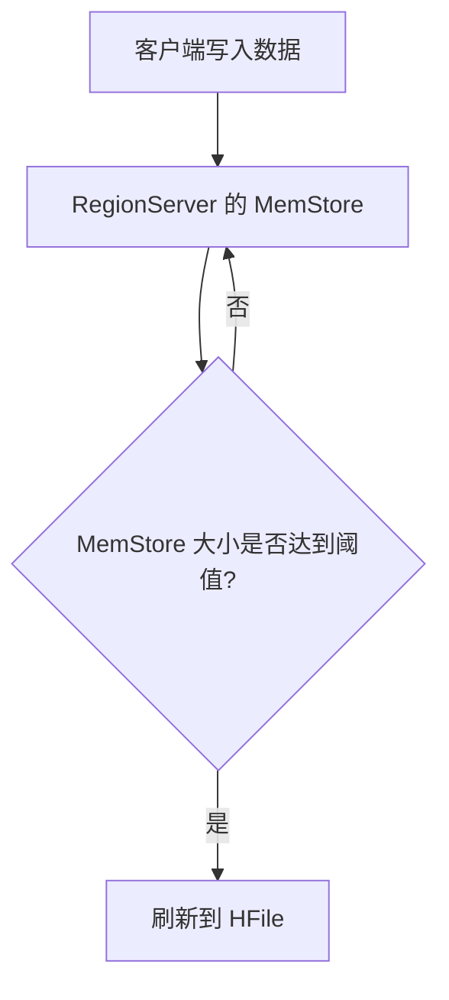

# HBase MemStore

## 介绍

HBase 是一个分布式的、面向列的数据库，设计用于处理大规模数据。在 HBase 的存储架构中，**MemStore** 是一个非常重要的组件。它负责在数据写入磁盘之前临时存储数据。理解 MemStore 的工作原理对于掌握 HBase 的数据写入和存储机制至关重要。

## 什么是 MemStore？

MemStore 是 HBase 中的一个内存缓冲区，用于存储新写入的数据。当数据通过 HBase 客户端写入时，首先会被写入到 MemStore 中。MemStore 中的数据会定期刷新到磁盘上的 HFile 中，这个过程称为 **flush**。

### MemStore 的作用

1. **提高写入性能**：由于数据首先写入内存，因此写入操作非常快速。
2. **数据排序**：MemStore 中的数据是按行键（Row Key）排序的，这有助于在数据刷新到磁盘时生成有序的 HFile。
3. **减少磁盘 I/O**：通过批量写入数据，MemStore 可以减少频繁的磁盘 I/O 操作，从而提高整体性能。

## MemStore 的工作原理

### 数据写入流程

1. **客户端写入数据**：当客户端向 HBase 写入数据时，数据首先被写入到 RegionServer 的 MemStore 中。
2. **MemStore 存储数据**：MemStore 是一个内存中的数据结构，通常使用跳表（SkipList）来存储数据，以确保数据的有序性。
3. **MemStore 刷新**：当 MemStore 的大小达到一定阈值时，数据会被刷新到磁盘上的 HFile 中。这个过程称为 **flush**。



### MemStore 刷新条件

MemStore 的刷新通常由以下条件触发：

1. **MemStore 大小达到阈值**：当 MemStore 的大小达到 `hbase.hregion.memstore.flush.size` 配置的阈值时，会触发刷新。
2. **RegionServer 的全局 MemStore 大小达到阈值**：当整个 RegionServer 的 MemStore 总大小达到 `hbase.regionserver.global.memstore.size` 配置的阈值时，会触发刷新。
3. **手动触发**：可以通过 HBase Shell 或 API 手动触发 MemStore 的刷新。

## 实际案例

假设我们有一个 HBase 表 `user_activity`，用于存储用户的浏览记录。每次用户浏览一个页面时，都会向 `user_activity` 表中写入一条记录。

```java
// 示例代码：向 HBase 写入数据
Table table = connection.getTable(TableName.valueOf("user_activity"));
Put put = new Put(Bytes.toBytes("user123"));
put.addColumn(Bytes.toBytes("cf"), Bytes.toBytes("page"), Bytes.toBytes("homepage"));
table.put(put);
```

在这个例子中，写入的数据首先会被存储到 MemStore 中。当 MemStore 的大小达到阈值时，数据会被刷新到磁盘上的 HFile 中。

## 总结

MemStore 是 HBase 存储架构中的关键组件，它在数据写入磁盘之前临时存储数据，从而提高写入性能并减少磁盘 I/O。理解 MemStore 的工作原理对于优化 HBase 的性能和存储管理非常重要。

## 附加资源

- [HBase 官方文档](https://hbase.apache.org/book.html)
- [HBase 存储架构详解](https://hbase.apache.org/book.html#arch)
- [HBase MemStore 配置参数](https://hbase.apache.org/book.html#config.files)

## 练习

1. 尝试在本地 HBase 集群中创建一个表，并观察 MemStore 的刷新行为。
2. 修改 HBase 配置参数，调整 MemStore 的刷新阈值，观察对写入性能的影响。
3. 使用 HBase Shell 手动触发 MemStore 的刷新，并查看生成的 HFile。

:::tip
在调整 HBase 配置参数时，建议先在测试环境中进行，以避免对生产环境造成影响。
:::