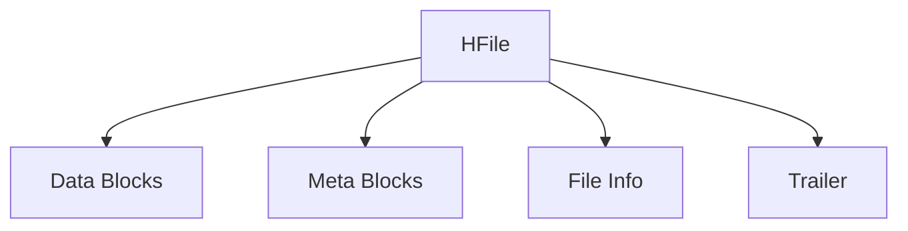

# HBase StoreFile/HFile

HBase 是一个分布式的、面向列的数据库，基于 Google 的 Bigtable 设计。在 HBase 中，数据存储的基本单位是 **StoreFile**，而 **HFile** 是 StoreFile 的底层文件格式。理解 StoreFile 和 HFile 的结构和工作原理对于掌握 HBase 的存储机制至关重要。

## 什么是 StoreFile 和 HFile？

在 HBase 中，数据首先写入内存中的 **MemStore**，当 MemStore 达到一定大小时，数据会被刷新到磁盘，形成 **StoreFile**。StoreFile 是 HBase 中存储数据的基本单位，而 **HFile** 是 StoreFile 的底层文件格式。HFile 是一种基于 Hadoop 的序列文件格式，专门为 HBase 设计，用于高效存储和检索数据。

### HFile 的结构

HFile 是一个多层的、有序的键值存储文件。它的结构可以分为以下几个部分：

1. **Data Blocks**：存储实际的键值对数据。
2. **Meta Blocks**：存储元数据，例如布隆过滤器（Bloom Filter）。
3. **File Info**：存储文件的元信息，例如创建时间、压缩信息等。
4. **Trailer**：存储文件的索引信息，用于快速定位数据块。

## HFile 的工作原理

### 数据写入

当数据从 MemStore 刷新到磁盘时，HBase 会生成一个新的 HFile。HFile 中的数据是按照键的顺序存储的，这使得范围查询非常高效。

### 数据读取

当 HBase 需要读取数据时，它会首先查找内存中的 MemStore，如果数据不在 MemStore 中，则会从磁盘上的 HFile 中读取。HFile 的索引信息（Trailer）可以帮助快速定位数据块，从而提高读取效率。

### 数据合并

随着数据的不断写入，HBase 会产生多个 HFile。为了优化读取性能，HBase 会定期执行 **Compaction** 操作，将多个小的 HFile 合并成一个大的 HFile。Compaction 分为两种类型：

1. **Minor Compaction**：合并小的 HFile，但不删除过期数据。
2. **Major Compaction**：合并所有 HFile，并删除过期数据。

## 实际应用场景

### 场景 1：日志存储

假设你正在构建一个日志存储系统，每天会产生大量的日志数据。你可以使用 HBase 来存储这些日志数据。每天的数据会被写入 MemStore，当 MemStore 达到一定大小时，数据会被刷新到 HFile 中。随着时间的推移，HBase 会自动执行 Compaction 操作，将多个小的 HFile 合并成一个大的 HFile，从而提高查询效率。

### 场景 2：实时数据分析

在实时数据分析场景中，数据需要快速写入和读取。HBase 的 MemStore 和 HFile 机制可以确保数据的高效写入和读取。通过合理配置 Compaction 策略，可以进一步优化系统的性能。

## 总结

HBase 的 StoreFile 和 HFile 是其存储架构的核心组件。StoreFile 是 HBase 中存储数据的基本单位，而 HFile 是 StoreFile 的底层文件格式。理解 HFile 的结构和工作原理对于掌握 HBase 的存储机制至关重要。通过合理配置 Compaction 策略，可以进一步优化 HBase 的性能。

## 附加资源

- [HBase 官方文档](https://hbase.apache.org/book.html)
- [HBase 存储架构详解](https://www.ibm.com/cloud/learn/hbase)
- [HBase Compaction 策略](https://hbase.apache.org/book.html#compaction)

## 练习

1. 尝试在本地搭建一个 HBase 集群，并观察 HFile 的生成和 Compaction 过程。
2. 编写一个简单的 HBase 客户端程序，模拟日志数据的写入和读取，观察 HFile 的变化。

:::tip
在学习和实践过程中，如果遇到问题，可以参考 HBase 的官方文档或社区论坛，获取更多帮助。
:::