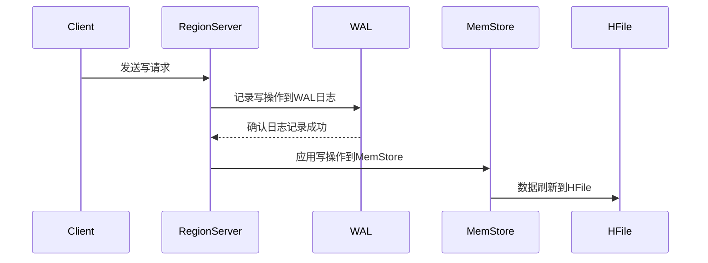

## 介绍

在HBase中，WAL（Write-Ahead Log）日志是一个非常重要的组件，用于确保数据的持久性和一致性。WAL日志的核心思想是：在数据写入内存（MemStore）之前，先将写操作记录到日志中。这样，即使在系统崩溃的情况下，HBase也可以通过重放WAL日志来恢复未持久化的数据。

WAL日志的主要作用是：
1. **数据持久性**：确保数据在写入内存之前已经记录到磁盘，避免数据丢失。
2. **数据一致性**：在分布式环境中，WAL日志帮助确保数据的一致性，特别是在RegionServer崩溃时。

## WAL日志的工作原理

### 1. 写操作流程

当客户端向HBase写入数据时，写操作会首先被记录到WAL日志中，然后再写入内存（MemStore）。这个过程可以概括为以下步骤：

1. 客户端发送写请求到RegionServer。
2. RegionServer将写操作记录到WAL日志中。
3. 写操作被应用到内存中的MemStore。
4. 当MemStore达到一定大小时，数据会被刷新到HFile中（持久化存储）。



### 2. WAL日志的结构

WAL日志由多个WAL文件组成，每个WAL文件包含多个编辑（Edit）。每个编辑代表一个写操作。WAL文件是顺序写入的，因此写入性能非常高。

WAL日志文件通常存储在HDFS上，以确保高可用性和持久性。每个RegionServer都有自己的WAL日志文件。

### 3. WAL日志的恢复

当RegionServer崩溃时，HBase会通过以下步骤恢复数据：

1. 从HDFS上读取WAL日志文件。
2. 重放WAL日志中的编辑，将未持久化的数据重新应用到MemStore中。
3. 将MemStore中的数据刷新到HFile中。

这个过程确保了即使在RegionServer崩溃的情况下，数据也不会丢失。

## 实际案例

假设我们有一个HBase表 `user_activity`，用于记录用户的点击行为。每次用户点击时，我们会将点击事件写入HBase。

```java
// 示例代码：写入HBase
Table table = connection.getTable(TableName.valueOf("user_activity"));
Put put = new Put(Bytes.toBytes("user123"));
put.addColumn(Bytes.toBytes("cf"), Bytes.toBytes("click"), Bytes.toBytes("2023-10-01T12:34:56"));
table.put(put);
```

在这个例子中，`Put` 操作会首先被记录到WAL日志中，然后再写入MemStore。如果在写入MemStore之前RegionServer崩溃，HBase可以通过重放WAL日志来恢复这个写操作，确保数据不会丢失。

## 总结

WAL日志是HBase中确保数据持久性和一致性的关键机制。通过在写操作应用到内存之前记录日志，HBase能够在系统崩溃时恢复未持久化的数据。理解WAL日志的工作原理对于设计和维护可靠的HBase系统至关重要。

## 附加资源

- [HBase官方文档](https://hbase.apache.org/book.html)
- [HBase WAL日志深入解析](https://hbase.apache.org/wal.html)
- [HBase数据一致性机制](https://hbase.apache.org/acid.html)

## 练习

1. 尝试在本地HBase集群中模拟RegionServer崩溃，并观察WAL日志的恢复过程。
2. 编写一个简单的HBase客户端程序，记录写操作并验证WAL日志的存在。
3. 研究HBase的WAL日志压缩机制，了解它是如何优化存储空间的。
