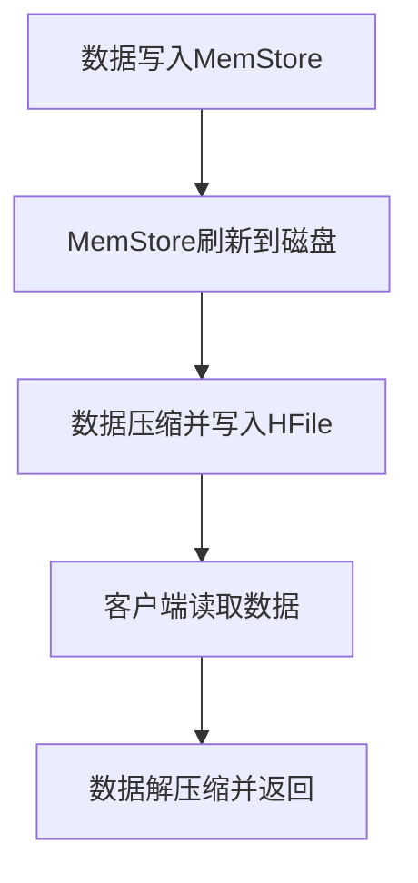

# HBase 数据压缩

## 介绍

在大数据存储系统中，数据压缩是一项关键技术，能够有效减少存储空间占用并提高数据传输效率。HBase作为分布式列式数据库，支持多种数据压缩算法，帮助用户优化存储和性能。本文将详细介绍HBase中的数据压缩技术，包括其工作原理、配置方法以及实际应用场景。

## 什么是数据压缩？

数据压缩是通过特定的算法将数据编码为更紧凑的格式，以减少存储空间和网络传输带宽。在HBase中，数据压缩通常应用于存储文件（如HFile）和日志文件（如WAL），以减少磁盘占用并提高读写性能。

HBase支持多种压缩算法，包括：
- **GZIP**：高压缩率，但压缩和解压缩速度较慢。
- **SNAPPY**：压缩率适中，但压缩和解压缩速度较快。
- **LZO**：与SNAPPY类似，但需要额外的配置。
- **ZSTD**：较新的压缩算法，提供高压缩率和较快的速度。

## 配置HBase数据压缩

在HBase中，可以通过以下步骤为表启用数据压缩：

1. **创建表时指定压缩算法**：
   ```bash
   create 'my_table', {NAME => 'cf', COMPRESSION => 'SNAPPY'}
   ```
   上述命令创建了一个名为 `my_table` 的表，并为列族 `cf` 启用了 `SNAPPY` 压缩。

2. **修改现有表的压缩算法**：
   ```bash
   alter 'my_table', {NAME => 'cf', COMPRESSION => 'GZIP'}
   ```
   该命令将 `my_table` 表的列族 `cf` 的压缩算法修改为 `GZIP`。

3. **验证压缩设置**：
   ```bash
   describe 'my_table'
   ```
   该命令将显示表的详细信息，包括列族的压缩设置。

## 数据压缩的工作原理

HBase的数据压缩发生在数据写入磁盘之前。以下是数据压缩的基本流程：

1. **数据写入**：客户端将数据写入HBase的内存区域（MemStore）。
2. **数据刷新**：当MemStore达到一定大小时，数据会被刷新到磁盘，形成HFile。
3. **压缩**：在数据写入HFile之前，HBase会根据配置的压缩算法对数据进行压缩。
4. **数据读取**：当客户端读取数据时，HBase会自动解压缩数据并返回给客户端。

以下是一个简单的流程图，展示了数据压缩的过程：



## 实际应用场景

### 场景1：节省存储空间

假设你有一个存储大量日志数据的HBase表，每天新增的数据量达到数百GB。通过启用 `GZIP` 压缩，可以将存储空间减少50%以上，从而显著降低存储成本。

### 场景2：提高查询性能

在一个需要频繁读取数据的场景中，使用 `SNAPPY` 压缩可以在保证较高压缩率的同时，提供快速的解压缩速度，从而减少查询延迟。

## 总结

数据压缩是HBase中优化存储和性能的重要手段。通过选择合适的压缩算法，用户可以在节省存储空间和提高查询性能之间找到平衡。本文介绍了HBase支持的主要压缩算法、配置方法以及实际应用场景，希望能帮助你更好地理解和应用HBase数据压缩技术。

## 附加资源与练习

- **练习1**：创建一个HBase表，并尝试为不同的列族配置不同的压缩算法，观察存储空间的变化。
- **练习2**：使用 `hbase shell` 命令查看表的压缩设置，并尝试修改压缩算法。
- **资源**：
  - [HBase官方文档](https://hbase.apache.org/)
  - [HBase数据压缩配置指南](https://hbase.apache.org/book.html#compression)

:::tip
在实际生产环境中，建议根据数据特性和访问模式选择合适的压缩算法。例如，对于需要频繁读取的数据，可以选择 `SNAPPY`；对于需要长期存储且不常访问的数据，可以选择 `GZIP`。
:::