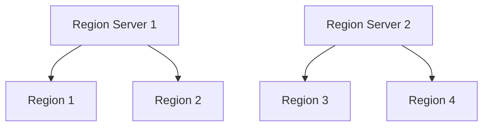

# HBase 集群规划

HBase是一个分布式的、面向列的数据库，设计用于处理大规模数据。为了确保HBase集群的高效运行，合理的集群规划至关重要。本文将逐步介绍如何规划和设计一个HBase集群，帮助初学者理解关键概念和最佳实践。

## 1. 什么是HBase集群规划？

HBase集群规划是指为HBase集群选择合适的硬件、配置节点以及优化性能的过程。一个良好的规划可以确保集群在高负载下仍能稳定运行，同时最大限度地利用资源。

## 2. 硬件选择

### 2.1 主节点（Master Node）

主节点负责管理集群的元数据和协调工作。建议使用高性能的服务器，配备多核CPU和足够的内存。

### 2.2 区域服务器（Region Server）

区域服务器是HBase集群的核心，负责存储和处理数据。每个区域服务器应配备足够的CPU、内存和存储空间。建议使用SSD硬盘以提高I/O性能。

### 2.3 ZooKeeper节点

ZooKeeper用于协调集群中的各个节点。建议至少配置3个ZooKeeper节点，以确保高可用性。

:::tip
**提示**：在生产环境中，建议将ZooKeeper节点部署在独立的服务器上，以避免资源竞争。
:::

## 3. 节点配置

### 3.1 主节点配置

主节点的配置应确保其能够快速响应元数据请求。建议配置如下：

```bash
hbase.master.info.port = 60010
hbase.master.logcleaner.plugins = org.apache.hadoop.hbase.master.cleaner.TimeToLiveLogCleaner
```

### 3.2 区域服务器配置

区域服务器的配置应优化数据存储和查询性能。建议配置如下：

```bash
hbase.regionserver.handler.count = 30
hbase.regionserver.global.memstore.size = 0.4
```

### 3.3 ZooKeeper配置

ZooKeeper的配置应确保其高可用性和快速响应。建议配置如下：

```bash
tickTime=2000
initLimit=10
syncLimit=5
```

## 4. 性能优化

### 4.1 数据分区

合理的数据分区可以显著提高查询性能。建议根据数据访问模式进行分区。



### 4.2 缓存配置

合理配置缓存可以减少磁盘I/O，提高查询速度。建议启用块缓存和MemStore缓存。

```bash
hbase.regionserver.global.memstore.size = 0.4
hfile.block.cache.size = 0.4
```

## 5. 实际案例

假设我们有一个电商网站，需要存储和处理大量的用户行为数据。我们可以规划一个包含3个主节点、10个区域服务器和3个ZooKeeper节点的HBase集群。通过合理的数据分区和缓存配置，我们可以确保在高并发情况下仍能快速响应用户请求。

## 6. 总结

HBase集群规划是确保集群高效运行的关键步骤。通过合理选择硬件、配置节点和优化性能，我们可以构建一个稳定、高效的HBase集群。

## 7. 附加资源

- [HBase官方文档](https://hbase.apache.org/)
- [HBase性能调优指南](https://hbase.apache.org/book.html#performance)

## 8. 练习

1. 设计一个包含5个区域服务器的HBase集群，并列出每个节点的硬件配置。
2. 配置一个HBase集群，并测试其在高并发情况下的性能。

:::caution
**注意**：在实际生产环境中，建议进行充分的测试和性能调优，以确保集群的稳定性和高效性。
:::