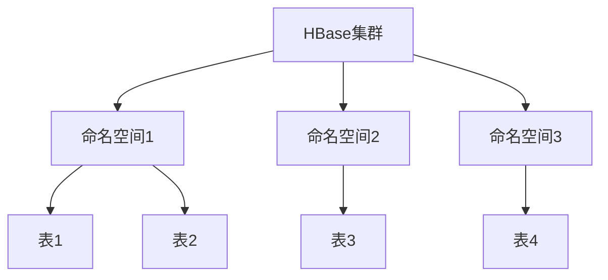
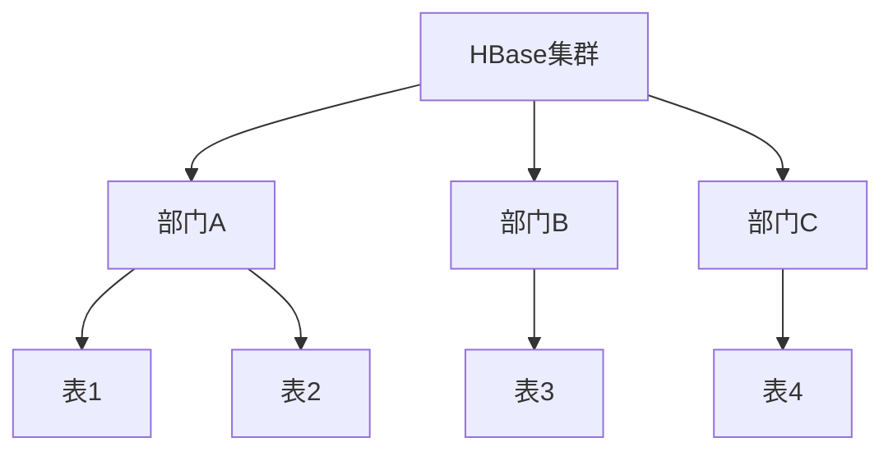

# HBase 多租户管理

## 介绍

在多租户环境中，多个用户或应用程序共享同一个HBase集群的资源。为了确保每个租户的资源使用不会影响其他租户，HBase提供了多种机制来实现资源隔离和管理。本文将详细介绍HBase多租户管理的概念、实现方式以及实际应用场景。

## 多租户管理的核心概念

### 1. 命名空间（Namespace）

命名空间是HBase中用于隔离表的一种机制。通过将表分配到不同的命名空间，可以实现资源的逻辑隔离。每个命名空间可以有自己的配置和权限控制。

```bash
# 创建命名空间
hbase> create_namespace 'tenant1'

# 在命名空间中创建表
hbase> create 'tenant1:table1', 'cf1'
```

### 2. 配额管理（Quotas）

HBase允许管理员为每个命名空间或表设置配额，以限制其资源使用。配额可以基于存储空间、请求速率等进行设置。

```bash
# 设置命名空间的存储配额
hbase> set_quota TYPE => SPACE, NAMESPACE => 'tenant1', LIMIT => '10G'

# 设置表的请求速率配额
hbase> set_quota TYPE => THROTTLE, TABLE => 'tenant1:table1', LIMIT => '1000req/sec'
```

### 3. 权限控制（Access Control）

HBase支持基于角色的访问控制（RBAC），可以为每个命名空间或表设置不同的权限，确保只有授权的用户或应用程序可以访问特定资源。

```bash
# 授予用户对命名空间的读写权限
hbase> grant 'user1', 'RW', '@tenant1'

# 撤销用户对表的写权限
hbase> revoke 'user1', 'W', 'tenant1:table1'
```

## 实际应用场景

### 场景1：多租户SaaS平台

在一个SaaS平台中，多个客户共享同一个HBase集群。通过使用命名空间和配额管理，可以确保每个客户的资源使用不会影响其他客户。例如，可以为每个客户创建一个独立的命名空间，并设置存储和请求速率配额。



### 场景2：企业内部多部门共享

在一个大型企业内部，多个部门可能需要共享同一个HBase集群。通过使用权限控制，可以确保每个部门只能访问其授权的表和命名空间，从而保护数据安全。



## 总结

HBase多租户管理通过命名空间、配额管理和权限控制等机制，实现了资源的逻辑隔离和高效利用。这些机制不仅适用于多租户SaaS平台，也适用于企业内部的多部门共享场景。通过合理配置和管理，可以确保每个租户或部门的资源使用不会影响其他租户或部门，同时保护数据安全。

## 附加资源与练习

- **练习1**：创建一个新的命名空间，并在其中创建两个表。为其中一个表设置存储配额，为另一个表设置请求速率配额。
- **练习2**：为两个不同的用户分配不同的权限，确保一个用户只能读取某个命名空间中的表，而另一个用户可以读写该命名空间中的表。

通过以上练习，您将更深入地理解HBase多租户管理的实际应用和配置方法。