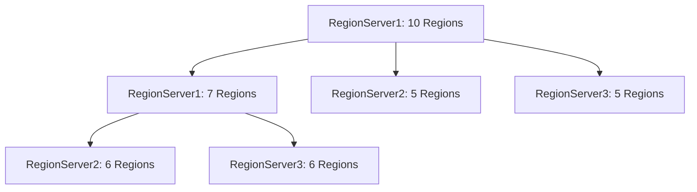

# HBase 负载均衡

HBase是一个分布式的、面向列的数据库，设计用于处理大规模数据。在HBase集群中，负载均衡是一个关键的管理任务，它确保数据均匀分布在各个RegionServer上，从而避免某些节点过载而其他节点空闲的情况。本文将详细介绍HBase负载均衡的概念、工作原理以及如何在实际场景中应用。

## 什么是HBase负载均衡？

HBase负载均衡是指通过动态调整RegionServer上的Region分布，使得集群中的每个RegionServer都能均匀地处理请求和数据存储。负载均衡的目标是最大化集群的资源利用率，同时避免单个节点成为性能瓶颈。

:::note
负载均衡不仅仅是为了平衡数据存储，还包括平衡计算资源的使用。
:::

## HBase 负载均衡的工作原理

HBase的负载均衡主要由HMaster负责。HMaster会定期检查集群中各个RegionServer的负载情况，并根据一定的策略将Region从一个RegionServer迁移到另一个RegionServer。以下是负载均衡的基本步骤：

1. **监控负载**：HMaster会定期收集各个RegionServer的负载信息，包括Region数量、请求量等。
2. **计算负载差异**：HMaster会计算集群中所有RegionServer的负载差异，判断是否需要进行调整。
3. **迁移Region**：如果发现某些RegionServer负载过高，HMaster会将这些RegionServer上的部分Region迁移到负载较低的RegionServer上。
4. **更新元数据**：迁移完成后，HMaster会更新HBase的元数据，确保客户端能够正确访问迁移后的Region。

:::tip
HBase的负载均衡策略可以通过配置文件进行调整，以适应不同的应用场景。
:::

## 负载均衡策略

HBase提供了多种负载均衡策略，默认情况下使用的是`StochasticLoadBalancer`。以下是一些常见的负载均衡策略：

- **StochasticLoadBalancer**：基于随机算法的负载均衡器，能够综合考虑Region数量、请求量、数据大小等多个因素。
- **SimpleLoadBalancer**：简单的负载均衡器，仅考虑Region数量。
- **RegionCountSkewCostFunction**：基于Region数量的负载均衡器，适用于Region数量分布不均匀的场景。

## 配置负载均衡

在HBase中，负载均衡的配置可以通过修改`hbase-site.xml`文件来实现。以下是一个配置示例：

```xml
<property>
  <name>hbase.master.loadbalance.bytable</name>
  <value>true</value>
</property>
<property>
  <name>hbase.master.loadbalancer.class</name>
  <value>org.apache.hadoop.hbase.master.balancer.StochasticLoadBalancer</value>
</property>
```

:::caution
修改配置文件后，需要重启HMaster才能使配置生效。
:::

## 实际案例

假设我们有一个HBase集群，包含3个RegionServer。初始状态下，RegionServer1上有10个Region，RegionServer2上有5个Region，RegionServer3上有5个Region。这种情况下，RegionServer1的负载明显高于其他两个RegionServer。

通过启用负载均衡，HMaster会将RegionServer1上的部分Region迁移到RegionServer2和RegionServer3上，最终使得每个RegionServer上的Region数量大致相同，从而平衡集群的负载。



## 总结

HBase负载均衡是确保集群高效运行的关键机制。通过动态调整Region的分布，HBase能够最大化资源利用率，避免单点过载。本文介绍了HBase负载均衡的基本概念、工作原理、配置方法以及实际应用场景。

## 附加资源

- [HBase官方文档](https://hbase.apache.org/)
- [HBase负载均衡配置指南](https://hbase.apache.org/book.html#hbase_load_balancing)

## 练习

1. 尝试在本地HBase集群中启用负载均衡，并观察Region的迁移情况。
2. 修改负载均衡策略，观察不同策略对集群性能的影响。
