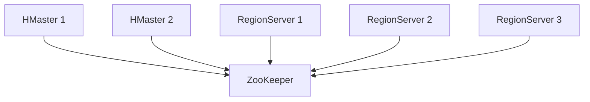

# HBase 高可用配置

HBase是一个分布式的、面向列的数据库，通常用于处理大规模数据。在生产环境中，确保HBase集群的高可用性（High Availability, HA）至关重要。高可用性意味着即使某些节点发生故障，系统仍能继续运行，从而避免数据丢失或服务中断。

本文将逐步介绍如何在HBase中配置高可用性，并通过实际案例展示其应用场景。

## 什么是HBase高可用性？

HBase的高可用性主要通过以下两种机制实现：

1. **HMaster的高可用性**：HMaster是HBase集群的管理节点，负责管理表的元数据和RegionServer的负载均衡。如果HMaster宕机，整个集群将无法正常工作。因此，配置多个HMaster实例是实现高可用性的关键。

2. **RegionServer的高可用性**：RegionServer负责存储实际的数据。如果某个RegionServer宕机，HBase会自动将其负责的Region重新分配到其他健康的RegionServer上。

## 配置HMaster的高可用性

### 1. 配置多个HMaster

在HBase中，可以通过配置多个HMaster实例来实现高可用性。以下是配置步骤：

1. **修改`hbase-site.xml`文件**：在HBase的配置文件中，添加以下配置项：

   ```xml
   <property>
     <name>hbase.master</name>
     <value>hbase-master1:60000,hbase-master2:60000</value>
   </property>
   ```

   其中，`hbase-master1`和`hbase-master2`是两个HMaster的主机名。

2. **启动多个HMaster**：在配置完成后，分别在两个节点上启动HMaster：

   ```bash
   hbase-daemon.sh start master
   ```

   这样，HBase集群中就会有两个HMaster实例，其中一个作为活跃的HMaster，另一个作为备用的HMaster。

### 2. 使用ZooKeeper进行故障切换

HBase使用ZooKeeper来管理HMaster的选举和故障切换。ZooKeeper会监控HMaster的状态，并在活跃的HMaster宕机时，自动将备用的HMaster提升为活跃状态。

确保ZooKeeper集群的配置正确，并在`hbase-site.xml`中指定ZooKeeper的地址：

```xml
<property>
  <name>hbase.zookeeper.quorum</name>
  <value>zk1:2181,zk2:2181,zk3:2181</value>
</property>
```

## 配置RegionServer的高可用性

### 1. 自动故障转移

HBase会自动处理RegionServer的故障。当某个RegionServer宕机时，HMaster会检测到该故障，并将其负责的Region重新分配到其他健康的RegionServer上。

### 2. 数据复制

为了进一步提高数据的可用性，可以启用HBase的数据复制功能。数据复制允许将数据复制到多个RegionServer上，从而在某个RegionServer宕机时，仍然可以从其他RegionServer读取数据。

在`hbase-site.xml`中启用数据复制：

```xml
<property>
  <name>hbase.replication</name>
  <value>true</value>
</property>
```

## 实际案例

假设我们有一个HBase集群，包含两个HMaster和三个RegionServer。以下是集群的架构图：



在这个集群中，ZooKeeper负责监控HMaster的状态。如果HMaster 1宕机，ZooKeeper会自动将HMaster 2提升为活跃的HMaster，从而确保集群的持续运行。

## 总结

通过配置多个HMaster和使用ZooKeeper进行故障切换，可以确保HBase集群的高可用性。此外，启用数据复制功能可以进一步提高数据的可用性。在实际生产环境中，高可用性配置是确保系统稳定运行的关键。

## 附加资源

- [HBase官方文档](https://hbase.apache.org/)
- [ZooKeeper官方文档](https://zookeeper.apache.org/)

## 练习

1. 尝试在一个小型HBase集群中配置多个HMaster，并模拟HMaster的故障切换。
2. 启用HBase的数据复制功能，并测试在RegionServer宕机时数据的可用性。