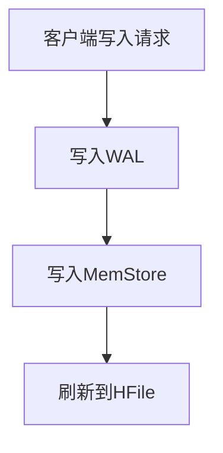
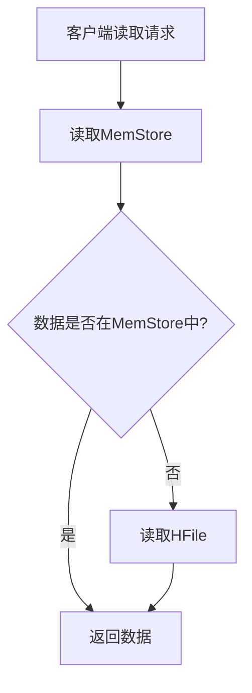

## 介绍

HBase是一个分布式的、面向列的数据库，基于Google的Bigtable设计。它构建在Hadoop HDFS之上，提供了高可靠性、高性能的数据存储和访问能力。理解HBase的读写流程对于掌握其内部机制至关重要。本文将逐步讲解HBase的读写流程，并通过实际案例帮助你更好地理解这些概念。

## HBase 写流程

### 1. 客户端写入请求

当客户端向HBase写入数据时，首先会将数据发送到HBase的RegionServer。HBase的表被水平分割成多个Region，每个Region负责存储表中的一部分数据。客户端通过HBase的元数据表（`hbase:meta`）找到负责存储该数据的RegionServer。

### 2. 写入WAL（Write-Ahead Log）

在数据写入内存之前，HBase会先将数据写入WAL（Write-Ahead Log）。WAL是一种预写日志，用于在系统崩溃时恢复数据。WAL确保了数据的持久性，即使RegionServer崩溃，数据也不会丢失。

### 3. 写入MemStore

数据写入WAL后，会被写入内存中的MemStore。MemStore是一个有序的内存数据结构，存储了最近写入的数据。当MemStore达到一定大小时，数据会被刷新到HDFS中的HFile。

### 4. 刷新到HFile

当MemStore中的数据达到一定阈值时，HBase会将这些数据刷新到HDFS中的HFile。HFile是HBase的底层存储文件，存储在HDFS上。这个过程称为“flush”。

:::note
WAL的作用是确保数据的持久性，即使在系统崩溃的情况下，数据也不会丢失。
:::

## HBase 读流程

### 1. 客户端读取请求

当客户端从HBase读取数据时，首先会通过HBase的元数据表（`hbase:meta`）找到存储该数据的RegionServer。

### 2. 读取MemStore

HBase首先会从内存中的MemStore查找数据。如果数据在MemStore中，HBase会直接返回这些数据。

### 3. 读取HFile

如果数据不在MemStore中，HBase会从HDFS中的HFile读取数据。HFile是HBase的底层存储文件，存储在HDFS上。HBase会合并多个HFile中的数据，以提供一致的数据视图。

### 4. 返回数据

HBase将MemStore和HFile中的数据合并后，返回给客户端。

:::tip
HBase的读取性能依赖于MemStore和HFile的合并操作。合理配置MemStore的大小和HFile的合并策略可以显著提高读取性能。
:::

## 实际案例

假设我们有一个HBase表 `user_data`，用于存储用户的基本信息。表结构如下：

| Row Key | Column Family:info | Column Family:contact |
|---------|--------------------|-----------------------|
| user1   | name: John         | email: john@example.com |
| user2   | name: Alice        | phone: 123-456-7890     |

### 写入数据

当客户端向 `user_data` 表写入数据时，HBase会按照以下步骤处理：

1. 客户端发送写入请求，将 `user3` 的数据写入表。
2. 数据首先写入WAL，确保数据的持久性。
3. 数据随后写入MemStore。
4. 当MemStore达到一定大小时，数据被刷新到HDFS中的HFile。

### 读取数据

当客户端从 `user_data` 表读取数据时，HBase会按照以下步骤处理：

1. 客户端发送读取请求，查询 `user1` 的数据。
2. HBase首先从MemStore查找数据。
3. 如果数据不在MemStore中，HBase会从HFile读取数据。
4. HBase将MemStore和HFile中的数据合并后，返回给客户端。

## 总结

HBase的读写流程是其内部机制的核心部分。通过理解HBase的写流程（包括WAL、MemStore和HFile）以及读流程（包括MemStore和HFile的合并），你可以更好地掌握HBase的工作原理。合理配置HBase的存储和读取策略，可以显著提高系统的性能和可靠性。

## 附加资源

- [HBase官方文档](https://hbase.apache.org/)
- 《HBase权威指南》—— Lars George
- [HBase性能调优指南](https://hbase.apache.org/book.html#performance)

## 练习

1. 尝试在本地HBase集群中创建一个表，并写入一些数据。观察WAL和MemStore的变化。
2. 配置HBase的MemStore大小，观察其对读写性能的影响。
3. 阅读HBase的源码，深入理解其读写流程的实现细节。