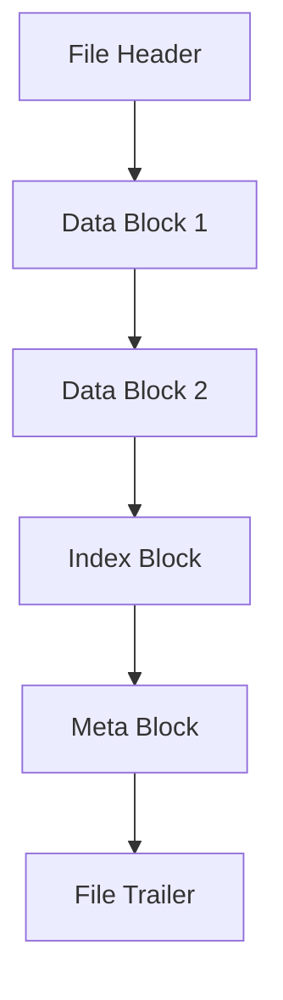

# HBase HFile结构详解

HBase是一个分布式的、面向列的数据库，它基于Google的Bigtable设计。HFile是HBase中存储数据的底层文件格式，理解HFile的结构对于深入掌握HBase的内部机制至关重要。本文将详细介绍HFile的结构，并通过实际案例展示其应用场景。

## 1. HFile简介

HFile是HBase中存储数据的文件格式，它基于Hadoop的HDFS（分布式文件系统）存储。HFile的设计目标是高效地存储和检索大量数据。每个HFile文件对应一个HBase表的列族（Column Family），并且包含多个数据块（Data Block）。

## 2. HFile的结构

HFile的结构可以分为以下几个部分：

### 2.1 文件头（File Header）

文件头包含HFile的元数据信息，如文件格式版本、创建时间等。文件头是HFile的第一个部分，用于标识文件的类型和版本。

### 2.2 数据块（Data Block）

数据块是HFile中存储实际数据的最小单元。每个数据块包含多个键值对（Key-Value Pair），这些键值对按照键的顺序排列。数据块的大小可以通过配置参数进行调整，默认大小为64KB。

### 2.3 索引块（Index Block）

索引块用于快速定位数据块。每个索引块包含多个索引条目，每个条目指向一个数据块的起始位置。索引块的存在使得HFile能够高效地进行随机读取。

### 2.4 元数据块（Meta Block）

元数据块存储与HFile相关的元数据信息，如布隆过滤器（Bloom Filter）等。布隆过滤器用于快速判断某个键是否存在于HFile中，从而减少不必要的磁盘读取操作。

### 2.5 文件尾（File Trailer）

文件尾包含HFile的校验信息和其他元数据，如数据块的偏移量、索引块的偏移量等。文件尾是HFile的最后一个部分，用于确保文件的完整性。

## 3. HFile的读写流程

### 3.1 写入流程

当数据写入HBase时，HBase首先将数据写入内存中的MemStore。当MemStore达到一定大小时，数据会被刷新（Flush）到磁盘，生成一个新的HFile。HFile的生成过程包括以下步骤：

1. 将数据按照键的顺序排序。
2. 将排序后的数据划分为多个数据块。
3. 为每个数据块生成索引条目，并写入索引块。
4. 生成元数据块和文件尾，并将所有部分写入HDFS。

### 3.2 读取流程

当从HBase读取数据时，HBase首先通过索引块定位到包含目标键的数据块，然后从数据块中读取相应的键值对。读取流程如下：

1. 通过索引块定位到目标数据块。
2. 从数据块中读取键值对。
3. 如果使用了布隆过滤器，首先通过布隆过滤器判断目标键是否存在于HFile中。

## 4. 实际案例

假设我们有一个HBase表，表名为`user`，列族为`info`。我们向表中插入以下数据：

```plaintext
row1:info:name -> Alice
row1:info:age -> 25
row2:info:name -> Bob
row2:info:age -> 30
```

当这些数据被刷新到磁盘时，会生成一个HFile。HFile的结构如下：



在这个HFile中，`Data Block 1`包含`row1`的数据，`Data Block 2`包含`row2`的数据。索引块包含指向这两个数据块的索引条目。

## 5. 总结

HFile是HBase中存储数据的底层文件格式，理解其结构对于掌握HBase的内部机制至关重要。HFile由文件头、数据块、索引块、元数据块和文件尾组成，每个部分都有其特定的作用。通过本文的介绍，希望读者能够对HFile的结构有一个清晰的理解，并能够在实际应用中灵活运用。

## 6. 附加资源与练习

- **附加资源**：
  - [HBase官方文档](https://hbase.apache.org/book.html)
  - [HFile源码解析](https://github.com/apache/hbase)

- **练习**：
  - 尝试在本地HBase集群中创建一个表，并插入一些数据，观察HFile的生成过程。
  - 使用HBase的API读取HFile中的数据，并分析其结构。

:::tip
提示：在实际应用中，合理配置HFile的数据块大小和布隆过滤器可以显著提高HBase的读写性能。
:::