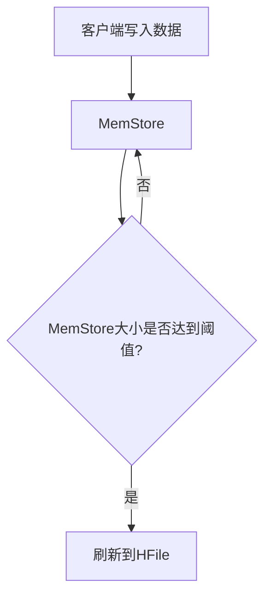

# HBase 内存管理

HBase是一个分布式的、面向列的数据库，广泛应用于大数据存储和处理场景。为了高效处理海量数据，HBase在内存管理方面做了许多优化。本文将详细介绍HBase内存管理的核心机制，帮助初学者理解其工作原理。

## 1. 概述

HBase的内存管理主要涉及两个关键组件：**MemStore** 和 **BlockCache**。MemStore用于存储写入的数据，而BlockCache则用于缓存读取的数据。合理的内存管理可以显著提升HBase的读写性能。

## 2. MemStore

### 2.1 MemStore的作用

MemStore是HBase中用于存储写入数据的缓存区域。当客户端向HBase写入数据时，数据首先会被写入MemStore，而不是直接写入磁盘。这样可以减少磁盘I/O操作，提高写入性能。

### 2.2 MemStore的刷新机制

当MemStore中的数据达到一定大小时，HBase会将其刷新（flush）到磁盘上的HFile中。这个过程称为**MemStore刷新**。刷新操作会触发磁盘写入，因此频繁的刷新会影响性能。



### 2.3 配置MemStore大小

MemStore的大小可以通过HBase配置文件进行调整。以下是一个示例配置：

```xml
<property>
    <name>hbase.hregion.memstore.flush.size</name>
    <value>134217728</value> <!-- 128MB -->
</property>
```

:::tip
适当增大MemStore的大小可以减少刷新频率，但也会增加内存占用。因此，需要根据实际应用场景进行权衡。
:::

## 3. BlockCache

### 3.1 BlockCache的作用

BlockCache是HBase中用于缓存读取数据的区域。当客户端从HBase读取数据时，数据会首先被缓存到BlockCache中，以便后续的读取操作可以更快地访问这些数据。

### 3.2 BlockCache的类型

HBase支持多种BlockCache实现，包括：

- **LRUBlockCache**：基于LRU（最近最少使用）算法的缓存实现。
- **BucketCache**：一种更高效的缓存实现，支持堆外内存和SSD缓存。

### 3.3 配置BlockCache

BlockCache的大小可以通过以下配置进行调整：

```xml
<property>
    <name>hfile.block.cache.size</name>
    <value>0.4</value> <!-- 40%的堆内存 -->
</property>
```

:::caution
BlockCache的大小设置过大可能会导致内存不足，从而影响系统稳定性。建议根据实际内存情况进行调整。
:::

## 4. 内存分配策略

### 4.1 堆内存与堆外内存

HBase的内存管理不仅涉及堆内存，还可以使用堆外内存（off-heap memory）。堆外内存不受JVM垃圾回收机制的影响，因此可以更高效地管理大块内存。

### 4.2 内存分配示例

以下是一个使用堆外内存的示例配置：

```xml
<property>
    <name>hbase.regionserver.global.memstore.size</name>
    <value>0.4</value> <!-- 40%的堆内存 -->
</property>
<property>
    <name>hbase.regionserver.global.memstore.size.lower.limit</name>
    <value>0.35</value> <!-- 35%的堆内存 -->
</property>
```

## 5. 实际案例

### 5.1 案例：优化写入性能

假设我们有一个需要频繁写入数据的应用场景。通过增大MemStore的大小，我们可以减少刷新频率，从而提高写入性能。以下是一个优化后的配置示例：

```xml
<property>
    <name>hbase.hregion.memstore.flush.size</name>
    <value>268435456</value> <!-- 256MB -->
</property>
```

### 5.2 案例：优化读取性能

在一个需要频繁读取数据的场景中，我们可以通过增大BlockCache的大小来提高读取性能。以下是一个优化后的配置示例：

```xml
<property>
    <name>hfile.block.cache.size</name>
    <value>0.6</value> <!-- 60%的堆内存 -->
</property>
```

## 6. 总结

HBase的内存管理是其性能优化的关键。通过合理配置MemStore和BlockCache的大小，以及选择合适的缓存实现，可以显著提升HBase的读写性能。希望本文能帮助初学者更好地理解HBase的内存管理机制。

## 7. 附加资源与练习

- **资源**：
  - [HBase官方文档](https://hbase.apache.org/book.html)
  - 《HBase权威指南》

- **练习**：
  1. 尝试调整MemStore的大小，观察写入性能的变化。
  2. 配置不同的BlockCache实现，比较其读取性能。
