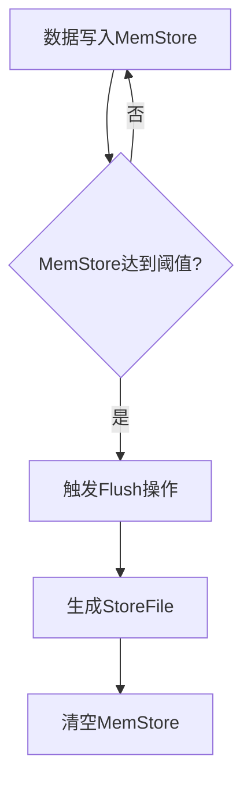

# HBase Flush机制

HBase是一个分布式的、面向列的数据库，基于Hadoop的HDFS存储数据。在HBase中，Flush机制是一个关键的内部机制，用于将内存中的数据持久化到磁盘，以确保数据的可靠性和一致性。本文将详细介绍HBase的Flush机制，帮助初学者理解其工作原理和应用场景。

## 什么是HBase Flush机制？

HBase的Flush机制是指将内存中的数据（称为MemStore）写入到HDFS中的过程。MemStore是HBase用来存储写入数据的缓冲区，当MemStore中的数据达到一定大小时，HBase会触发Flush操作，将这些数据写入到HDFS中的StoreFile中。Flush操作是HBase保证数据持久化和一致性的重要手段。

## Flush机制的触发条件

HBase的Flush机制主要由以下几个条件触发：

1. **MemStore大小达到阈值**：当MemStore中的数据量达到配置的阈值（默认为128MB）时，HBase会自动触发Flush操作。
2. **RegionServer的全局MemStore大小达到阈值**：当整个RegionServer的MemStore总大小达到一定阈值时，HBase会触发全局Flush操作，以防止内存溢出。
3. **手动触发Flush**：用户可以通过HBase的API手动触发Flush操作。

## Flush机制的工作流程

Flush机制的工作流程可以分为以下几个步骤：

1. **数据写入MemStore**：当客户端向HBase写入数据时，数据首先会被写入到MemStore中。
2. **MemStore达到阈值**：当MemStore中的数据量达到配置的阈值时，HBase会触发Flush操作。
3. **生成StoreFile**：Flush操作会将MemStore中的数据写入到HDFS中的StoreFile中。StoreFile是HBase在HDFS中存储数据的文件格式。
4. **清空MemStore**：Flush操作完成后，MemStore中的数据会被清空，以便继续接收新的写入数据。



## 实际应用场景

### 场景一：数据持久化

在一个电商网站中，用户的订单数据需要实时写入到HBase中。为了确保数据不会因为系统故障而丢失，HBase的Flush机制会定期将内存中的订单数据写入到HDFS中，从而实现数据的持久化。

### 场景二：内存管理

在一个社交网络应用中，用户的行为数据（如点赞、评论等）会频繁写入到HBase中。为了避免内存溢出，HBase的Flush机制会在MemStore达到一定大小时自动触发Flush操作，将数据写入到HDFS中，从而有效管理内存资源。

## 代码示例

以下是一个简单的Java代码示例，展示如何手动触发HBase的Flush操作：

```java
import org.apache.hadoop.hbase.client.Connection;
import org.apache.hadoop.hbase.client.ConnectionFactory;
import org.apache.hadoop.hbase.client.Table;
import org.apache.hadoop.hbase.client.Admin;
import org.apache.hadoop.hbase.HBaseConfiguration;
import org.apache.hadoop.hbase.TableName;

public class HBaseFlushExample {
    public static void main(String[] args) throws Exception {
        // 创建HBase配置
        org.apache.hadoop.conf.Configuration config = HBaseConfiguration.create();
        
        // 创建HBase连接
        Connection connection = ConnectionFactory.createConnection(config);
        
        // 获取Admin对象
        Admin admin = connection.getAdmin();
        
        // 获取表对象
        TableName tableName = TableName.valueOf("my_table");
        Table table = connection.getTable(tableName);
        
        // 手动触发Flush操作
        admin.flush(tableName);
        
        // 关闭连接
        table.close();
        admin.close();
        connection.close();
    }
}
```

:::note
在实际应用中，手动触发Flush操作并不常见，通常HBase会自动管理Flush操作。但在某些特殊情况下，手动触发Flush操作可能是必要的。
:::

## 总结

HBase的Flush机制是确保数据持久化和一致性的重要手段。通过本文的介绍，你应该已经了解了Flush机制的工作原理、触发条件以及在实际应用中的作用。掌握Flush机制对于理解HBase的内部机制和优化HBase的性能至关重要。

## 附加资源与练习

- **附加资源**：
  - [HBase官方文档](https://hbase.apache.org/book.html)
  - 《HBase权威指南》—— Lars George

- **练习**：
  1. 尝试在本地HBase环境中配置不同的MemStore大小阈值，观察Flush操作的触发频率。
  2. 编写一个程序，模拟高并发写入场景，观察HBase的Flush机制如何管理内存。

通过实践和深入学习，你将能够更好地理解和应用HBase的Flush机制。