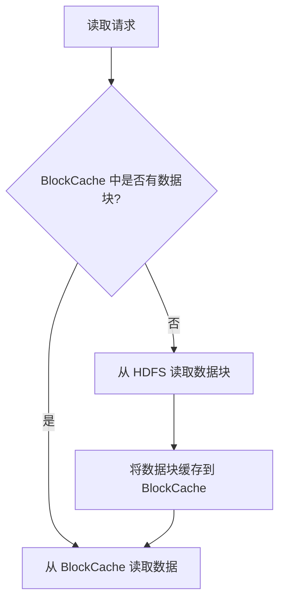

# HBase BlockCache 工作原理

HBase 是一个分布式的、面向列的数据库，广泛应用于大数据存储和处理场景。为了提高数据读取性能，HBase 引入了 **BlockCache** 机制。本文将详细介绍 BlockCache 的工作原理，帮助你理解其在 HBase 中的作用。

## 什么是 BlockCache？

BlockCache 是 HBase 中的一种缓存机制，用于存储从 HDFS（Hadoop 分布式文件系统）读取的数据块（Block）。这些数据块通常是 HFile 中的一部分，HFile 是 HBase 存储数据的底层文件格式。通过缓存这些数据块，HBase 可以减少对磁盘的频繁访问，从而显著提高读取性能。

:::note
BlockCache 主要缓存的是 HFile 中的数据块，而不是整个文件。每个数据块的大小通常为 64KB 或 128KB。
:::

## BlockCache 的工作原理

### 1. 数据块的读取与缓存

当 HBase 需要读取某一行数据时，首先会检查 BlockCache 中是否已经缓存了该行数据所在的数据块。如果缓存命中（Cache Hit），则直接从 BlockCache 中读取数据；如果缓存未命中（Cache Miss），则需要从 HDFS 中读取数据块，并将其缓存到 BlockCache 中。



### 2. BlockCache 的缓存策略

HBase 提供了多种缓存策略，常见的包括 **LRU（Least Recently Used）** 和 **BucketCache**。

- **LRU 缓存策略**：基于最近最少使用原则，当缓存空间不足时，会淘汰最近最少使用的数据块。
- **BucketCache**：将缓存分为多个桶（Bucket），每个桶可以独立管理缓存数据。BucketCache 通常与堆外内存（Off-Heap Memory）结合使用，以减少垃圾回收（GC）对性能的影响。

:::tip
在实际生产环境中，BucketCache 通常与 LRU 缓存策略结合使用，以优化缓存性能。
:::

### 3. BlockCache 的缓存层级

HBase 的 BlockCache 通常分为两个层级：

- **L1 Cache（一级缓存）**：位于 JVM 堆内存中，访问速度最快，但容量有限。
- **L2 Cache（二级缓存）**：通常位于堆外内存或 SSD 中，容量较大，但访问速度相对较慢。

```mermaid
graph TD
    A[BlockCache] --> B[L1 Cache (堆内存)]
    A --> C[L2 Cache (堆外内存/SSD)]
```

## 实际应用场景

假设你有一个 HBase 表，存储了大量的用户行为数据。当用户频繁查询某个时间段内的行为数据时，这些数据所在的数据块会被缓存到 BlockCache 中。随着查询次数的增加，缓存命中率也会提高，从而减少对磁盘的访问，显著提升查询性能。

:::caution
如果缓存空间不足，可能会导致频繁的缓存淘汰，从而影响性能。因此，合理配置 BlockCache 的大小和缓存策略非常重要。
:::

## 总结

BlockCache 是 HBase 中用于优化数据读取性能的关键机制。通过缓存 HFile 中的数据块，BlockCache 可以减少对磁盘的频繁访问，从而提高查询效率。理解 BlockCache 的工作原理和缓存策略，有助于你在实际应用中更好地配置和优化 HBase 性能。

## 附加资源与练习

- **资源**：
  - [HBase 官方文档](https://hbase.apache.org/)
  - [HBase 性能调优指南](https://hbase.apache.org/book.html#performance)
  
- **练习**：
  1. 尝试在本地 HBase 集群中启用 BlockCache，并观察其对查询性能的影响。
  2. 修改 BlockCache 的大小和缓存策略，测试不同配置下的性能差异。
