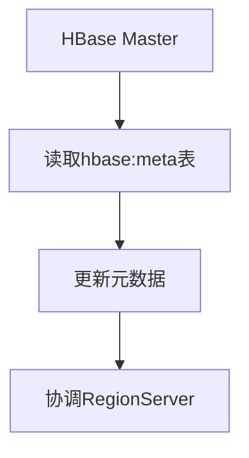
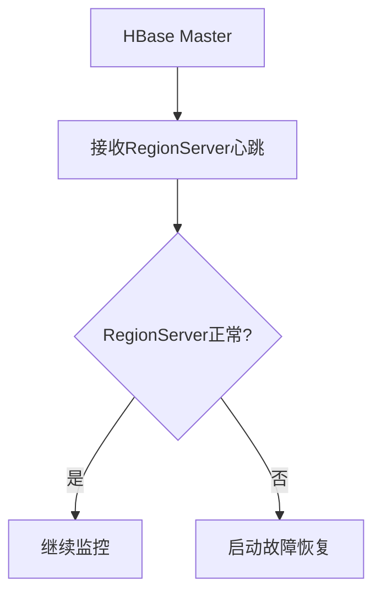
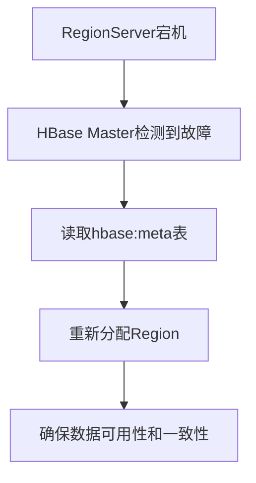
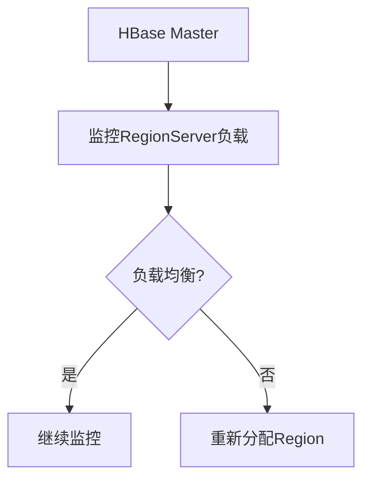

# HBase Master功能详解

HBase是一个分布式的、面向列的数据库，基于Hadoop的HDFS构建。HBase Master是HBase集群中的核心组件之一，负责管理集群的元数据、协调RegionServer的工作以及处理集群的故障恢复等任务。本文将详细介绍HBase Master的功能及其在HBase集群中的关键作用。

## 1. HBase Master简介

HBase Master是HBase集群的管理节点，负责管理整个集群的元数据、协调RegionServer的工作以及处理集群的故障恢复等任务。HBase Master的主要职责包括：

- **元数据管理**：HBase Master负责管理HBase的元数据，包括表的结构、Region的分配等信息。
- **RegionServer管理**：HBase Master负责监控和管理RegionServer的状态，确保RegionServer正常工作。
- **故障恢复**：当RegionServer发生故障时，HBase Master负责重新分配Region，确保数据的可用性和一致性。
- **负载均衡**：HBase Master负责监控集群的负载情况，并根据需要重新分配Region，以实现负载均衡。

## 2. HBase Master的核心功能

### 2.1 元数据管理

HBase Master负责管理HBase的元数据，包括表的结构、Region的分配等信息。元数据存储在HBase的系统表中，例如`hbase:meta`表。HBase Master通过读取和更新这些系统表来管理元数据。

### 2.2 RegionServer管理

HBase Master负责监控和管理RegionServer的状态。每个RegionServer都会定期向HBase Master发送心跳信号，以表明其正常运行。如果HBase Master检测到某个RegionServer停止发送心跳信号，它会认为该RegionServer已经宕机，并启动故障恢复流程。

### 2.3 故障恢复

当RegionServer发生故障时，HBase Master负责重新分配Region，确保数据的可用性和一致性。HBase Master会从`hbase:meta`表中读取Region的分配信息，并将这些Region重新分配到其他正常的RegionServer上。

### 2.4 负载均衡

HBase Master负责监控集群的负载情况，并根据需要重新分配Region，以实现负载均衡。HBase Master会根据RegionServer的负载情况，将Region从负载较高的RegionServer迁移到负载较低的RegionServer上。

## 3. 实际应用场景

### 3.1 集群扩展

当HBase集群需要扩展时，HBase Master负责将新加入的RegionServer纳入集群管理，并重新分配Region以实现负载均衡。例如，当一个新的RegionServer加入集群时，HBase Master会从现有的RegionServer中迁移部分Region到新的RegionServer上。

### 3.2 故障恢复

假设某个RegionServer由于硬件故障而宕机，HBase Master会检测到该故障，并从`hbase:meta`表中读取该RegionServer上的Region信息。然后，HBase Master会将这些Region重新分配到其他正常的RegionServer上，确保数据的可用性和一致性。

### 3.3 负载均衡

在一个高并发的HBase集群中，某些RegionServer可能会因为处理大量请求而负载过高。HBase Master会监控这些RegionServer的负载情况，并将部分Region迁移到负载较低的RegionServer上，以实现负载均衡。

## 4. 总结

HBase Master是HBase集群中的核心组件，负责管理集群的元数据、协调RegionServer的工作以及处理集群的故障恢复等任务。通过本文的介绍，你应该对HBase Master的功能有了更深入的了解。HBase Master在集群扩展、故障恢复和负载均衡等方面发挥着关键作用，确保HBase集群的高可用性和高性能。

## 5. 附加资源与练习

- **附加资源**：
  - [HBase官方文档](https://hbase.apache.org/)
  - [HBase架构详解](https://hbase.apache.org/book.html#architecture)

- **练习**：
  - 尝试在一个小型HBase集群中模拟RegionServer故障，观察HBase Master如何进行故障恢复。
  - 使用HBase Shell命令查看`hbase:meta`表中的元数据信息，理解HBase Master如何管理元数据。

:::tip
如果你对HBase Master的功能有任何疑问，欢迎在评论区留言，我们会尽快为你解答！
:::