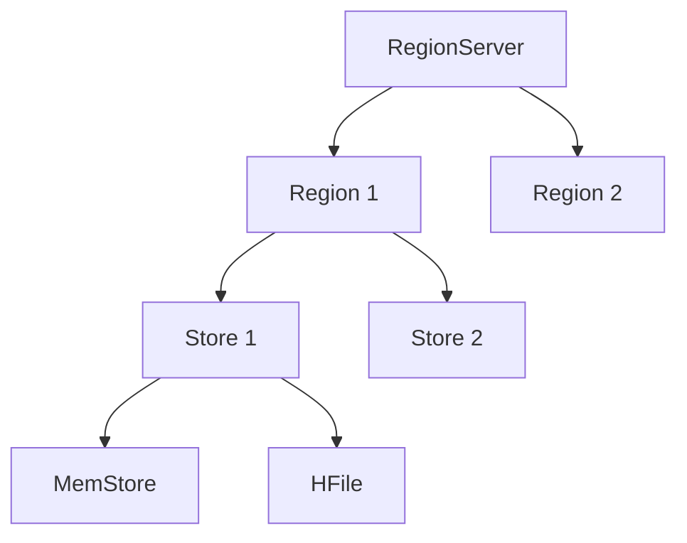
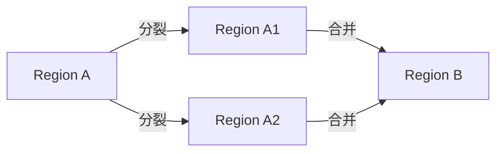

# HBase RegionServer功能详解

HBase是一个分布式的、面向列的数据库，基于Google的Bigtable设计。它构建在Hadoop HDFS之上，提供高可靠性、高性能的数据存储和访问能力。在HBase的架构中，**RegionServer**是一个核心组件，负责管理数据的存储和访问。本文将详细介绍RegionServer的功能及其在HBase中的作用。

## 什么是RegionServer？

RegionServer是HBase集群中的一个关键组件，负责管理一个或多个**Region**。每个Region是表的一部分，存储了表中的一部分数据。RegionServer的主要职责包括：

1. **数据存储**：管理Region中的数据，包括读写操作。
2. **数据分区**：将表的数据划分为多个Region，每个Region由RegionServer管理。
3. **数据恢复**：在RegionServer故障时，负责数据的恢复和重新分配。
4. **负载均衡**：通过动态调整Region的分布，确保集群的负载均衡。

## RegionServer的核心功能

### 1. 数据存储与管理

RegionServer负责管理Region中的数据。每个Region包含多个**Store**，每个Store对应表中的一个列族（Column Family）。Store内部使用**MemStore**和**HFile**来存储数据。

- **MemStore**：内存中的数据结构，用于缓存写入的数据。当MemStore达到一定大小时，数据会被刷新到磁盘上的HFile中。
- **HFile**：基于HDFS的文件格式，用于持久化存储数据。



### 2. 数据读写操作

RegionServer处理客户端的数据读写请求。当客户端请求读取数据时，RegionServer会从MemStore和HFile中检索数据并返回给客户端。写入操作则首先写入MemStore，随后异步刷新到HFile中。

:::note
**注意**：写入操作首先写入MemStore，因此写入性能较高，但数据在刷新到HFile之前可能会丢失。
:::

### 3. Region的分裂与合并

随着数据的增长，Region的大小可能会超过预设的阈值。此时，RegionServer会触发**Region分裂**，将一个Region拆分为两个较小的Region。相反，当Region的大小过小时，RegionServer可能会触发**Region合并**，将多个小Region合并为一个较大的Region。



### 4. 数据恢复与故障处理

RegionServer是HBase集群中的关键组件，如果某个RegionServer发生故障，HBase会自动将该RegionServer管理的Region重新分配到其他健康的RegionServer上。这个过程称为**Region迁移**。

:::caution
**警告**：RegionServer故障可能导致短暂的服务中断，直到Region迁移完成。
:::

## 实际应用场景

### 场景1：高并发写入

假设你正在构建一个实时日志收集系统，需要处理大量的写入请求。HBase的RegionServer可以高效地处理这些写入请求，因为写入操作首先写入MemStore，随后异步刷新到HFile中。

```java
// 示例代码：向HBase写入数据
Configuration config = HBaseConfiguration.create();
Connection connection = ConnectionFactory.createConnection(config);
Table table = connection.getTable(TableName.valueOf("logs"));

Put put = new Put(Bytes.toBytes("row1"));
put.addColumn(Bytes.toBytes("cf"), Bytes.toBytes("log"), Bytes.toBytes("This is a log entry"));
table.put(put);
```

### 场景2：大规模数据查询

在一个电商平台中，你可能需要查询用户的订单历史。HBase的RegionServer可以高效地处理这些查询请求，因为它将数据分布在多个Region中，每个Region由不同的RegionServer管理。

```java
// 示例代码：从HBase读取数据
Get get = new Get(Bytes.toBytes("row1"));
Result result = table.get(get);
byte[] value = result.getValue(Bytes.toBytes("cf"), Bytes.toBytes("log"));
System.out.println("Log entry: " + Bytes.toString(value));
```

## 总结

RegionServer是HBase架构中的核心组件，负责管理数据的存储、读写、分区和恢复。通过理解RegionServer的功能，你可以更好地设计和优化HBase集群，以满足不同的应用需求。

## 附加资源与练习

- **练习1**：尝试在本地HBase集群中创建一个表，并观察RegionServer如何管理Region。
- **练习2**：编写一个简单的Java程序，使用HBase客户端API向表中写入和读取数据。
- **资源**：阅读HBase官方文档，深入了解RegionServer的配置和优化策略。

通过本文的学习，你应该对HBase RegionServer的功能有了全面的了解。接下来，你可以通过实践进一步巩固这些知识。