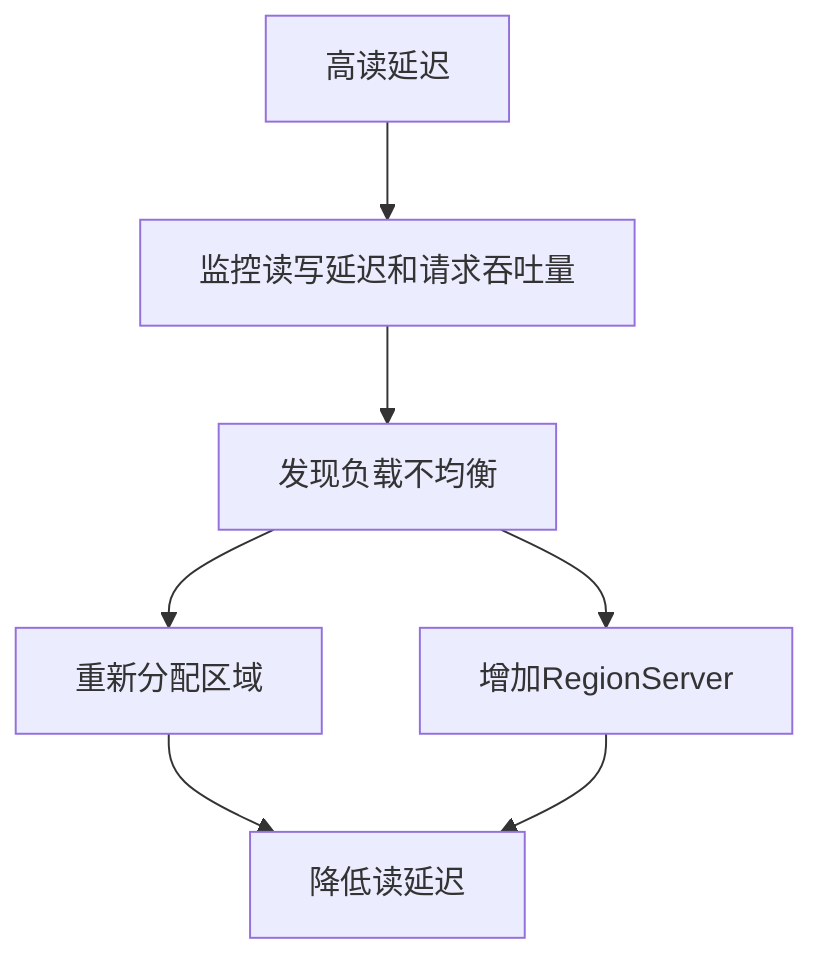

# HBase 性能指标

在HBase性能调优中，了解并监控关键性能指标是至关重要的。这些指标可以帮助你识别潜在的性能瓶颈，并采取相应的优化措施。本文将介绍HBase中的一些关键性能指标，并通过实际案例展示如何应用这些指标来优化HBase集群的性能。

## 介绍

HBase是一个分布式的、面向列的数据库，设计用于处理大规模数据集。为了确保HBase集群的高效运行，我们需要监控和分析一系列性能指标。这些指标可以帮助我们了解集群的健康状况，识别潜在的性能问题，并采取相应的优化措施。

## 关键性能指标

### 1. 读写延迟（Read/Write Latency）

读写延迟是指从客户端发起请求到收到响应所需的时间。高延迟通常意味着系统存在性能瓶颈。

- **读延迟**：从HBase读取数据所需的时间。
- **写延迟**：向HBase写入数据所需的时间。

:::tip
监控读写延迟可以帮助你识别是否存在热点区域或负载不均衡的问题。
:::

### 2. 请求吞吐量（Request Throughput）

请求吞吐量是指单位时间内处理的请求数量。高吞吐量通常意味着系统能够高效地处理大量请求。

- **读吞吐量**：单位时间内处理的读请求数量。
- **写吞吐量**：单位时间内处理的写请求数量。

### 3. 内存使用情况（Memory Usage）

HBase依赖于内存来缓存数据和索引，因此内存使用情况是一个重要的性能指标。

- **MemStore使用率**：MemStore是HBase中用于缓存写操作的内存区域。高MemStore使用率可能导致频繁的Flush操作，从而影响性能。
- **BlockCache使用率**：BlockCache用于缓存读操作的数据块。高BlockCache使用率可以提高读性能。

### 4. 磁盘I/O（Disk I/O）

磁盘I/O是指HBase与底层存储系统之间的数据读写操作。高磁盘I/O通常意味着系统正在处理大量数据。

- **读I/O**：从磁盘读取数据的操作。
- **写I/O**：向磁盘写入数据的操作。

### 5. 区域服务器负载（RegionServer Load）

区域服务器负载是指每个RegionServer处理的请求数量。负载不均衡可能导致某些RegionServer过载，从而影响整体性能。

- **请求数量**：每个RegionServer处理的请求数量。
- **区域数量**：每个RegionServer管理的区域数量。

## 实际案例

假设我们有一个HBase集群，最近发现读延迟显著增加。通过监控读写延迟和请求吞吐量，我们发现某些RegionServer的读延迟远高于其他RegionServer。进一步分析发现，这些RegionServer管理的区域数量过多，导致负载不均衡。

为了解决这个问题，我们可以采取以下措施：

1. **重新分配区域**：将部分区域从负载较高的RegionServer迁移到负载较低的RegionServer。
2. **增加RegionServer**：如果集群资源允许，可以增加RegionServer的数量，以分担负载。

## 总结

监控和分析HBase性能指标是优化集群性能的关键步骤。通过关注读写延迟、请求吞吐量、内存使用情况、磁盘I/O和区域服务器负载等指标，我们可以识别潜在的性能问题，并采取相应的优化措施。

## 附加资源

- [HBase官方文档](https://hbase.apache.org/)
- [HBase性能调优指南](https://hbase.apache.org/book.html#performance)

## 练习

1. 在你的HBase集群中，监控读写延迟和请求吞吐量，并分析是否存在负载不均衡的问题。
2. 尝试重新分配区域或增加RegionServer，观察性能指标的变化。