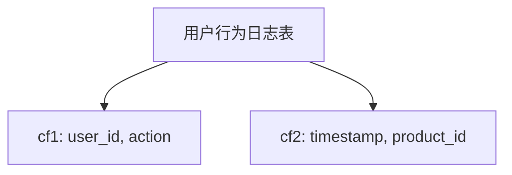

# HBase 列族优化

HBase是一个分布式的、面向列的数据库，广泛应用于大数据存储和处理场景。在HBase中，列族（Column Family）是数据存储的基本单位之一。合理设计和优化列族可以显著提升HBase的性能。本文将详细介绍HBase列族优化的概念、方法和实际应用场景。

## 什么是列族？

在HBase中，表由多个列族组成，每个列族包含一组相关的列。列族在物理存储上是独立的，这意味着不同的列族会存储在不同的文件中。因此，列族的设计直接影响数据的存储和查询性能。

## 列族优化的关键点

### 1. 列族数量

HBase建议每个表的列族数量不要过多，通常不超过3个。过多的列族会导致存储文件（HFile）数量增加，从而增加读写操作的复杂性。

:::caution
注意：每个列族都会生成独立的存储文件，过多的列族会导致存储文件数量激增，影响性能。
:::

### 2. 列族属性

HBase允许为每个列族设置不同的属性，这些属性会影响数据的存储和查询性能。以下是一些常见的列族属性：

- **BLOCKSIZE**：设置HFile的块大小，默认值为64KB。较大的块大小适合顺序扫描，较小的块大小适合随机读取。
- **COMPRESSION**：设置数据压缩算法，如`SNAPPY`、`GZIP`等。压缩可以减少存储空间，但会增加CPU开销。
- **BLOOMFILTER**：布隆过滤器可以加速数据查找，减少不必要的磁盘读取。

```java
// 示例：创建表时设置列族属性
HTableDescriptor tableDescriptor = new HTableDescriptor(TableName.valueOf("myTable"));
HColumnDescriptor columnDescriptor = new HColumnDescriptor("cf1");
columnDescriptor.setBlocksize(64 * 1024); // 设置块大小为64KB
columnDescriptor.setCompressionType(Algorithm.SNAPPY); // 设置压缩算法为SNAPPY
columnDescriptor.setBloomFilterType(BloomType.ROW); // 设置布隆过滤器类型为ROW
tableDescriptor.addFamily(columnDescriptor);
admin.createTable(tableDescriptor);
```

### 3. 列族设计

在设计列族时，应考虑数据的访问模式。例如，如果某些列经常一起被查询，可以将它们放在同一个列族中，以减少跨列族的读取操作。

:::tip
提示：将经常一起访问的列放在同一个列族中，可以减少跨列族的读取操作，提升查询性能。
:::

## 实际案例

假设我们有一个电商网站的用户行为日志表，包含以下列：

- `user_id`：用户ID
- `action`：用户行为（如点击、购买）
- `timestamp`：行为时间戳
- `product_id`：商品ID

我们可以将这些列分为两个列族：

- `cf1`：包含`user_id`和`action`
- `cf2`：包含`timestamp`和`product_id`

这样设计的好处是，如果查询经常只涉及用户行为（如统计用户的点击次数），可以只读取`cf1`列族，减少不必要的磁盘读取。



## 总结

HBase列族优化是提升HBase性能的重要手段。通过合理设计列族数量、设置列族属性以及根据数据访问模式设计列族，可以显著提升HBase的存储和查询性能。

## 附加资源

- [HBase官方文档](https://hbase.apache.org/)
- 《HBase权威指南》：深入讲解HBase的设计和优化技巧

## 练习

1. 创建一个HBase表，设置不同的列族属性（如块大小、压缩算法等），并观察其对性能的影响。
2. 设计一个适合你业务场景的列族结构，并解释其设计思路。

通过本文的学习，你应该对HBase列族优化有了初步的了解。希望你能在实际应用中灵活运用这些知识，提升HBase的性能。