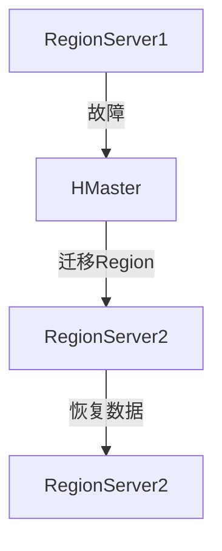

# HBase 数据一致性保证

在分布式数据库系统中，数据一致性是一个至关重要的概念。HBase作为一个分布式的、面向列的数据库，提供了多种机制来保证数据的一致性。本文将详细介绍HBase如何实现数据一致性，并通过实际案例和代码示例帮助初学者理解这一概念。

## 什么是数据一致性？

数据一致性指的是在分布式系统中，多个副本或节点之间的数据保持一致的状态。在HBase中，数据一致性主要通过以下几种机制来保证：

1. **写前日志（WAL）**：HBase在写入数据之前，会先将操作记录到WAL中，以确保在发生故障时能够恢复数据。
2. **多版本并发控制（MVCC）**：HBase使用MVCC来管理数据的版本，确保在并发读写操作时数据的一致性。
3. **RegionServer的故障恢复**：当RegionServer发生故障时，HBase会自动将其负责的Region迁移到其他健康的RegionServer上，确保数据不丢失。

## HBase 数据一致性的核心机制

### 写前日志（WAL）

HBase的写前日志（Write-Ahead Log, WAL）机制是保证数据一致性的关键。每次写入操作都会先记录到WAL中，然后再写入内存（MemStore）。这样即使在写入内存后发生故障，也可以通过WAL恢复数据。

```java
// 示例：HBase写入操作
Put put = new Put(Bytes.toBytes("row1"));
put.addColumn(Bytes.toBytes("cf"), Bytes.toBytes("col1"), Bytes.toBytes("value1"));
table.put(put);
```

### 多版本并发控制（MVCC）

HBase使用MVCC来管理数据的版本。每次写入操作都会生成一个新的版本，读取操作则可以根据时间戳获取特定版本的数据。这种方式可以有效避免读写冲突，保证数据的一致性。

```java
// 示例：HBase读取操作
Get get = new Get(Bytes.toBytes("row1"));
get.setTimeStamp(1633072800000L); // 读取特定时间戳的数据
Result result = table.get(get);
```

### RegionServer的故障恢复

当RegionServer发生故障时，HBase会自动将其负责的Region迁移到其他健康的RegionServer上。这个过程由HMaster协调完成，确保数据不丢失，并且系统能够继续正常运行。



## 实际案例

假设我们有一个电商网站，使用HBase存储用户的购物车信息。为了保证在用户添加商品到购物车时数据的一致性，我们可以使用HBase的WAL和MVCC机制。

1. **用户添加商品到购物车**：每次用户添加商品时，HBase会先将操作记录到WAL中，然后再更新购物车数据。
2. **读取购物车信息**：当用户查看购物车时，HBase会根据时间戳读取最新的购物车数据，确保用户看到的是最新的信息。

```java
// 示例：用户添加商品到购物车
Put put = new Put(Bytes.toBytes("user1"));
put.addColumn(Bytes.toBytes("cart"), Bytes.toBytes("item1"), Bytes.toBytes("quantity1"));
table.put(put);

// 示例：用户查看购物车
Get get = new Get(Bytes.toBytes("user1"));
Result result = table.get(get);
```

## 总结

HBase通过写前日志（WAL）、多版本并发控制（MVCC）和RegionServer的故障恢复机制，有效地保证了数据的一致性。这些机制不仅确保了数据的可靠性，还提高了系统的容错能力。

## 附加资源与练习

- **资源**：
  - [HBase官方文档](https://hbase.apache.org/)
  - 《HBase权威指南》

- **练习**：
  1. 尝试在本地HBase环境中实现一个简单的写入和读取操作，观察WAL和MVCC的效果。
  2. 模拟RegionServer故障，观察HBase如何自动恢复数据。

通过本文的学习，你应该对HBase的数据一致性保证有了初步的了解。继续深入学习和实践，你将能够更好地掌握HBase的核心机制。