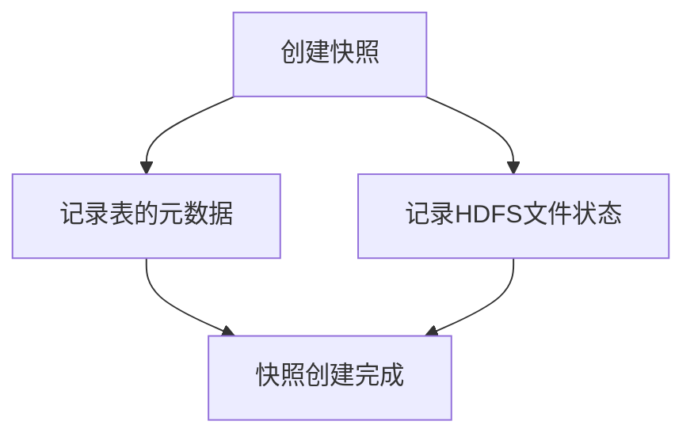

# HBase 快照功能

## 介绍

HBase是一个分布式的、面向列的数据库，广泛应用于大数据存储和处理场景。在实际生产环境中，数据的安全性和可恢复性至关重要。HBase的快照功能（Snapshot）提供了一种高效、轻量级的数据备份和恢复机制，能够在几乎不影响系统性能的情况下，快速创建表或表的某个时间点的副本。

快照功能的核心思想是**元数据管理**，而不是实际复制数据。它通过记录表的元数据和文件系统的状态，来实现数据的“冻结”状态。因此，快照的创建和删除操作非常快速，且不会占用额外的存储空间。

## 快照的基本操作

### 创建快照

在HBase中，可以通过命令行工具或HBase Shell来创建快照。以下是使用HBase Shell创建快照的示例：

```bash
hbase> snapshot 'my_table', 'my_table_snapshot_20231001'
```

- `my_table`：需要创建快照的表名。
- `my_table_snapshot_20231001`：快照的名称。

创建快照后，HBase会记录表的元数据和文件系统的状态，但不会复制实际数据。

### 查看快照

可以通过以下命令查看已创建的快照：

```bash
hbase> list_snapshots
```

输出示例：

```
SNAPSHOT                        TABLE + CREATION TIME
my_table_snapshot_20231001      my_table (2023-10-01 12:00:00)
```

### 删除快照

如果不再需要某个快照，可以通过以下命令删除：

```bash
hbase> delete_snapshot 'my_table_snapshot_20231001'
```

### 恢复快照

快照的一个重要用途是数据恢复。可以通过以下命令将表恢复到快照的状态：

```bash
hbase> restore_snapshot 'my_table_snapshot_20231001'
```

:::caution
恢复快照会覆盖表的当前状态，因此在执行此操作前，请确保数据已备份或不再需要。
:::

## 快照的工作原理

HBase的快照功能依赖于HDFS（Hadoop Distributed File System）的快照机制。当创建一个快照时，HBase会记录以下信息：

1. **表的元数据**：包括表的列族、列限定符等信息。
2. **HDFS文件的状态**：记录表对应的HDFS文件的状态，确保文件不会被修改或删除。

快照的核心优势在于它**不复制数据**，而是通过元数据管理来实现数据的“冻结”状态。因此，快照的创建和删除操作非常高效。



## 实际应用场景

### 场景1：数据备份

在数据迁移或系统升级前，可以通过快照功能快速备份数据。例如，在升级HBase版本前，创建一个快照，确保在升级失败时可以快速恢复到之前的状态。

```bash
hbase> snapshot 'user_data', 'user_data_backup_20231001'
```

### 场景2：数据恢复

假设某个表的数据被意外删除或损坏，可以通过快照功能快速恢复数据。

```bash
hbase> restore_snapshot 'user_data_backup_20231001'
```

### 场景3：数据测试

在开发或测试环境中，可以通过快照功能快速创建表的副本，用于测试新功能或修复Bug，而不会影响生产环境。

```bash
hbase> clone_snapshot 'user_data_backup_20231001', 'user_data_test'
```

:::tip
`clone_snapshot`命令会创建一个新的表，该表是快照的副本，但不会影响原始表。
:::

## 总结

HBase的快照功能是一种高效、轻量级的数据备份和恢复机制，适用于多种场景，如数据备份、恢复和测试。通过快照功能，可以在几乎不影响系统性能的情况下，快速创建表的副本，并在需要时恢复到指定状态。

## 附加资源与练习

### 资源
- [HBase官方文档 - 快照功能](https://hbase.apache.org/book.html#ops.snapshots)
- [HDFS快照机制](https://hadoop.apache.org/docs/stable/hadoop-project-dist/hadoop-hdfs/HdfsSnapshots.html)

### 练习
1. 在本地HBase环境中创建一个表，并尝试使用快照功能备份和恢复数据。
2. 使用`clone_snapshot`命令创建一个表的副本，并验证数据是否一致。
3. 研究HDFS快照机制，了解其与HBase快照功能的关系。