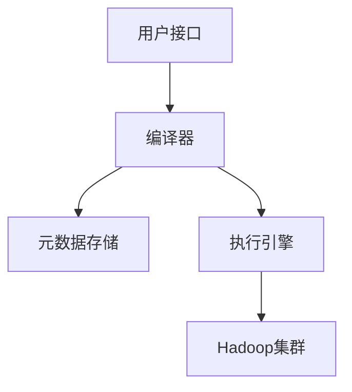

# Hive 简介

Hive是一个基于Hadoop的数据仓库工具，旨在简化大规模数据集的处理和分析。它提供了类似于SQL的查询语言（称为HiveQL），使得熟悉SQL的用户能够轻松地处理存储在Hadoop分布式文件系统（HDFS）中的数据。Hive将SQL查询转换为MapReduce任务，从而在Hadoop集群上执行。

## Hive 的架构

Hive的架构主要由以下几个组件组成：

1. **用户接口**：用户可以通过命令行工具（CLI）、Web UI或JDBC/ODBC接口与Hive交互。
2. **编译器**：将HiveQL查询转换为MapReduce任务。
3. **元数据存储**：存储表的结构、分区信息等元数据，通常使用关系型数据库（如MySQL）来存储。
4. **执行引擎**：负责执行编译器生成的MapReduce任务。



## Hive QL基础

HiveQL是Hive的查询语言，它与SQL非常相似。以下是一个简单的HiveQL查询示例：

```sql
-- 创建一个表
CREATE TABLE employees (
    id INT,
    name STRING,
    salary FLOAT
);

-- 插入数据
INSERT INTO TABLE employees VALUES (1, 'Alice', 50000.0);
INSERT INTO TABLE employees VALUES (2, 'Bob', 60000.0);

-- 查询数据
SELECT * FROM employees WHERE salary > 55000;
```

**输出结果：**

| id | name | salary |
|----|------|--------|
| 2  | Bob  | 60000  |

## Hive 的实际应用场景

Hive广泛应用于大数据处理和分析领域，特别是在以下场景中：

1. **数据仓库**：Hive可以用于构建企业级数据仓库，存储和分析大规模数据集。
2. **日志分析**：通过Hive处理和分析服务器日志，识别异常行为或性能瓶颈。
3. **数据挖掘**：利用Hive进行数据挖掘，发现数据中的潜在模式和趋势。

## 总结

Hive是一个强大的工具，使得处理和分析大规模数据集变得更加简单和高效。通过HiveQL，用户可以轻松地执行复杂的查询操作，而无需深入了解底层的MapReduce编程模型。对于初学者来说，掌握Hive的基础知识是进入大数据领域的重要一步。

## 附加资源

- [Hive官方文档](https://hive.apache.org/)
- 《Hive编程指南》 - 一本详细介绍Hive的书籍
- [HiveQL教程](https://www.tutorialspoint.com/hive/index.htm)

## 练习

1. 创建一个包含学生信息的Hive表，并插入一些数据。
2. 编写一个HiveQL查询，查找成绩高于90分的学生。
3. 尝试使用Hive的分区功能，将数据按年份进行分区存储。

:::tip
在学习和使用Hive时，建议结合Hadoop生态系统中的其他工具（如HDFS、MapReduce）进行实践，以加深理解。
:::