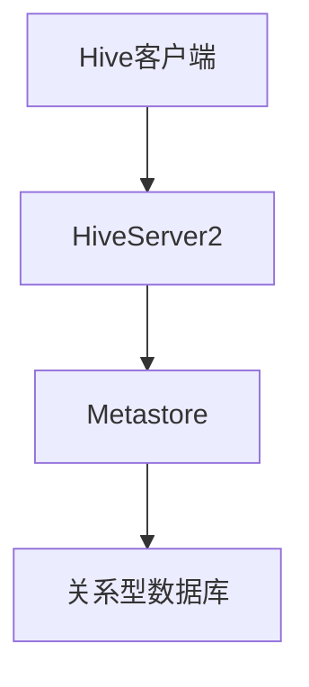

# Hive 元数据存储

## 介绍

Hive是一个基于Hadoop的数据仓库工具，用于处理大规模数据集。它提供了类似SQL的查询语言（HiveQL），使得用户可以通过熟悉的SQL语法来查询和分析数据。然而，Hive的核心功能之一是**元数据存储**，它负责管理表、列、分区等元数据信息。

元数据存储是Hive的重要组成部分，它帮助Hive理解数据的结构、位置和属性。通过元数据存储，Hive能够高效地执行查询、优化查询计划以及管理数据的分区和存储。

## 元数据存储的作用

Hive元数据存储的主要作用包括：

1. **表结构管理**：存储表的定义、列名、数据类型等信息。
2. **分区管理**：记录表的分区信息，帮助Hive快速定位数据。
3. **数据位置管理**：存储数据在HDFS或其他存储系统中的位置。
4. **权限管理**：管理用户对表和分区的访问权限。
5. **统计信息**：存储表的统计信息，如行数、大小等，用于查询优化。

## 元数据存储的实现

Hive元数据存储通常使用关系型数据库（如MySQL、PostgreSQL）来存储元数据信息。Hive提供了一个名为**Metastore**的服务，用于与元数据存储进行交互。

### Metastore的架构



在上面的架构图中，Hive客户端通过HiveServer2与Metastore进行通信，Metastore则负责与底层的关系型数据库交互，存储和检索元数据。

### 配置Metastore

要配置Hive使用特定的关系型数据库作为元数据存储，需要在`hive-site.xml`文件中进行配置。以下是一个使用MySQL作为元数据存储的示例配置：

```xml
<configuration>
    <property>
        <name>javax.jdo.option.ConnectionURL</name>
        <value>jdbc:mysql://localhost/metastore_db?createDatabaseIfNotExist=true</value>
    </property>
    <property>
        <name>javax.jdo.option.ConnectionDriverName</name>
        <value>com.mysql.jdbc.Driver</value>
    </property>
    <property>
        <name>javax.jdo.option.ConnectionUserName</name>
        <value>hiveuser</value>
    </property>
    <property>
        <name>javax.jdo.option.ConnectionPassword</name>
        <value>hivepassword</value>
    </property>
</configuration>
```

:::note
确保你已经安装了MySQL数据库，并且已经创建了`metastore_db`数据库。
:::

### 元数据存储的表结构

Hive元数据存储在关系型数据库中以表的形式存在。以下是一些重要的元数据表：

- **DBS**：存储数据库信息。
- **TBLS**：存储表信息。
- **COLUMNS_V2**：存储表的列信息。
- **PARTITIONS**：存储分区信息。
- **SDS**：存储数据存储信息（如HDFS路径）。

## 实际案例

假设我们有一个名为`sales`的表，存储了销售数据。该表包含以下列：`id`、`product`、`quantity`、`sale_date`。我们希望通过Hive查询2023年1月的销售数据。

### 创建表

首先，我们需要在Hive中创建`sales`表：

```sql
CREATE TABLE sales (
    id INT,
    product STRING,
    quantity INT,
    sale_date DATE
)
PARTITIONED BY (year INT, month INT);
```

### 添加分区

接下来，我们为2023年1月的数据添加分区：

```sql
ALTER TABLE sales ADD PARTITION (year=2023, month=1);
```

### 查询数据

现在，我们可以查询2023年1月的销售数据：

```sql
SELECT * FROM sales WHERE year = 2023 AND month = 1;
```

:::tip
通过分区，Hive可以快速定位到特定时间段的数据，从而提高查询效率。
:::

## 总结

Hive元数据存储是Hive的核心组件之一，它负责管理表、列、分区等元数据信息。通过元数据存储，Hive能够高效地执行查询、优化查询计划以及管理数据的分区和存储。本文介绍了元数据存储的作用、实现方式以及如何在实际应用中使用它。

## 附加资源

- [Hive官方文档](https://cwiki.apache.org/confluence/display/Hive/Home)
- [Hive Metastore配置指南](https://cwiki.apache.org/confluence/display/Hive/AdminManual+Metastore+Administration)

## 练习

1. 尝试配置Hive使用PostgreSQL作为元数据存储。
2. 创建一个分区表，并查询特定分区的数据。
3. 探索Hive元数据存储中的其他表，了解它们的结构和作用。