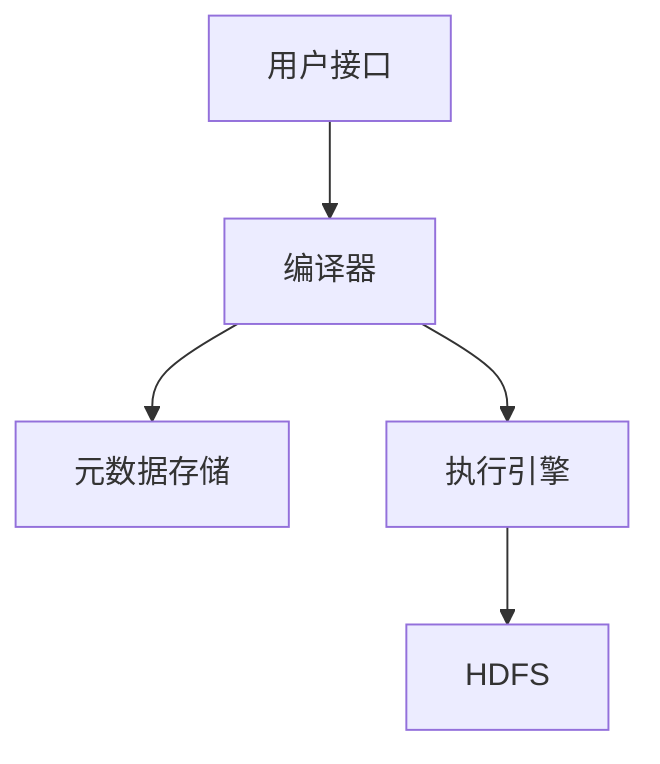

# Hive 架构

Hive是一个基于Hadoop的数据仓库工具，旨在通过类SQL语言（HiveQL）简化大数据的查询和分析。Hive的架构设计使其能够高效地处理大规模数据集，同时为用户提供熟悉的SQL接口。本文将详细介绍Hive的架构及其核心组件。

## Hive 架构概述

Hive的架构主要由以下几个核心组件组成：

1. **用户接口（User Interface）**：提供命令行工具（CLI）、Web界面和JDBC/ODBC接口，供用户提交查询。
2. **编译器（Compiler）**：将HiveQL查询转换为MapReduce任务或Tez任务。
3. **元数据存储（Metastore）**：存储表结构、分区信息等元数据。
4. **执行引擎（Execution Engine）**：执行由编译器生成的执行计划。
5. **HDFS（Hadoop Distributed File System）**：存储实际数据。



## 核心组件详解

### 1. 用户接口（User Interface）

Hive提供了多种用户接口，包括：

- **命令行接口（CLI）**：用户可以通过命令行直接与Hive交互。
- **Web界面**：通过浏览器访问Hive的Web UI。
- **JDBC/ODBC接口**：允许通过编程语言（如Java、Python）与Hive交互。

:::tip
对于初学者，建议从命令行接口（CLI）开始，逐步熟悉Hive的基本操作。
:::

### 2. 编译器（Compiler）

编译器是Hive的核心组件之一，负责将HiveQL查询转换为底层执行引擎（如MapReduce或Tez）可以理解的任务。编译过程包括以下步骤：

1. **解析（Parsing）**：将HiveQL查询解析为抽象语法树（AST）。
2. **语义分析（Semantic Analysis）**：检查语法树中的表、列是否存在，并验证查询的合法性。
3. **逻辑计划生成（Logical Plan Generation）**：生成逻辑执行计划。
4. **优化（Optimization）**：对逻辑计划进行优化，如谓词下推、列裁剪等。
5. **物理计划生成（Physical Plan Generation）**：将优化后的逻辑计划转换为物理执行计划。

:::note
Hive的优化器会根据查询的复杂性和数据量自动选择最优的执行策略。
:::

### 3. 元数据存储（Metastore）

元数据存储是Hive的重要组成部分，负责存储表结构、分区信息、列类型等元数据。Hive默认使用Derby数据库作为元数据存储，但在生产环境中通常使用MySQL或PostgreSQL等关系型数据库。

:::caution
元数据存储的性能直接影响Hive的查询效率，因此在高并发场景下，建议使用高性能的数据库。
:::

### 4. 执行引擎（Execution Engine）

执行引擎负责执行由编译器生成的物理计划。Hive支持多种执行引擎，包括：

- **MapReduce**：Hive的默认执行引擎，适合处理大规模数据。
- **Tez**：基于DAG（有向无环图）的执行引擎，性能优于MapReduce。
- **Spark**：通过Hive-on-Spark插件支持Spark作为执行引擎。

:::tip
对于需要快速响应的查询，建议使用Tez或Spark作为执行引擎。
:::

### 5. HDFS（Hadoop Distributed File System）

HDFS是Hive的底层存储系统，负责存储实际数据。Hive表的数据通常以文件的形式存储在HDFS上，支持多种文件格式，如ORC、Parquet等。

:::note
选择合适的文件格式可以显著提高查询性能和数据压缩率。
:::

## 实际案例

假设我们有一个存储在HDFS上的日志数据表 `logs`，表结构如下：

```sql
CREATE TABLE logs (
    timestamp STRING,
    user_id STRING,
    action STRING
) STORED AS ORC;
```

我们可以使用HiveQL查询过去24小时内活跃用户的数量：

```sql
SELECT COUNT(DISTINCT user_id)
FROM logs
WHERE timestamp >= unix_timestamp() - 86400;
```

**输出结果**：

```
1000
```

:::tip
在实际应用中，Hive常用于日志分析、数据仓库构建等场景。
:::

## 总结

Hive的架构设计使其能够高效地处理大规模数据集，同时为用户提供熟悉的SQL接口。通过理解Hive的核心组件及其工作原理，用户可以更好地利用Hive进行大数据分析。

## 附加资源与练习

- **练习**：尝试在本地安装Hive，并创建一个简单的表，执行一些基本查询。
- **资源**：
  - [Hive官方文档](https://hive.apache.org/)
  - 《Hive编程指南》书籍

:::caution
在学习过程中，务必注意Hive的版本兼容性，避免因版本问题导致查询失败。
:::