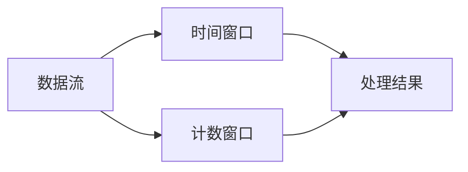

## 什么是流式数据？

流式数据（Streaming Data）是指连续生成、实时传输的数据流。与传统的批量数据不同，流式数据是动态的、无界的，通常以事件的形式产生。例如，社交媒体上的实时消息、传感器数据、股票市场交易数据等都是流式数据的典型例子。

流式数据的特点包括：
- **实时性**：数据在生成后立即被处理和分析。
- **连续性**：数据流是持续不断的，没有明确的结束点。
- **高吞吐量**：数据通常以高速率生成，需要高效的处理系统。

## 流式数据处理的基本概念

### 1. 数据流（Data Stream）
数据流是流式数据的基本单位，通常由一系列事件或记录组成。每个事件包含时间戳和相关的数据内容。例如，一个传感器数据流可能包含温度、湿度和时间戳。

### 2. 窗口（Window）
由于流式数据是无限的，我们通常通过定义窗口来处理数据。窗口可以是时间窗口（如过去5分钟的数据）或计数窗口（如最近的100条记录）。



### 3. 流式处理引擎
流式处理引擎是用于处理流式数据的软件系统。常见的流式处理引擎包括 Apache Kafka、Apache Flink 和 Apache Storm。这些引擎能够实时处理数据流，并支持复杂的计算和分析。

## 流式数据处理的实际案例

### 案例：实时股票交易分析
假设我们有一个股票交易平台，需要实时分析股票价格的变化。我们可以使用流式数据处理来实现以下功能：
1. **实时价格监控**：监控股票价格的实时变化，并在价格超过某个阈值时触发警报。
2. **趋势分析**：计算过去5分钟内股票价格的平均值，并预测未来的价格趋势。

```sql
-- 使用 Hive SQL 进行流式数据处理
SELECT 
    stock_symbol, 
    AVG(price) OVER (ORDER BY event_time RANGE BETWEEN INTERVAL 5 MINUTE PRECEDING AND CURRENT ROW) AS avg_price
FROM 
    stock_trades
WHERE 
    event_time > NOW() - INTERVAL 5 MINUTE;
```

### 输入数据示例
```json
[
    {"stock_symbol": "AAPL", "price": 150.50, "event_time": "2023-10-01T10:00:00Z"},
    {"stock_symbol": "AAPL", "price": 151.00, "event_time": "2023-10-01T10:01:00Z"},
    {"stock_symbol": "AAPL", "price": 152.00, "event_time": "2023-10-01T10:02:00Z"}
]
```

### 输出结果示例
```json
[
    {"stock_symbol": "AAPL", "avg_price": 151.17}
]
```

## 总结

流式数据处理是现代数据架构中的重要组成部分，尤其在需要实时分析和响应的场景中。通过理解流式数据的基本概念和处理方式，您可以更好地应对实时数据挑战，并构建高效的流式处理系统。

:::tip 提示
如果您想进一步学习流式数据处理，可以尝试使用 Apache Kafka 或 Apache Flink 进行实践操作。
:::

## 附加资源
- [Apache Kafka 官方文档](https://kafka.apache.org/documentation/)
- [Apache Flink 官方文档](https://flink.apache.org/docs/)
- [Hive 流式处理指南](https://hive.apache.org/)

## 练习
1. 使用 Hive SQL 编写一个查询，计算过去10分钟内某只股票的最高价格。
2. 尝试使用 Apache Kafka 创建一个简单的数据流，并实时处理数据。