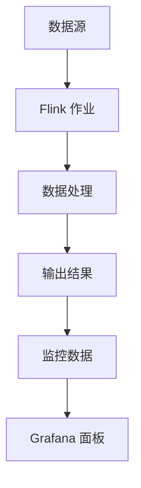

# 流处理监控

在现代数据处理的场景中，流处理（Stream Processing）已经成为处理实时数据的关键技术。流处理监控则是确保流处理系统稳定运行、及时发现和解决问题的关键环节。本文将详细介绍流处理监控的基本概念、工具以及实际应用场景，帮助初学者掌握如何监控和管理流式数据处理任务。

## 什么是流处理监控？

流处理监控是指对流处理系统的运行状态、性能指标和数据处理过程进行实时监控和分析的过程。通过监控，我们可以及时发现系统中的异常、性能瓶颈以及数据处理的延迟等问题，从而确保流处理任务的高效运行。

流处理监控通常包括以下几个方面：

1. **系统健康状态**：监控流处理系统的整体健康状态，包括 CPU、内存、磁盘等资源的使用情况。
2. **数据处理延迟**：监控数据从进入系统到处理完成的时间延迟，确保数据处理的实时性。
3. **吞吐量**：监控系统每秒处理的数据量，确保系统能够处理预期的数据负载。
4. **错误率**：监控数据处理过程中出现的错误率，及时发现并修复问题。

## 流处理监控工具

在实际应用中，有许多工具可以帮助我们进行流处理监控。以下是一些常用的工具：

- **Prometheus**：一个开源的系统监控和警报工具，支持多种数据源和灵活的查询语言。
- **Grafana**：一个开源的可视化工具，通常与 Prometheus 结合使用，用于展示监控数据。
- **Kafka Monitor**：专门用于监控 Apache Kafka 的工具，可以监控 Kafka 集群的健康状态、消息延迟等。
- **Flink Dashboard**：Apache Flink 自带的监控界面，可以实时查看 Flink 作业的运行状态和性能指标。

## 流处理监控的实际应用

### 案例：监控 Apache Flink 流处理作业

假设我们有一个使用 Apache Flink 进行实时数据处理的作业，我们需要监控该作业的运行状态和性能指标。以下是一个简单的示例，展示如何使用 Prometheus 和 Grafana 来监控 Flink 作业。

#### 1. 配置 Prometheus 监控 Flink

首先，我们需要在 Flink 的配置文件中启用 Prometheus 监控：

```yaml
metrics.reporter.prom.class: org.apache.flink.metrics.prometheus.PrometheusReporter
metrics.reporter.prom.port: 9250-9260
```

#### 2. 配置 Grafana 展示监控数据

在 Grafana 中，我们可以创建一个新的 Dashboard，并添加 Prometheus 作为数据源。然后，我们可以添加一些常用的监控面板，例如：

- **作业吞吐量**：展示每秒处理的数据量。
- **数据处理延迟**：展示数据从进入系统到处理完成的时间延迟。
- **错误率**：展示数据处理过程中出现的错误率。

#### 3. 查看监控数据

通过 Grafana，我们可以实时查看 Flink 作业的运行状态和性能指标。例如，以下是一个展示作业吞吐量的 Grafana 面板：



## 总结

流处理监控是确保流处理系统稳定运行的关键环节。通过使用 Prometheus、Grafana 等工具，我们可以实时监控流处理作业的运行状态和性能指标，及时发现和解决问题。希望本文能够帮助初学者掌握流处理监控的基本概念和实际应用。

## 附加资源与练习

- **练习**：尝试在自己的流处理作业中配置 Prometheus 和 Grafana，并创建一个监控 Dashboard。
- **资源**：
  - [Prometheus 官方文档](https://prometheus.io/docs/)
  - [Grafana 官方文档](https://grafana.com/docs/)
  - [Apache Flink 监控指南](https://ci.apache.org/projects/flink/flink-docs-stable/monitoring/index.html)

:::tip
提示：在实际应用中，流处理监控不仅仅是技术问题，还需要结合业务需求进行定制化监控。建议根据具体的业务场景，设计合适的监控指标和报警策略。
:::