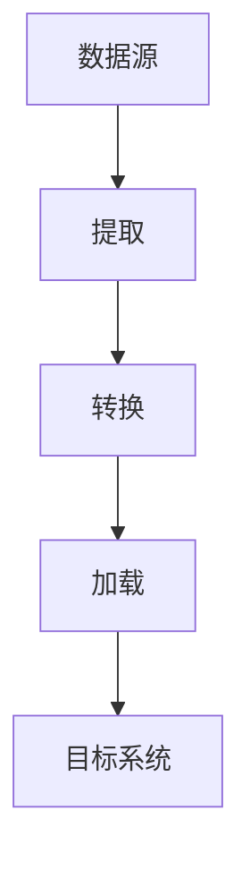

# 流式ETL

## 介绍

流式ETL（Extract, Transform, Load）是一种数据处理模式，用于实时或近实时地从数据源提取数据，进行转换，然后加载到目标系统中。与传统的批处理ETL不同，流式ETL处理的是连续的数据流，适用于需要快速响应的场景，如实时分析、监控和报警。

流式ETL的核心思想是将数据处理过程分解为三个步骤：

1. **提取（Extract）**：从数据源（如Kafka、Flume等）中实时获取数据。
2. **转换（Transform）**：对提取的数据进行清洗、过滤、聚合等操作。
3. **加载（Load）**：将处理后的数据加载到目标系统（如Hive、HBase等）中。

## 流式ETL的工作原理

流式ETL通常依赖于流处理引擎（如Apache Flink、Apache Storm、Apache Spark Streaming等）来实现。以下是流式ETL的基本工作流程：



1. **提取**：流处理引擎从数据源中持续读取数据流。数据源可以是消息队列（如Kafka）、日志文件、传感器数据等。
2. **转换**：在数据流到达后，引擎会立即对数据进行处理。常见的转换操作包括数据清洗、格式转换、聚合计算等。
3. **加载**：处理后的数据会被加载到目标系统中，如数据仓库、数据库或实时分析系统。

## 代码示例

以下是一个简单的流式ETL示例，使用Apache Flink从Kafka中读取数据，进行简单的转换，然后将结果写入Hive表。

```java
import org.apache.flink.streaming.api.environment.StreamExecutionEnvironment;
import org.apache.flink.streaming.connectors.kafka.FlinkKafkaConsumer;
import org.apache.flink.streaming.util.serialization.SimpleStringSchema;
import org.apache.flink.table.api.EnvironmentSettings;
import org.apache.flink.table.api.Table;
import org.apache.flink.table.api.bridge.java.StreamTableEnvironment;
import org.apache.flink.types.Row;

import java.util.Properties;

public class StreamETLExample {
    public static void main(String[] args) throws Exception {
        // 设置流处理环境
        StreamExecutionEnvironment env = StreamExecutionEnvironment.getExecutionEnvironment();
        EnvironmentSettings settings = EnvironmentSettings.newInstance().useBlinkPlanner().inStreamingMode().build();
        StreamTableEnvironment tableEnv = StreamTableEnvironment.create(env, settings);

        // Kafka配置
        Properties properties = new Properties();
        properties.setProperty("bootstrap.servers", "localhost:9092");
        properties.setProperty("group.id", "test");

        // 创建Kafka消费者
        FlinkKafkaConsumer<String> kafkaConsumer = new FlinkKafkaConsumer<>("input-topic", new SimpleStringSchema(), properties);

        // 从Kafka中读取数据流
        tableEnv.executeSql(
            "CREATE TABLE KafkaTable (\n" +
            "  user_id STRING,\n" +
            "  event_time TIMESTAMP(3),\n" +
            "  event_type STRING\n" +
            ") WITH (\n" +
            "  'connector' = 'kafka',\n" +
            "  'topic' = 'input-topic',\n" +
            "  'properties.bootstrap.servers' = 'localhost:9092',\n" +
            "  'format' = 'json'\n" +
            ")"
        );

        // 转换：过滤出特定类型的事件
        Table filteredTable = tableEnv.sqlQuery(
            "SELECT user_id, event_time, event_type FROM KafkaTable WHERE event_type = 'click'"
        );

        // 将结果写入Hive表
        tableEnv.executeSql(
            "CREATE TABLE HiveTable (\n" +
            "  user_id STRING,\n" +
            "  event_time TIMESTAMP(3),\n" +
            "  event_type STRING\n" +
            ") WITH (\n" +
            "  'connector' = 'hive',\n" +
            "  'hive-version' = '3.1.2',\n" +
            "  'hive-database' = 'default',\n" +
            "  'hive-table' = 'click_events'\n" +
            ")"
        );

        filteredTable.executeInsert("HiveTable");

        // 启动流处理任务
        env.execute("Stream ETL Example");
    }
}
```

### 输入示例

假设Kafka中的输入数据如下：

```json
{"user_id": "123", "event_time": "2023-10-01T12:00:00Z", "event_type": "click"}
{"user_id": "456", "event_time": "2023-10-01T12:01:00Z", "event_type": "view"}
```

### 输出示例

经过流式ETL处理后，Hive表中的数据如下：

| user_id | event_time          | event_type |
|---------|---------------------|------------|
| 123     | 2023-10-01 12:00:00 | click      |

## 实际应用场景

流式ETL在许多实时数据处理场景中都有广泛应用，以下是一些典型的应用场景：

1. **实时日志分析**：从服务器日志中提取关键指标（如错误率、响应时间），并实时加载到监控系统中。
2. **电商实时推荐**：从用户行为数据流中提取点击、购买等事件，实时生成推荐结果。
3. **物联网数据处理**：从传感器数据流中提取温度、湿度等信息，实时进行异常检测。

:::tip
在实际应用中，流式ETL的性能和可靠性至关重要。确保选择适合的流处理引擎，并合理设计数据处理流程。
:::

## 总结

流式ETL是一种强大的数据处理模式，适用于需要实时或近实时处理数据的场景。通过流处理引擎，我们可以从数据源中提取数据，进行转换，并将结果加载到目标系统中。本文通过一个简单的代码示例展示了流式ETL的基本流程，并介绍了一些实际应用场景。

## 附加资源

- [Apache Flink 官方文档](https://flink.apache.org/)
- [Apache Kafka 官方文档](https://kafka.apache.org/documentation/)
- [Hive 官方文档](https://hive.apache.org/)

## 练习

1. 修改上述代码示例，使其能够处理更多类型的事件（如“购买”、“收藏”等）。
2. 尝试使用其他流处理引擎（如Apache Spark Streaming）实现相同的流式ETL流程。
3. 设计一个实时监控系统，使用流式ETL处理服务器日志并生成实时报警。

:::caution
在进行流式ETL开发时，务必注意数据的一致性和容错性。流处理引擎通常提供检查点机制，确保在故障发生时能够恢复处理状态。
:::