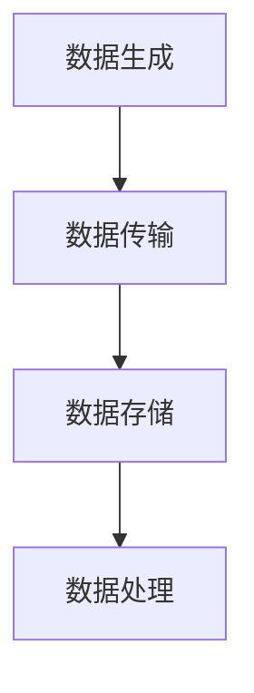
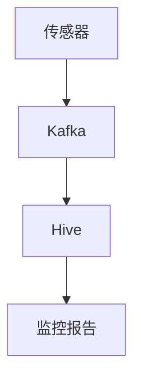

# 实时数据导入

实时数据导入是现代数据处理中的一个重要概念，尤其是在大数据和流式处理领域。它允许系统在数据生成的同时，立即将其导入到数据处理引擎中进行分析和处理。Hive 作为 Hadoop 生态系统中的重要组件，也支持实时数据导入的功能。本文将详细介绍如何在 Hive 中实现实时数据导入，并通过实际案例帮助初学者理解其应用场景。

## 什么是实时数据导入？

实时数据导入是指将数据从源系统（如传感器、日志文件、数据库等）实时地传输到目标系统（如 Hive 表）的过程。与传统的批处理不同，实时数据导入能够在数据生成的同时进行处理，从而实现更快的响应时间和更高的数据新鲜度。

在 Hive 中，实时数据导入通常通过流式处理工具（如 Apache Kafka、Apache Flume 等）来实现。这些工具可以将数据从源系统实时传输到 Hive 表中，供后续的分析和查询使用。

## 实时数据导入的基本流程

实时数据导入的基本流程可以分为以下几个步骤：

1. **数据生成**：数据从源系统（如传感器、日志文件等）生成。
2. **数据传输**：通过流式处理工具（如 Kafka、Flume）将数据传输到 Hive。
3. **数据存储**：数据被存储到 Hive 表中。
4. **数据处理**：对存储的数据进行查询和分析。



## 实现实时数据导入的步骤

### 1. 配置 Kafka 作为数据源

首先，我们需要配置 Kafka 作为数据源。Kafka 是一个分布式流处理平台，能够高效地处理大量实时数据。

```bash
# 启动 Kafka 服务器
bin/kafka-server-start.sh config/server.properties
```

### 2. 创建 Hive 表

接下来，我们需要在 Hive 中创建一个表来存储实时导入的数据。

```sql
CREATE TABLE real_time_data (
    id INT,
    timestamp STRING,
    value DOUBLE
) STORED AS ORC;
```

### 3. 使用 Kafka Connect 将数据导入 Hive

Kafka Connect 是一个工具，用于将数据从 Kafka 导入到其他系统（如 Hive）。我们可以使用 Kafka Connect 的 Hive Sink Connector 来实现这一功能。

```bash
# 配置 Kafka Connect
name=hive-sink
connector.class=io.confluent.connect.hive.HiveSinkConnector
tasks.max=1
topics=real_time_data
hive.metastore.uris=thrift://localhost:9083
hive.database=default
hive.table=real_time_data
```

### 4. 验证数据导入

最后，我们可以通过查询 Hive 表来验证数据是否成功导入。

```sql
SELECT * FROM real_time_data LIMIT 10;
```

## 实际案例：实时监控系统

假设我们正在构建一个实时监控系统，该系统需要从多个传感器收集数据，并将这些数据实时导入到 Hive 中进行存储和分析。通过使用 Kafka 和 Hive，我们可以轻松实现这一需求。

1. **数据生成**：传感器每秒钟生成一次数据。
2. **数据传输**：通过 Kafka 将传感器数据传输到 Hive。
3. **数据存储**：数据被存储到 Hive 表中。
4. **数据处理**：对存储的数据进行实时分析，生成监控报告。



## 总结

实时数据导入是流式处理中的一个关键概念，它允许我们在数据生成的同时进行处理和分析。通过使用 Kafka 和 Hive，我们可以轻松实现实时数据导入，并将其应用于各种实际场景中，如实时监控系统、日志分析等。

## 附加资源

- [Apache Kafka 官方文档](https://kafka.apache.org/documentation/)
- [Apache Hive 官方文档](https://hive.apache.org/)
- [Kafka Connect 官方文档](https://docs.confluent.io/platform/current/connect/index.html)

## 练习

1. 尝试配置 Kafka 和 Hive，并实现一个简单的实时数据导入流程。
2. 修改 Hive 表结构，使其能够存储更多的字段，并验证数据导入是否成功。
3. 探索其他流式处理工具（如 Apache Flume）与 Hive 的集成方式。

:::tip
在实现实时数据导入时，确保 Kafka 和 Hive 的配置正确，并且网络连接稳定，以避免数据丢失或延迟。
:::