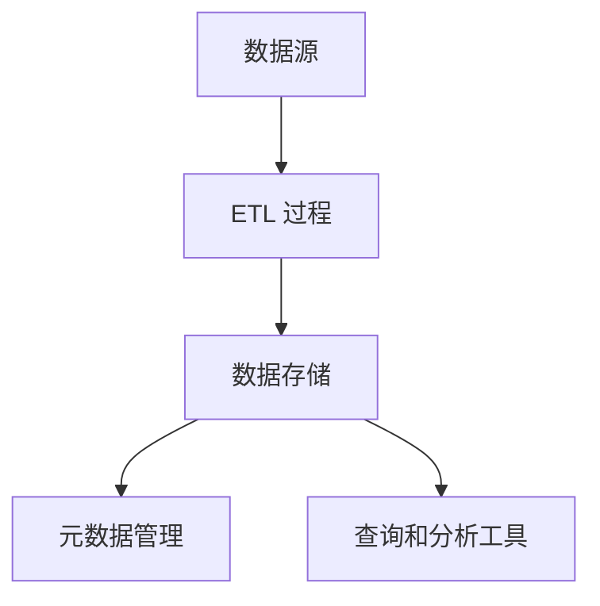

# 数据仓库基础概念

## 引言

数据仓库（Data Warehouse）是现代数据管理和分析的核心组件之一。它是一个专门用于存储、管理和分析大量历史数据的系统，旨在支持企业的决策制定过程。与传统的操作型数据库不同，数据仓库专注于数据的集成、历史存储和复杂查询分析。

本文将逐步介绍数据仓库的基础概念，包括其定义、特点、架构以及实际应用场景，帮助初学者全面理解数据仓库的核心思想。

---

## 什么是数据仓库？

数据仓库是一个面向主题的、集成的、非易失的、随时间变化的数据集合，用于支持管理决策。它从多个异构数据源中提取数据，经过清洗、转换和加载（ETL）后，存储在一个统一的存储库中，供分析和报告使用。

:::note
**面向主题**：数据仓库围绕特定的业务主题（如销售、库存、客户等）组织数据，而不是围绕应用程序或功能。
:::

:::tip
**集成**：数据仓库将来自不同数据源的数据整合到一个统一的视图中，确保数据的一致性和完整性。
:::

:::caution
**非易失性**：数据仓库中的数据通常是只读的，不会频繁更新或删除，主要用于历史数据的分析和查询。
:::

:::warning
**随时间变化**：数据仓库中的数据会随时间积累，支持对历史数据的分析和趋势预测。
:::

---

## 数据仓库的特点

1. **面向分析**：数据仓库的设计目标是支持复杂的查询和分析，而不是事务处理。
2. **历史数据存储**：数据仓库存储大量历史数据，支持时间序列分析和趋势预测。
3. **数据集成**：数据仓库从多个数据源中提取数据，并将其整合到一个统一的存储库中。
4. **高性能查询**：数据仓库通常采用列式存储、分区和索引等技术，以优化查询性能。
5. **支持决策**：数据仓库为企业的决策制定提供数据支持，帮助管理者做出更明智的决策。

---

## 数据仓库的架构

数据仓库的典型架构包括以下几个主要组件：

1. **数据源**：数据仓库的数据来源，可以是关系型数据库、文件系统、API 等。
2. **ETL 过程**：提取（Extract）、转换（Transform）、加载（Load）过程，用于将数据从源系统导入数据仓库。
3. **数据存储**：数据仓库的核心存储层，通常采用关系型数据库或分布式存储系统。
4. **元数据管理**：描述数据仓库中数据的结构、来源和转换规则的信息。
5. **查询和分析工具**：用于访问和分析数据仓库中数据的工具，如 SQL 查询、BI 工具等。

以下是一个典型的数据仓库架构图：



---

## 数据仓库的实际应用场景

### 案例：零售行业的数据仓库

假设一家零售公司希望分析其销售数据，以优化库存管理和营销策略。以下是数据仓库在该场景中的应用步骤：

1. **数据源**：从销售系统、库存系统和客户关系管理系统中提取数据。
2. **ETL 过程**：将数据清洗、转换并加载到数据仓库中。
3. **数据存储**：将整合后的数据存储在数据仓库中，按时间、产品和地区等维度组织。
4. **查询和分析**：使用 SQL 查询或 BI 工具分析销售趋势、库存水平和客户行为。

例如，以下是一个简单的 SQL 查询示例，用于分析某个月的销售数据：

```sql
SELECT 
    product_category, 
    SUM(sales_amount) AS total_sales
FROM 
    sales_data
WHERE 
    sales_date BETWEEN '2023-01-01' AND '2023-01-31'
GROUP BY 
    product_category;
```

**输出结果**：

| product_category | total_sales |
|------------------|-------------|
| Electronics      | 150000      |
| Clothing         | 80000       |
| Home Goods       | 60000       |

---

## 总结

数据仓库是现代数据管理和分析的核心工具，它通过集成、存储和分析历史数据，为企业决策提供支持。本文介绍了数据仓库的基础概念、特点、架构以及实际应用场景，帮助初学者理解其核心思想。

---

## 附加资源与练习

### 资源
- 《数据仓库工具箱》：一本经典的数据仓库设计书籍，适合深入学习。
- Apache Hive 官方文档：了解如何在 Hadoop 生态系统中构建数据仓库。

### 练习
1. 设计一个简单的数据仓库架构，包含至少两个数据源和一个 ETL 过程。
2. 使用 SQL 查询分析一个虚拟销售数据集，计算每个月的总销售额。
3. 研究一个实际的数据仓库案例（如 Amazon Redshift 或 Google BigQuery），并总结其特点和应用场景。