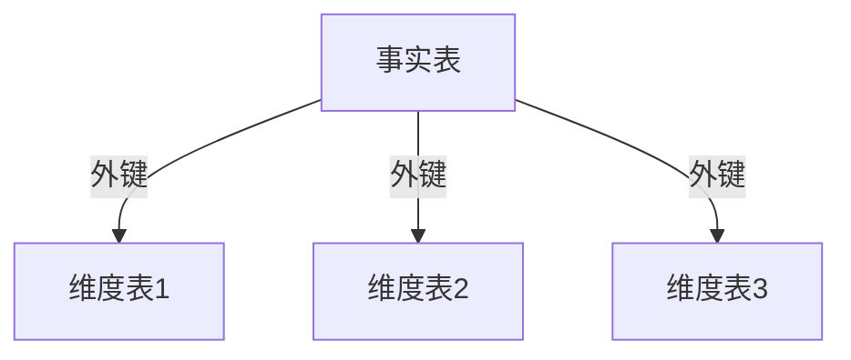
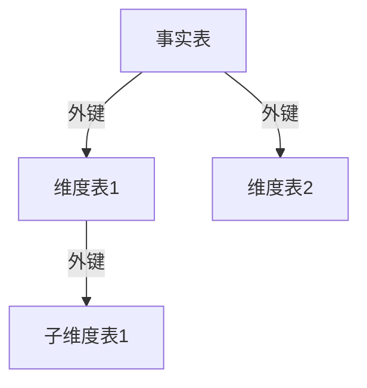

## 什么是维度建模？

维度建模是一种用于数据仓库设计的技术，旨在通过简化和优化数据结构，使其更适合分析和查询。它通过将数据组织成**事实表**和**维度表**，帮助用户快速理解数据并执行高效的查询。

- **事实表**：存储业务过程中的度量值（如销售额、订单数量等），通常是数值型数据。
- **维度表**：存储描述事实表中数据的上下文信息（如时间、地点、产品等），通常是文本型数据。

维度建模的核心目标是提高查询性能和数据可读性，同时支持复杂的分析需求。

---

## 维度建模的基本原则

### 1. 星型模型（Star Schema）
星型模型是维度建模中最常见的结构。它由一个中心的事实表和多个围绕它的维度表组成，形状像一颗星星。



- **事实表**：包含外键（指向维度表）和度量值。
- **维度表**：包含主键和描述性属性。

### 2. 雪花模型（Snowflake Schema）
雪花模型是星型模型的扩展，维度表进一步规范化，形成多层结构。虽然减少了数据冗余，但可能增加查询的复杂性。



### 3. 事实表的类型
- **事务事实表**：记录特定时间点发生的事件（如订单）。
- **周期快照事实表**：记录某一时间段内的汇总数据（如每日销售额）。
- **累积快照事实表**：记录跨时间的过程（如订单从创建到完成的各个阶段）。

---

## 维度建模的设计步骤

### 1. 确定业务过程
首先明确需要分析的业务过程，例如销售、库存或客户行为。

### 2. 定义粒度
确定事实表中每一行数据的粒度（如每笔订单、每日汇总等）。

### 3. 选择维度
确定描述事实数据的维度（如时间、产品、客户等）。

### 4. 确定事实
选择需要存储的度量值（如销售额、数量等）。

### 5. 构建模型
根据上述信息设计事实表和维度表，并建立它们之间的关系。

---

## 实际案例：电商销售分析

假设我们需要为一家电商公司设计一个数据仓库，用于分析销售数据。

### 1. 业务过程
分析每日销售情况。

### 2. 粒度
每条记录代表一天的销售数据。

### 3. 维度
- 时间维度（年、月、日）
- 产品维度（产品ID、产品名称、类别）
- 客户维度（客户ID、客户姓名、地区）

### 4. 事实
- 销售额
- 订单数量

### 5. 模型设计

```sql
-- 时间维度表
CREATE TABLE dim_time (
    time_id INT PRIMARY KEY,
    year INT,
    month INT,
    day INT
);

-- 产品维度表
CREATE TABLE dim_product (
    product_id INT PRIMARY KEY,
    product_name STRING,
    category STRING
);

-- 客户维度表
CREATE TABLE dim_customer (
    customer_id INT PRIMARY KEY,
    customer_name STRING,
    region STRING
);

-- 销售事实表
CREATE TABLE fact_sales (
    time_id INT,
    product_id INT,
    customer_id INT,
    sales_amount DOUBLE,
    order_count INT,
    FOREIGN KEY (time_id) REFERENCES dim_time(time_id),
    FOREIGN KEY (product_id) REFERENCES dim_product(product_id),
    FOREIGN KEY (customer_id) REFERENCES dim_customer(customer_id)
);
```

---

## 维度建模的优势

1. **查询性能高**：星型模型简化了表结构，减少了连接操作。
2. **易于理解**：直观的结构使业务用户更容易理解数据。
3. **扩展性强**：可以轻松添加新的维度或事实。

---

## 总结

维度建模是数据仓库设计的核心技术之一，通过将数据组织成事实表和维度表，显著提高了查询性能和数据可读性。星型模型和雪花模型是两种常见的设计模式，适用于不同的业务场景。

:::tip 提示
在实际项目中，建议优先使用星型模型，除非有明确的规范化需求。
:::

---

## 附加资源

1. [The Data Warehouse Toolkit by Ralph Kimball](https://www.amazon.com/Data-Warehouse-Toolkit-Definitive-Dimensional/dp/1118530802) - 维度建模的经典书籍。
2. [Hive官方文档](https://hive.apache.org/) - 了解更多关于Hive的使用方法。

---

## 练习

1. 设计一个用于分析库存变化的维度模型。
2. 在Hive中实现上述电商销售分析的模型，并插入示例数据。
3. 比较星型模型和雪花模型的优缺点，并说明它们适用的场景。